<div class="MCWHeader1">
SAP plus extend and innovate
</div>

<div class="MCWHeader2">
Before the hands-on lab setup guide
</div>

<div class="MCWHeader3">
May 2022
</div>


Information in this document, including URL and other Internet Web site references, is subject to change without notice. Unless otherwise noted, the example companies, organizations, products, domain names, e-mail addresses, logos, people, places, and events depicted herein are fictitious, and no association with any real company, organization, product, domain name, e-mail address, logo, person, place or event is intended or should be inferred. Complying with all applicable copyright laws is the responsibility of the user. Without limiting the rights under copyright, no part of this document may be reproduced, stored in or introduced into a retrieval system, or transmitted in any form or by any means (electronic, mechanical, photocopying, recording, or otherwise), or for any purpose, without the express written permission of Microsoft Corporation.

Microsoft may have patents, patent applications, trademarks, copyrights, or other intellectual property rights covering subject matter in this document. Except as expressly provided in any written license agreement from Microsoft, the furnishing of this document does not give you any license to these patents, trademarks, copyrights, or other intellectual property.

The names of manufacturers, products, or URLs are provided for informational purposes only and Microsoft makes no representations and warranties, either expressed, implied, or statutory, regarding these manufacturers or the use of the products with any Microsoft technologies. The inclusion of a manufacturer or product does not imply endorsement of Microsoft of the manufacturer or product. Links may be provided to third party sites. Such sites are not under the control of Microsoft and Microsoft is not responsible for the contents of any linked site or any link contained in a linked site, or any changes or updates to such sites. Microsoft is not responsible for webcasting or any other form of transmission received from any linked site. Microsoft is providing these links to you only as a convenience, and the inclusion of any link does not imply endorsement of Microsoft of the site or the products contained therein.

© 2022 Microsoft Corporation. All rights reserved.

Microsoft and the trademarks listed at <https://www.microsoft.com/en-us/legal/intellectualproperty/Trademarks/Usage/General.aspx> are trademarks of the Microsoft group of companies. All other trademarks are property of their respective owners.

**Contents**

- [SAP plus extend and innovate before the hands-on lab setup guide](#sap-plus-extend-and-innovate-before-the-hands-on-lab-setup-guide)
  - [Requirements](#requirements)
  - [Before the hands-on lab](#before-the-hands-on-lab)
    - [Task 1: Obtain the desired Azure Subscription Id value](#task-1-obtain-the-desired-azure-subscription-id-value)
    - [Task 2: Create a SAP Cloud Appliance](#task-2-create-a-sap-cloud-appliance)
    - [Task 3: Populate SAP data](#task-3-populate-sap-data)
    - [Task 4: Expose SAP sales data as an OData service](#task-4-expose-sap-sales-data-as-an-odata-service)
    - [Task 5: Deploy Azure Resources](#task-5-deploy-azure-resources)

# SAP plus extend and innovate before the hands-on lab setup guide

## Requirements

1. An Azure account with the ability to provision an Azure Synapse Workspace

2. Internet browser such as [Edge](https://www.microsoft.com/edge) or [Chrome](https://www.google.com/chrome/downloads/)

## Before the hands-on lab

Duration: X minutes

### Task 1: Obtain the desired Azure Subscription Id value

1. Using an internet browser, log into the [Azure Portal](https://portal.azure.com).

2. In the top toolbar, search for and select **Subscriptions**.

    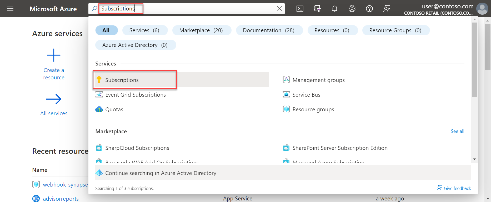

3. On the **Subscriptions** screen, locate the desired Azure Subscription to deploy lab resources and copy the **Subscription ID** value. Save this value in a text editor for later use.

    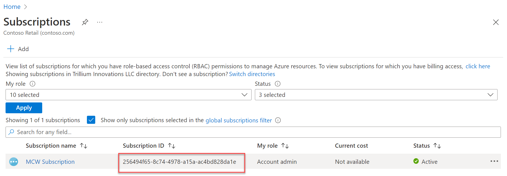

### Task 2: Create a SAP Cloud Appliance

1. Using an internet browser, open the [SAP Cloud Appliance Library](https://cal.sap.com/) website.

2. Select the **Log On** button in the header of the website.

    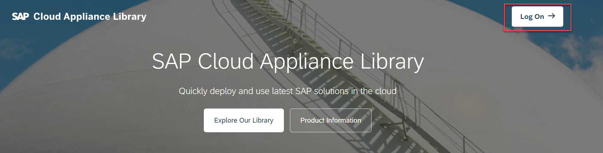

3. Either register for a new account, or log in with your existing credentials.

4. On the SAP Cloud Appliance Library **Appliance Templates** screen, search for and locate the **SAP S/4HANA 2021, Fully-Activated Appliance** item, and select the **Create Appliance** button in the search results.

    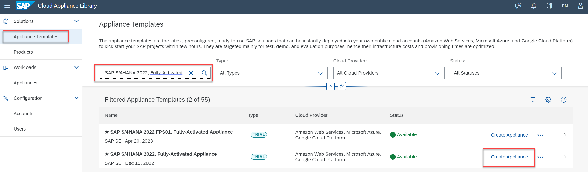

5. On the **Terms and Conditions** screen, read the conditions of the 30-day trial license, and select the **I Accept** button to continue.

6. On the **Basic Mode: Create Appliance - Account Details** screen, enter the following values, then select the **Authorize** button:

    | Field | Value |
    |-------|-------|
    | Name | MCW SAP plus extend and innovate |
    | Description | SAP instance for the Microsoft Cloud Workshop |
    | Cloud Provider | Select **Microsoft Azure** |
    | Subscription ID | Paste the **Subscription ID** value from Task 1 |
    | Authorization Type | Select **Standard Authorization** |

    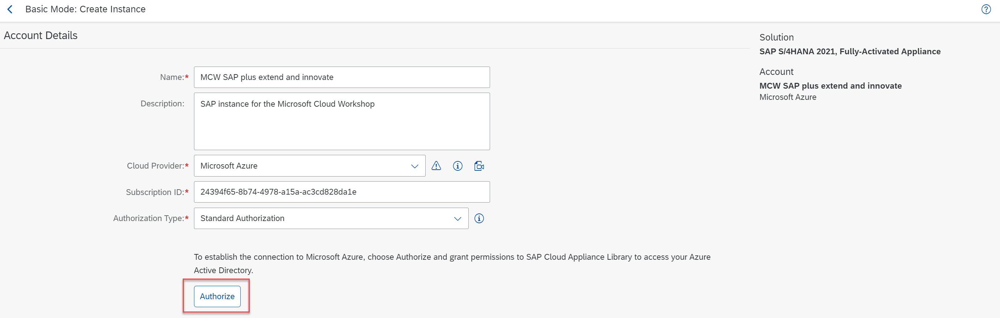

7. When prompted, authenticate to Azure. If prompted, select to **Consent on behalf of your organization** and select **Accept**.

    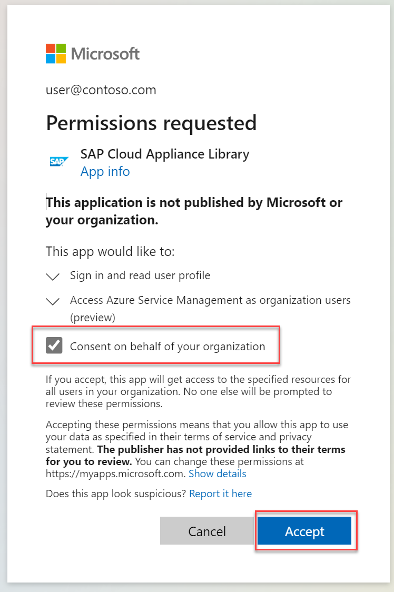

8. Returning to the **Basic Mode: Create Appliance** screen fill the **Appliance Details** form as follows and select **Create**:

    | Field | Value |
    |-------|-------|
    | Name  | MCW SAP |
    | Region | Select the nearest location |
    | Password | Choose a strong password |
    | Retype Password | Enter the chosen password |

    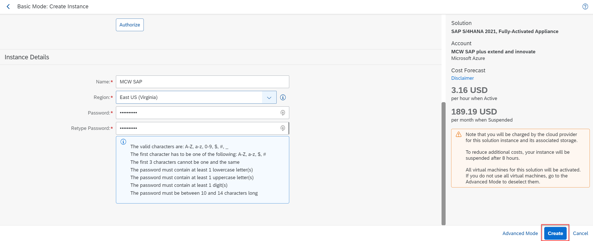

9. On the **Supported VM Sizes** modal dialog, select **OK**.

    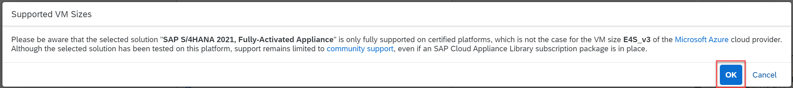

10. On the **Private Key** modal, select to **Store** the private ky in the SAP Cloud Appliance Library. Check the **Encrypt the private key with a password** and enter a password. Type the password once more in the **Retype Password** textbox. Select the **Download** button to download the encrypted key.

    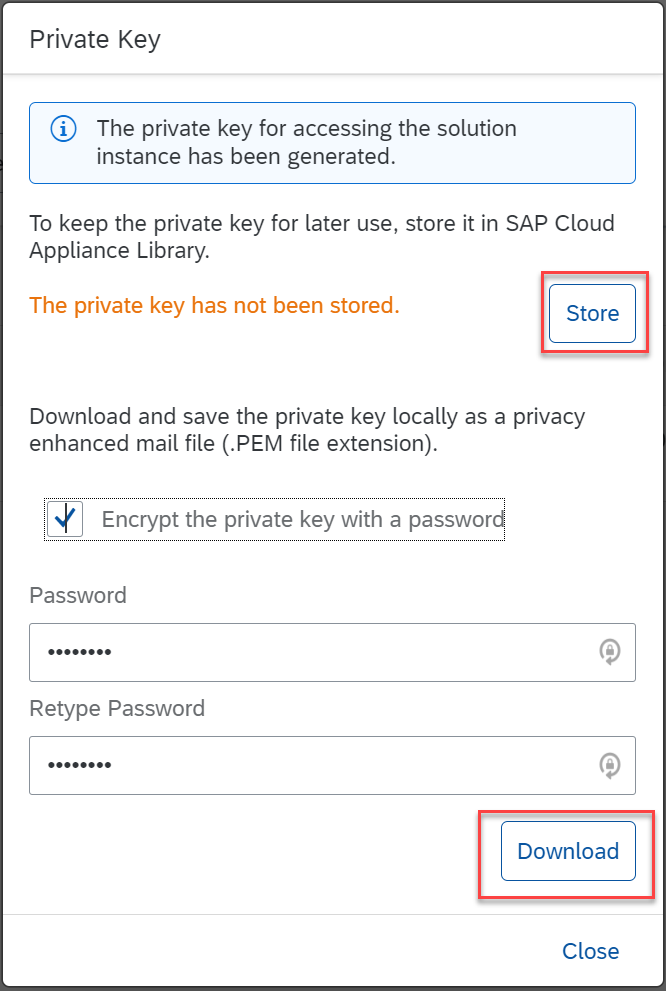

11. The deployment  will take approximately 90 minutes. The status will update on the Instances screen. Once complete, the status will indicate **Active**.

    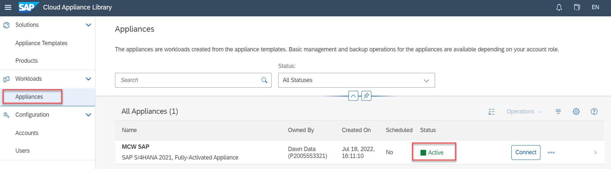

### Task 3: Populate SAP data

1. On the SAP Cloud Appliance Library Instances page, select the **Connect** button on the **MCW SAP** row.

    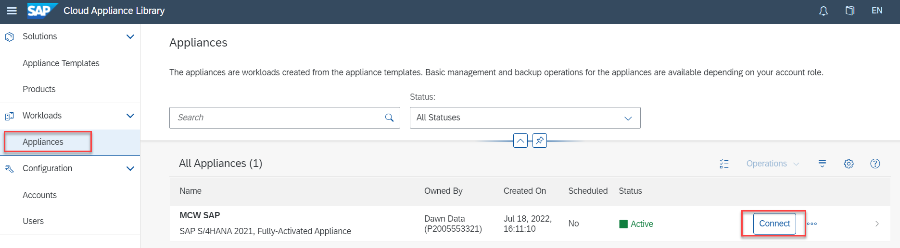

2. On the **Connect to the instance** dialog, select the **Connect** link on the RDP row. This will download an RDP file.

    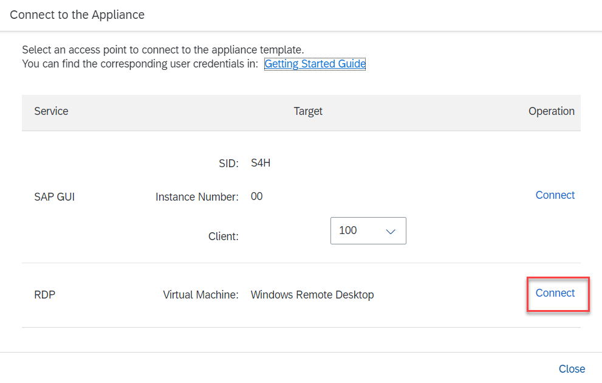

3. Open the downloaded RDP file and log into the instance using the username `Administrator` and the password used when deploying the instance.

4. From the desktop double-click the **HANA Studio** icon. This will open the Eclipse development environment.

    

5. In the **Select a directory as workspace** dialog, keep the default value and select **Launch**. Launching will take a few moments, please be patient.

    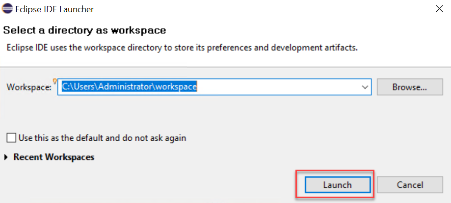

6. Change the perspective to development by expanding the **Window** menu, **Perspective**, **Open Perspective**, then selecting the **SAP HANA Development** item.

    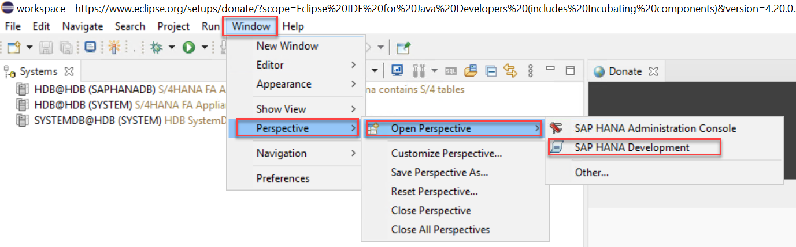

7. In the left panel, select the **Project Explorer** tab then double-click the **S4H_100_s4h_ext_en** folder.

    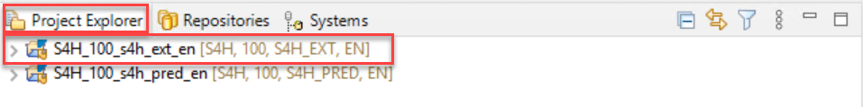

8. When prompted for a password, enter `Welcome1` and select **OK**.

    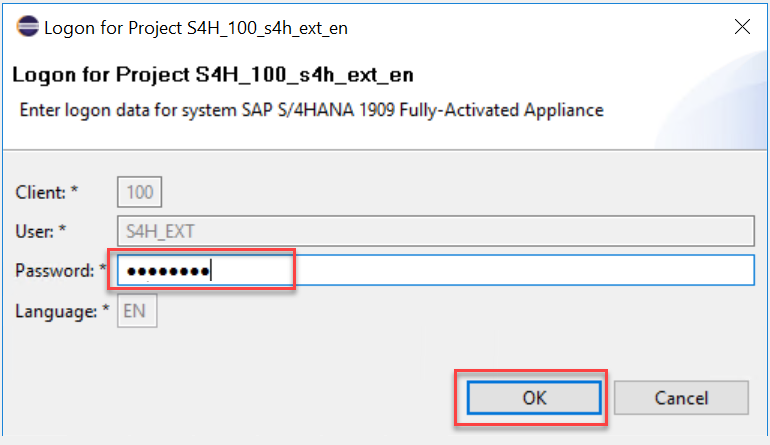

9.  Expand the **File** menu, then **New** and select the **Other** item.

    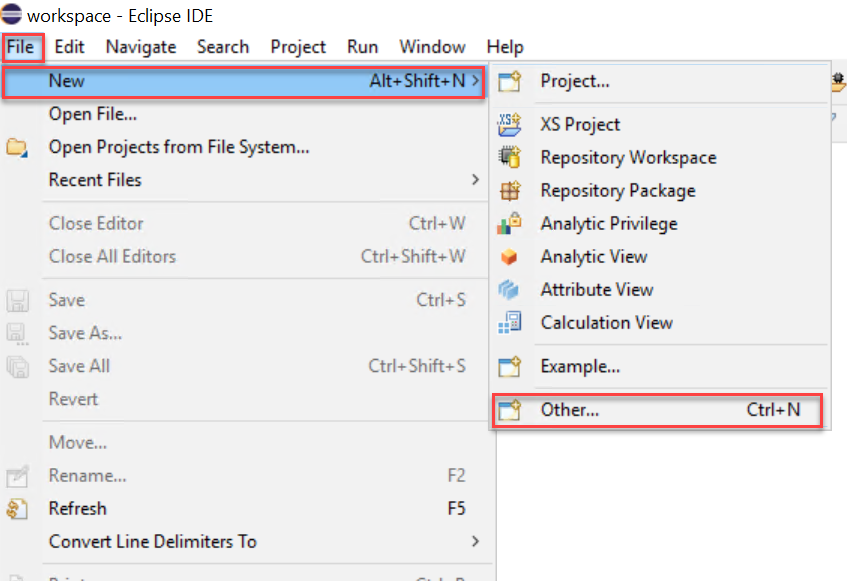

10. In the **Select a wizard** dialog, search for `Data Definition`. Select the **Data Definition** item beneath the **ABAP / Core Data Services** folders. Select **Next**.

    

11. Fill the **New Data Definition** dialog as follows, then select **Finish**.

    | Field | Value |
    |-------|-------|
    | Project | Retain the default **S4H_100_s4h_ext_en**. |
    | Package | Enter `$TMP`. |
    | Name | Enter `ZBD_ISalesDocument_E`. |
    | Description | Enter `ZBD_ISalesDocument_E` |

    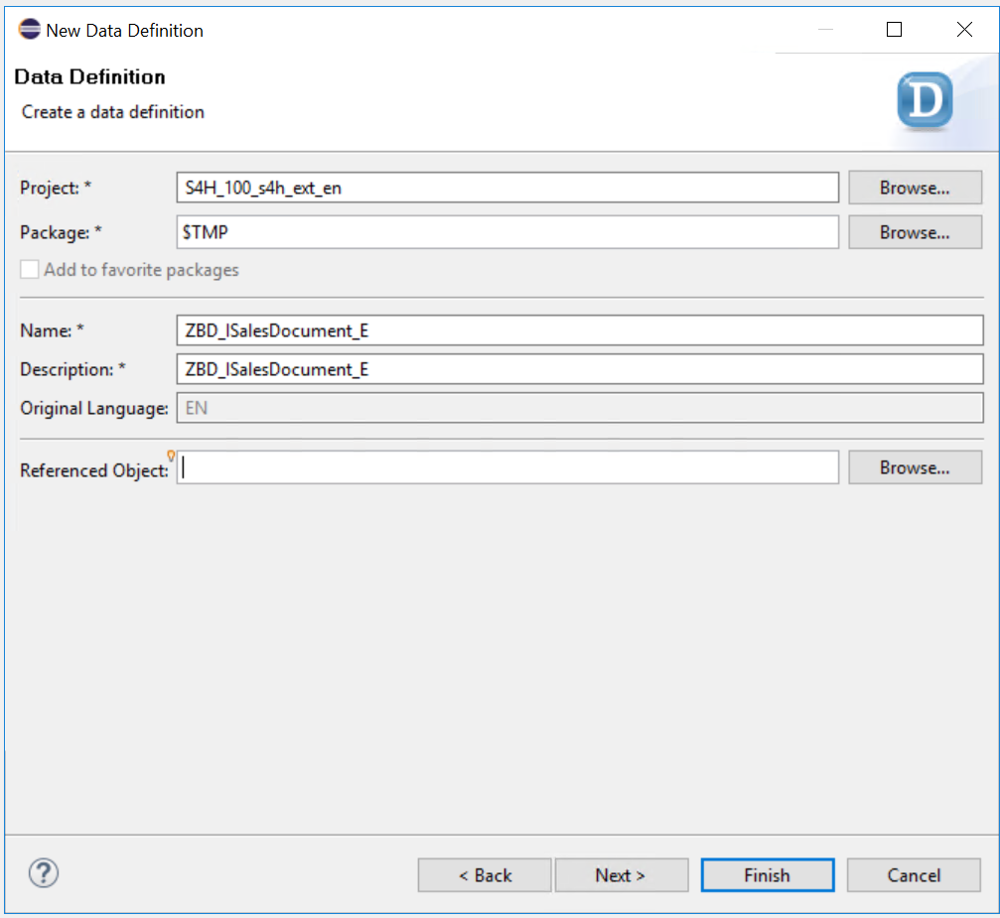

12. Replace the code listing for **ZBD_ISALESDOCUMENT_E** with the following. Save the file.

    ```SAP
    @AbapCatalog.sqlViewName: 'ZBD_ISALESDOC_E'
    @AbapCatalog.compiler.compareFilter: true
    @AbapCatalog.preserveKey: true
    @AccessControl.authorizationCheck: #CHECK
    @EndUserText.label: 'Expanded CDS for Extraction I_Salesdocument'
    define view ZBD_I_Salesdocument_E as select from I_SalesDocument {
    key SalesDocument,
        //Category
        SDDocumentCategory,
        SalesDocumentType,
        SalesDocumentProcessingType,

        CreationDate,
        CreationTime,
        LastChangeDate,
        //@Semantics.systemDate.lastChangedAt: true
        LastChangeDateTime,

        //Organization
        SalesOrganization,
        DistributionChannel,
        OrganizationDivision,
        SalesGroup,
        SalesOffice,
        
        //SoldTo
        SoldToParty,
        _SoldToParty.CustomerName,
        _SoldToParty.Country,
        _SoldToParty.CityName,
        _SoldToParty.PostalCode,
        _SoldToParty.CustomerAccountGroup,
        
        //SalesDistrict
        SalesDistrict,
        
        CustomerGroup,
        CreditControlArea,
        PurchaseOrderByCustomer,
        
        //Pricing
        TotalNetAmount,
        TransactionCurrency,
        PricingDate,
        //RetailPromotion,
        //PriceDetnExchangeRate,
        //SalesDocumentCondition,
        
        //Billing
        BillingDocumentDate,
        BillingCompanyCode
    } where SDDocumentCategory = 'C'
    ```

13. Right-click in the whitespace of the **ZBD_ISALESDOCUMENT_E** view code window and select **Activate**.

    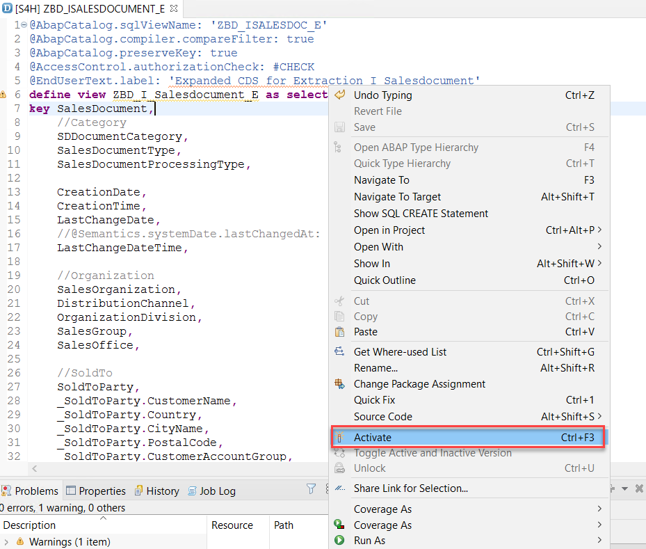

14. Right-click in the whitespace of the **ZBD_ISALESDOCUMENT_E** view once more, this time select **Open With** and choose **Data Preview**. This will display the raw data of the view.

    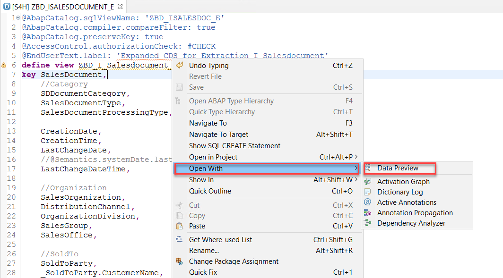

    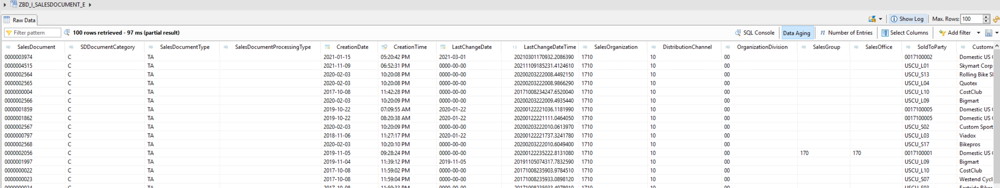

15. Keep the virtual machine with the Eclipse development environment open for the next task.

### Task 4: Expose SAP sales data as an OData service

1. Add the following code immediately preceding the `define view` line of code of the **ZBD_ISALESDOCUMENT_E** file and save the file.

    ```ABAL
    @OData.publish: true
    ```

    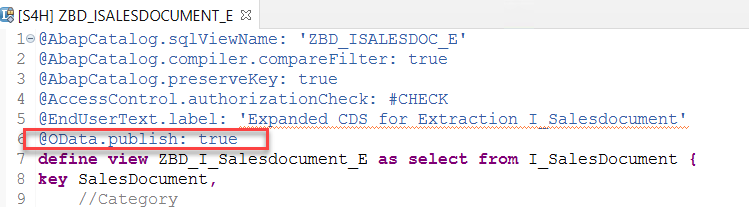

2. Right-click in the whitespace of the **ZBD_ISALESDOCUMENT_E** file, and select **Activate**.

3. Minimize the Eclipse development environment, and double-click the **SAP Logon** icon located on the desktop of the virtual machine. This will open the SAP GUI application.

    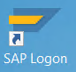

4. From the top toolbar menu, select the **Logon** button.

    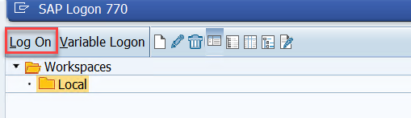

5. Log in with the username `S4H_EXT` and the password `Welcome1`, press <kbd>Enter</kbd> to submit the form.

    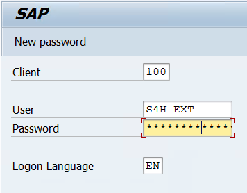

6. Once logged on, type `/n/IWFND/MAINT_SERVICE` in the toolbar menu transaction combo box and press <kbd>Enter</kbd>. This opens the **Activate and Maintain Services** window.

    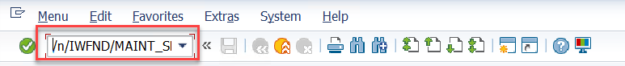  

7. From the toolbar menu of the **Activate and Maintain Services** window, select the **Add Service** button.

    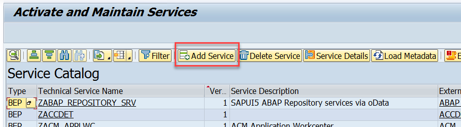

8. Populate the **Add Selected Services** filter form as follows and press <kbd>Enter</kbd>.

    | Field | Value |
    |-------|-------|
    | System Alias | Enter `Local`. |
    | Technical Service Name | Enter `ZBD_*`. |

    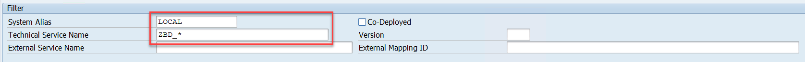

9. From the list of results, select the **ZBD_I_SALESDOCUMENT_E_CDS** item.

    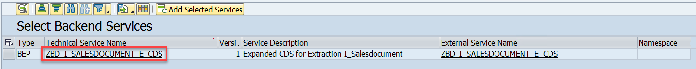

10. In the **Add Service** dialog, select the **Local Object** button located in the **Creation Information** section. This will populate the **$TMP** value, and press <kbd>Enter</kbd>. An information dialog indicating success will display, dismiss this dialog.

    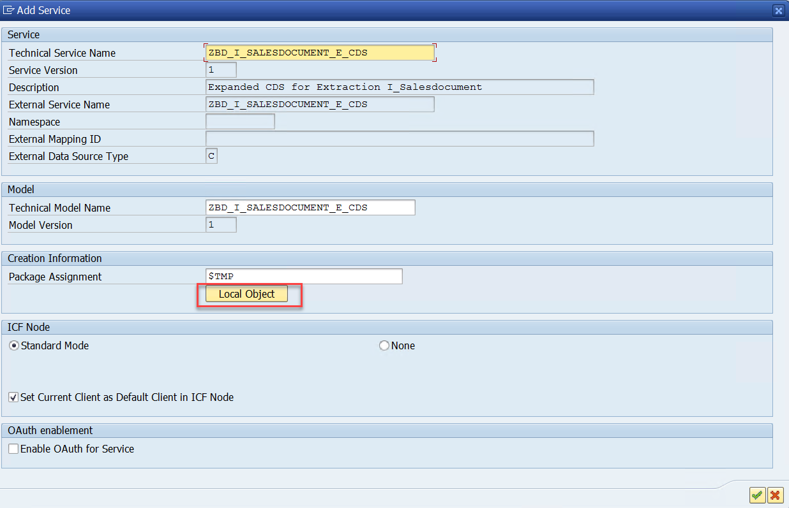

11. On the **Add Selected Services** screen, select the **Back** button on the toolbar menu. This will open the **Activate and Maintan Services** window once more.

    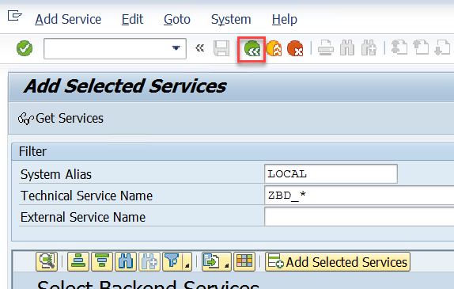

12. On the **Activate and Maintain Services** screen, select the **Filter** button from the toolbar menu.

    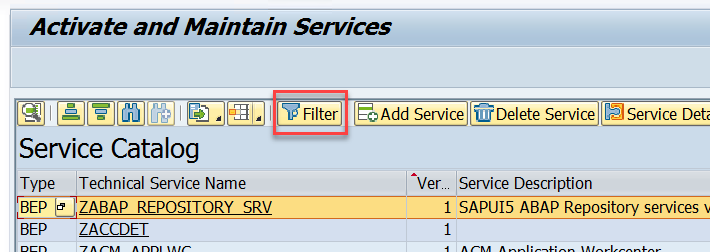

13. In the **Filter for Service Catalog** dialog, type `ZBD_*` in the **Technical Service Name** field and press <kbd>Enter</kbd>.

    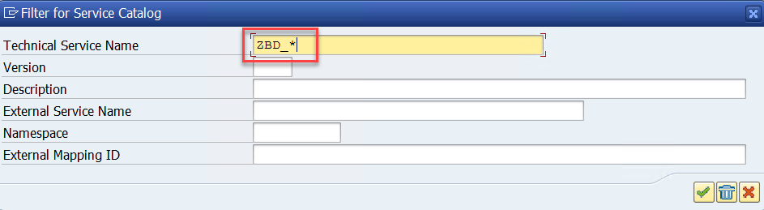

14. This action filters the **Activate and Maintain Services** screen to a single service. In the **ICF Nodes** pane, select the **SAP Gateway Client** button. If the **SAP GUI Security** dialog displays, check the **Remember My Decision** checkbox and select **Allow**.

    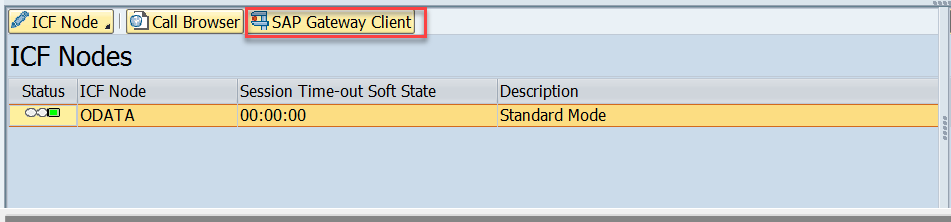

15. On the **SAP Gateway Client** window, select the **Execute** button from the toolbar menu. This tests the OData service. Verify in the **HTTP Response** pane that the status code indicates **200**.

    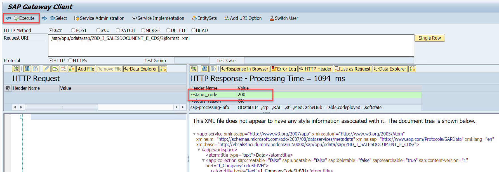

16. On the **SAP Gateway Client** window, select the **EntitySets** button on the toolbar menu.

    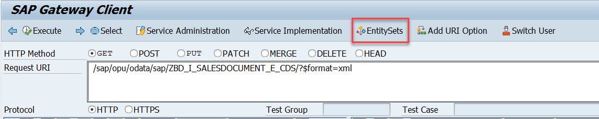

17. On the **EntitySets** dialog, double-click the **ZBD_I_Salesdocument_E** item.

    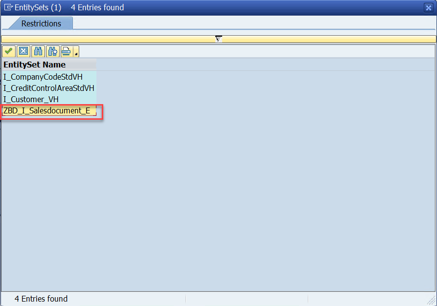 

18. On the **SAP Gateway Client** window, select **Execute**. This service retrieves the sales documents via the OData endpoint. Verify the HTTP Response status code value is **200**.

    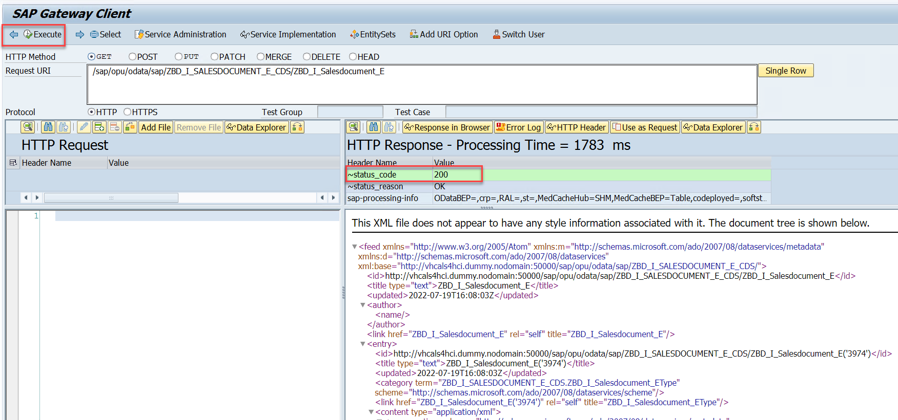

19. On the **SAP Gateway Client** window, select the **Back** button to return to the **Activate and Maintain Services** screen.

20. On the **ICF Node** pane, select the **Call Browser** button. This will bring up the **Security GUI** dialog once more. Copy the URL value for future use in the lab. After recording the value, close the dialog. This URL is the service endpoint for the sales document OData service.

    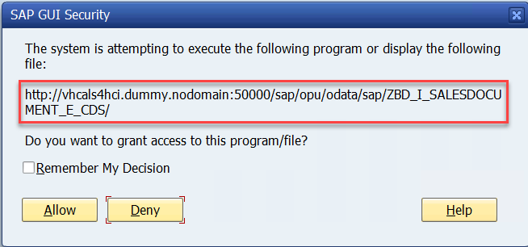

### Task 5: Deploy Azure Resources

This lab utilizes Terraform Infrastructure as Code to deploy the necessary Azure resources.

1. In the Azure portal, select the cloud shell button from the upper-right toolbar menu options.

    
  
2. In the Cloud Shell pane, ensure the PowerShell language is selected. Clone the source code repository by issuing the following command.

    ```PowerShell
    git clone https://github.com/codingbandit/MCW-SAP-plus-extend-and-innovate.git
    ```

3. Navigate to the Terraform directory by executing the following command.

    ```PowerShell
    cd 'MCW-SAP-plus-extend-and-innovate/Hands-on lab/Resources/terraform'
    ```

4. Set the desired subscription by executing the following code, replace **SUBSCRIPTION_ID** with the value you recorded earlier in the lab setup.

    ```PowerShell
    az account set --subscription SUBSCRIPTION_ID
    ```

5. Establish a user context by executing the following command. Follow the prompts to authenticate to the Azure Cloud Shell.

    ```PowerShell
    az login
    ```

6. Initialize the Terraform code using the following command.

    ```PowerShell
    terraform init
    ```

7. Deploy the lab resources by executing the following command. When prompted to perform the actions, type `yes` and press <kbd>Enter</kbd>. It will take approximately 15 minutes for the deployment to complete.

    ```PowerShell
    terraform apply
    ```

8. Close the Cloud Shell panel if desired.

You should follow all steps provided *before* performing the Hands-on lab.
