<div class="MCWHeader1">
SAP plus extend and innovate with Data and AI
</div>

<div class="MCWHeader2">
Hands-on lab step-by-step
</div>

<div class="MCWHeader3">
August 2022
</div>


Information in this document, including URL and other Internet Web site references, is subject to change without notice. Unless otherwise noted, the example companies, organizations, products, domain names, e-mail addresses, logos, people, places, and events depicted herein are fictitious, and no association with any real company, organization, product, domain name, e-mail address, logo, person, place or event is intended or should be inferred. Complying with all applicable copyright laws is the responsibility of the user. Without limiting the rights under copyright, no part of this document may be reproduced, stored in or introduced into a retrieval system, or transmitted in any form or by any means (electronic, mechanical, photocopying, recording, or otherwise), or for any purpose, without the express written permission of Microsoft Corporation.

Microsoft may have patents, patent applications, trademarks, copyrights, or other intellectual property rights covering subject matter in this document. Except as expressly provided in any written license agreement from Microsoft, the furnishing of this document does not give you any license to these patents, trademarks, copyrights, or other intellectual property.

The names of manufacturers, products, or URLs are provided for informational purposes only and Microsoft makes no representations and warranties, either expressed, implied, or statutory, regarding these manufacturers or the use of the products with any Microsoft technologies. The inclusion of a manufacturer or product does not imply endorsement of Microsoft of the manufacturer or product. Links may be provided to third party sites. Such sites are not under the control of Microsoft and Microsoft is not responsible for the contents of any linked site or any link contained in a linked site, or any changes or updates to such sites. Microsoft is not responsible for webcasting or any other form of transmission received from any linked site. Microsoft is providing these links to you only as a convenience, and the inclusion of any link does not imply endorsement of Microsoft of the site or the products contained therein.

© 2022 Microsoft Corporation. All rights reserved.

Microsoft and the trademarks listed at <https://www.microsoft.com/en-us/legal/intellectualproperty/Trademarks/Usage/General.aspx> are trademarks of the Microsoft group of companies. All other trademarks are property of their respective owners.

**Contents** 

<!-- TOC -->
- [SAP plus extend and innovate with Data and AI hands-on lab step-by-step](#sap-plus-extend-and-innovate-with-data-and-ai-hands-on-lab-step-by-step)
  - [Abstract and learning objectives](#abstract-and-learning-objectives)
  - [Overview](#overview)
  - [Solution architecture](#solution-architecture)
  - [Requirements](#requirements)
  - [Before the hands-on lab](#before-the-hands-on-lab)
  - [Exercise 1: Install the self-hosted integration runtime on the SAP virtual machine](#exercise-1-install-the-self-hosted-integration-runtime-on-the-sap-virtual-machine)
    - [Task 1: Download and install the self-hosted integration runtime](#task-1-download-and-install-the-self-hosted-integration-runtime)
  - [Exercise 2: Ingest sales order information from SAP into Azure Synapse Analytics](#exercise-2-ingest-sales-order-information-from-sap-into-azure-synapse-analytics)
    - [Task 1: Create dedicated SQL pool tables to hold sales data](#task-1-create-dedicated-sql-pool-tables-to-hold-sales-data)
    - [Task 2: Create a linked service to the SAP OData endpoint for sales order header information](#task-2-create-a-linked-service-to-the-sap-odata-endpoint-for-sales-order-header-information)
    - [Task 3: Create a linked service to the SAP OData endpoint for sales order item information](#task-3-create-a-linked-service-to-the-sap-odata-endpoint-for-sales-order-item-information)
    - [Task 4: Create a linked service to the dedicated SQL pool database](#task-4-create-a-linked-service-to-the-dedicated-sql-pool-database)
    - [Task 5: Create integration datasets for sales order header and sales order items](#task-5-create-integration-datasets-for-sales-order-header-and-sales-order-items)
    - [Task 6: Create a pipeline to ingest sales data from S/4HANA](#task-6-create-a-pipeline-to-ingest-sales-data-from-s4hana)
  - [Exercise 3: Ingest payment information from Cosmos DB into Azure Synapse Analytics](#exercise-3-ingest-payment-information-from-cosmos-db-into-azure-synapse-analytics)
    - [Task 1: Create a dedicated SQL pool table to hold payment information](#task-1-create-a-dedicated-sql-pool-table-to-hold-payment-information)
    - [Task 2: Create the Payments table integration dataset](#task-2-create-the-payments-table-integration-dataset)
    - [Task 3: Create the Payments ingestion pipeline](#task-3-create-the-payments-ingestion-pipeline)
  - [Exercise 4: Prepare data for the incoming cashflow prediction model training](#exercise-4-prepare-data-for-the-incoming-cashflow-prediction-model-training)
    - [Task 1: Create a SQL view that combines sales orders with payments data](#task-1-create-a-sql-view-that-combines-sales-orders-with-payments-data)
    - [Task 2: Move the view data to a parquet file in Azure Data Lake Storage Gen2](#task-2-move-the-view-data-to-a-parquet-file-in-azure-data-lake-storage-gen2)
  - [Exercise 5: Train a regression model to predict incoming cashflow using Azure Machine Learning Studio](#exercise-5-train-a-regression-model-to-predict-incoming-cashflow-using-azure-machine-learning-studio)
    - [Task 1: Retrieve the access key for the Azure Data Lake Storage account](#task-1-retrieve-the-access-key-for-the-azure-data-lake-storage-account)
    - [Task 2: Create an Azure Machine Learning datastore](#task-2-create-an-azure-machine-learning-datastore)
    - [Task 3: Create and run an Automated ML job](#task-3-create-and-run-an-automated-ml-job)
    - [Task 4: Deploy the best model as a web service](#task-4-deploy-the-best-model-as-a-web-service)
  - [Exercise 6: Train a regression model to predict incoming cashflow using Azure Synapse Analytics (OPTIONAL)](#exercise-6-train-a-regression-model-to-predict-incoming-cashflow-using-azure-synapse-analytics-optional)
    - [Task 1: Create the SalesPaymentsFull Spark table from the parquet file](#task-1-create-the-salespaymentsfull-spark-table-from-the-parquet-file)
    - [Task 2: Create an Azure Machine Learning linked service](#task-2-create-an-azure-machine-learning-linked-service)
    - [Task 3: Train a new regression model for incoming cash flow](#task-3-train-a-new-regression-model-for-incoming-cash-flow)
    - [Task 4: Deploy and test the regression model in the dedicated SQL pool](#task-4-deploy-and-test-the-regression-model-in-the-dedicated-sql-pool)
  - [Exercise 7: Visualize historical data with Power BI](#exercise-7-visualize-historical-data-with-power-bi)
    - [Task 1: Retrieve the database connection information for the dedicated SQL pool](#task-1-retrieve-the-database-connection-information-for-the-dedicated-sql-pool)
    - [Task 2: Import data into Power BI](#task-2-import-data-into-power-bi)
    - [Task 3: Create the relational model](#task-3-create-the-relational-model)
    - [Task 4: Create a sales per data and customer group visualization](#task-4-create-a-sales-per-data-and-customer-group-visualization)
    - [Task 5: Create a sales per region and customer group visualization](#task-5-create-a-sales-per-region-and-customer-group-visualization)
    - [Task 6: Create a payments per date and customer group visualization](#task-6-create-a-payments-per-date-and-customer-group-visualization)
    - [Task 7: Create a sales per customer group and material group visualization](#task-7-create-a-sales-per-customer-group-and-material-group-visualization)
    - [Task 8: Create a payment offset per customer group visualization](#task-8-create-a-payment-offset-per-customer-group-visualization)
    - [Task 9: Create a payment offset per customer group box plot visualization (Optional)](#task-9-create-a-payment-offset-per-customer-group-box-plot-visualization-optional)
  - [Exercise 8: Integrate Azure Machine Learning and Power BI](#exercise-8-integrate-azure-machine-learning-and-power-bi)
    - [Task 1: Add the deployed model to the Power BI report](#task-1-add-the-deployed-model-to-the-power-bi-report)
    - [Task 2: Create a Date table for report aggregation](#task-2-create-a-date-table-for-report-aggregation)
    - [Task 3: Create the Sales and Payment Forecast visualization](#task-3-create-the-sales-and-payment-forecast-visualization)
  - [Exercise 9: Create an alert in Power BI](#exercise-9-create-an-alert-in-power-bi)
    - [Task 1: Publish the Power BI report to an online workspace](#task-1-publish-the-power-bi-report-to-an-online-workspace)
    - [Task 2: Create a gauge visualization to be used as the notification trigger](#task-2-create-a-gauge-visualization-to-be-used-as-the-notification-trigger)
    - [Task 3: Create an alerting dashboard to send email with Power Automate](#task-3-create-an-alerting-dashboard-to-send-email-with-power-automate)
  - [Exercise 10: Update SAP from Power BI](#exercise-10-update-sap-from-power-bi)
    - [Task 1: Import a Power Automate flow](#task-1-import-a-power-automate-flow)
    - [Task 2: Add a Power Automate visual and author the update flow](#task-2-add-a-power-automate-visual-and-author-the-update-flow)
  - [After the hands-on lab](#after-the-hands-on-lab)
    - [Task 1: Delete the Power Automate flows](#task-1-delete-the-power-automate-flows)
    - [Task 2: Delete the Power BI workspace report and dataset](#task-2-delete-the-power-bi-workspace-report-and-dataset)
    - [Task 3: Remove deployed Azure resources with Terraform](#task-3-remove-deployed-azure-resources-with-terraform)
    - [Task 4: Terminate the SAP CAL appliance](#task-4-terminate-the-sap-cal-appliance)

<!-- /TOC -->

# SAP plus extend and innovate with Data and AI hands-on lab step-by-step

## Abstract and learning objectives

In this hands-on lab you will:

1. **Extract** (historical) Sales Orders from SAP S/4HANA using Azure Synapse Analytics pipelines

2. **Extract** historical payments from a non-SAP system, in this case Cosmos DB using Azure Synapse Analytics pipelines

3. **Visualize** the extracted Sales Orders and invoice data with Power BI

4. **Predict** incoming cash flow for Sales Orders using Azure Machine Learning

5. **Trigger actions** in SAP based on insights gained from the prediction model

## Overview

When customers buy goods, the corresponding payments are not completed immediately. Some customers will pay directly while other customers will pay at the end of their payment terms. This makes it difficult for companies to predict the incoming cashflow. In this lab, Azure tooling is used to predict the incoming cashflow. To predict cash flow, historical Sales Orders and payments data is required. Contoso Retail also needs a way to flag risky customers in the SAP system whose payments tend to arrive late.

## Solution architecture


 Sales Order information is stored in an S/4 HANA system and payments data is stored in Cosmos DB. Synapse Pipelines are used to ingest historical data from both sources. Power BI is used to visualize historical data and to create reports. Azure Machine Learning is used to create a model to predict incoming cash flow. Finally, a data alert is established to identify risky payers whose payments are typically late. This alert triggers a Power Automate process that will in-turn flag the risky payers in SAP.

## Requirements

1. Azure Subscription with Owner role

2. SAP CAL account

3. Power Platform account or membership in the [Microsoft 365 Developer Program](https://developer.microsoft.com/microsoft-365/dev-program)

4. [Power BI Desktop](https://powerbi.microsoft.com/desktop/)

5. [Postman](https://www.postman.com/downloads/)

## Before the hands-on lab

Refer to the Before the hands-on lab setup guide manual before continuing to the lab exercises.

## Exercise 1: Install the self-hosted integration runtime on the SAP virtual machine

Estimated time: 30 minutes

In this exercise, we will assume the SAP environment is either on-premises or secured via a virtual network. In order for Azure Synapse Analytics to utilize the locally hosted OData services on the SAP virtual machine, a self-hosted integration runtime must be installed. The self-hosted integration runtime is used to establish connectivity between Azure Synapse Analytics and other non-public internet facing compute resources. These can be on-premises resources and those protected by virtual networks and firewalls.

### Task 1: Download and install the self-hosted integration runtime

1. On the **SAP VM**, open the Chrome browser and log into the [Azure Portal](https://portal.azure.com).

2. Open the **mcw_sap_plus_extend_and_innovate** resource group then locate and open the **sapdatasynws{SUFFIX}** Synapse workspace resource.

3. Open Synapse Studio.

4. Select the **Manage** hub, then choose **Integration runtimes** from beneath the Integration header. From the Integration runtimes screen, select **+ New** from the toolbar menu.

    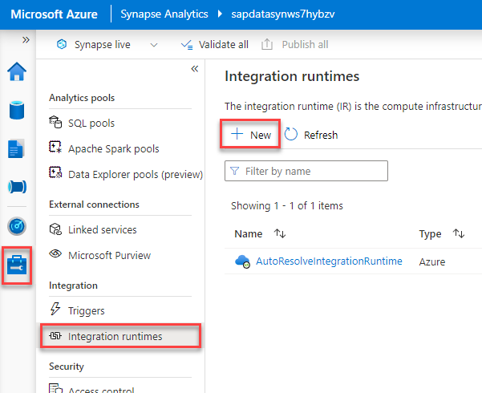

5. On the Integration runtime setup blade, select the **Azure, Self-Hosted** card. Select **Continue**.

    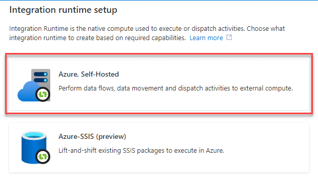

6. Select **Self-Hosted** as the network environment. Select **Continue**.

    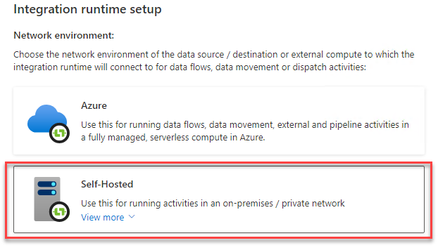  

7. Enter `SAPVM-SHIR` in the Name field and select **Create**.

    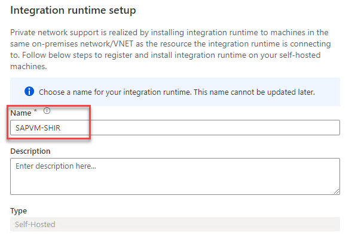

8. Select the link below the **Option 1: Express setup** header. This will download an executable file.

    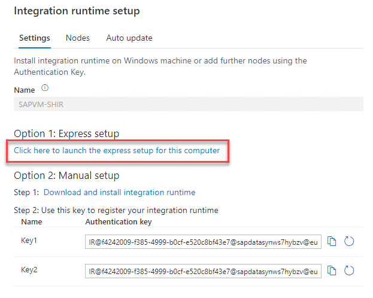

9. Run the downloaded executable. The Express Setup will download, install, and register the self-hosted integration runtime. Select the **Close** button once all the steps have completed.

    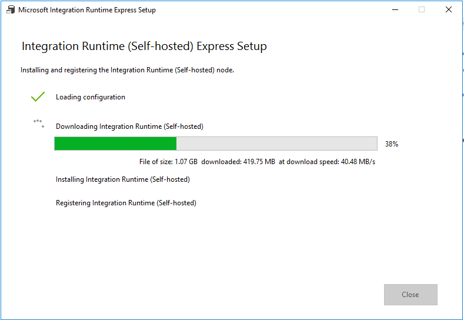

10. Close the Integration runtime setup blade.

11. The Integration runtimes list should now display **SAPVM-SHIR** in the list.

    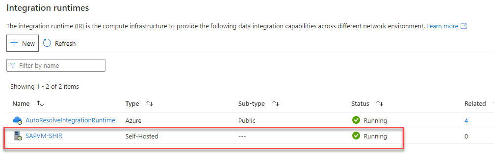

12. Optionally close Chrome and minimize the SAP VM.

## Exercise 2: Ingest sales order information from SAP into Azure Synapse Analytics

Estimated time: 35 minutes

Historical sales order information resides in S/4HANA and is exposed with OData services. The self-hosted integration runtime installed on the SAP virtual machine enables connectivity between Azure Synapse Analytics and S/4HANA, this will allow for local web calls to take place to the OData endpoints to retrieve sales data.

### Task 1: Create dedicated SQL pool tables to hold sales data

1. In Synapse Studio, select the **Develop** hub from the left menu, then expand the **+** menu from the center pane and choose **SQL script**.

    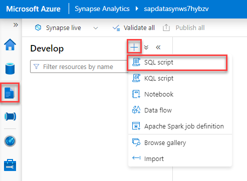

2. In the SQL script tab, choose to connect to the **sapdatasynsql** dedicated SQL pool in the toolbar menu.

    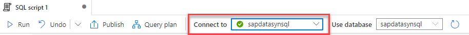

3. In the SQL script editor, paste and run the following SQL command to create the SalesOrderHeaders table. The **Run** button is located in the SQL script toolbar menu.

    ```SQL
    CREATE TABLE SalesOrderHeaders(
        BILLINGCOMPANYCODE nvarchar(4),
        BILLINGDOCUMENTDATE date,
        COUNTRY nvarchar(3),
        CREATIONDATE date,
        CREATIONTIME time,
        CREDITCONTROLAREA nvarchar(4),
        CUSTOMERACCOUNTGROUP nvarchar(4),
        CUSTOMERGROUP nvarchar(2),
        CUSTOMERNAME nvarchar(80),
        DISTRIBUTIONCHANNEL nvarchar(2),
        LASTCHANGEDATE date,
        LASTCHANGEDATETIME datetimeoffset,       
        ORGANIZATIONDIVISION nvarchar(2),
        PRICINGDATE date,
        PURCHASEORDERBYCUSTOMER nvarchar(35),
        SALESDISTRICT nvarchar(6),
        SALESDOCUMENT nvarchar(10) NOT NULL,
        SALESDOCUMENTPROCESSINGTYPE nvarchar(1),
        SALESDOCUMENTTYPE nvarchar(4),
        SALESGROUP nvarchar(3),
        SALESOFFICE nvarchar(4),
        SALESORGANIZATION nvarchar(4),
        SDDOCUMENTCATEGORY nvarchar(4),
        SOLDTOPARTY nvarchar(10),
        TOTALNETAMOUNT decimal(15, 2),
        TRANSACTIONCURRENCY nvarchar(5),
        CITYNAME nvarchar(35),
        POSTALCODE nvarchar(10)
    )
    ```

4. Replace the code in the script window with the following command to create the SalesOrderItems table. Run this script.

    ```SQL
    CREATE TABLE SalesOrderItems(
        SalesOrder nvarchar(10),
        SalesOrderItem nvarchar(6),
        SalesOrderItemText nvarchar(40),
        SoldToParty nvarchar(10),
        MaterialByCustomer nvarchar(35),
        MaterialName nvarchar(40),
        Material nvarchar(40),
        ShipToParty nvarchar(10),
        FullName nvarchar(80),
        SDProcessStatus nvarchar(1),
        DeliveryStatus nvarchar(1),
        SDDocumentRejectionStatus nvarchar(1),
        SalesDocumentRjcnReason nvarchar(2),
        RequestedQuantity decimal(15,3),
        RequestedQuantityUnit nvarchar(3),
        TransactionCurrency nvarchar(5),
        NetAmount decimal(16, 3),
        MaterialGroup nvarchar(9),
        Batch nvarchar(10),
        ProductionPlant nvarchar(4),
        StorageLocation nvarchar(4),
        ShippingPointName nvarchar(30),
        ShippingPoint nvarchar(4),
        SalesOrderItemCategory nvarchar(4),
        BillingBlockCriticality tinyint,
        ItemBillingBlockReason nvarchar(2),
        OrderRelatedBillingStatus nvarchar(1),
        RequestedDeliveryDate date,
        HigherLevelItem nvarchar(6),
        SalesOrderProcessingType nvarchar(1),
        RequirementSegment nvarchar(40)
    )
    ```

### Task 2: Create a linked service to the SAP OData endpoint for sales order header information

A linked service describes connectivity to external resources. In this case, an authenticated OData-based linked service is required to pull sales order data from SAP.

1. In Synapse Studio, select the **Manage** hub, then choose **Linked services** from the center menu. Select **+ New** in the Linked services screen toolbar menu.

    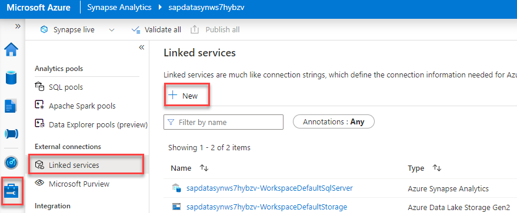

2. In the New linked service blade, search for and select **OData**. Select **Continue**.

    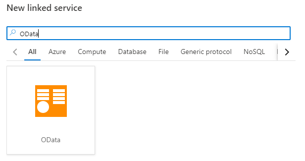

3. Fill the New linked service form as follows, then test connection. Select **Create**.

    | Field | Value |
    |-------|-------|
    | Name | Enter `sap_salesorderheader_odata`. |
    | Connect via integration runtime | Select **SAPVM-SHIR**. |
    | Service URL | Use the SAP OData URL recorded in the Before the hands-on lab steps. |
    | Authentication type | Select **Basic authentication**. |
    | User name | Enter `S4H_EXT`. |
    | Password | Enter `Welcome1`. |

    

### Task 3: Create a linked service to the SAP OData endpoint for sales order item information

1. In Synapse Studio, select the **Manage** hub, then choose **Linked services** from the center menu. Select **+ New** in the Linked services screen toolbar menu.

    

2. In the New linked service blade, search for and select **OData**. Select **Continue**.

    

3. Fill the New linked service form as follows, then test connection. Select **Create**.

    | Field | Value |
    |-------|-------|
    | Name | Enter `sap_salesorderitems_odata`. |
    | Connect via integration runtime | Select **SAPVM-SHIR**. |
    | Service URL | Use the SAP OData URL recorded in the from the Before the hands-on lab steps. Replace **ZBD_I_SALESDOCUMENT_E_CDS** with `sd_f1814_so_fs_srv` in the URL value. |
    | Authentication type | Select **Basic authentication**. |
    | User name | Enter `S4H_EXT`. |
    | Password | Enter `Welcome1`. |

    

### Task 4: Create a linked service to the dedicated SQL pool database

1. In Synapse Studio, select the **Manage** hub, then choose **Linked services** from the center menu. Select **+ New** in the Linked services screen toolbar menu.

    

2. In the New linked service blade, search for and select **Azure Synapse Analytics**. Select **Continue**.

    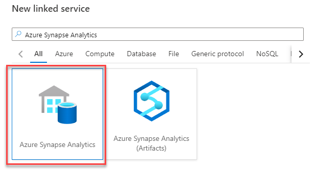

3. In the New linked service Azure Synapse Analytics blade, populate the form as follows then select **Create**.

    | Field | Value |
    |-------|-------|
    | Name | Enter `sales_order_data_sql`. |
    | Azure subscription | Select the Azure subscription for the lab. |
    | Server name | Select **sapdatasynws{SUFFIX}**. |
    | Database name | Select **sapdatasynsql**. |
    | Authentication type | Select **System Assigned Managed Identity**. |

    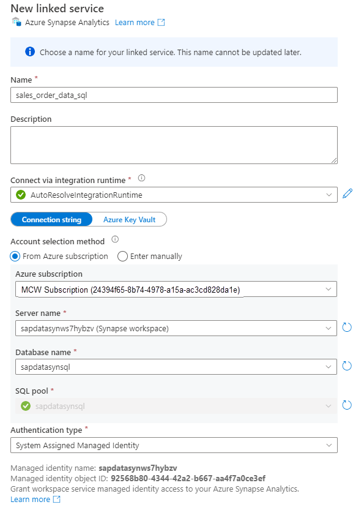

4. On the Synapse Studio toolbar menu, select **Publish all**. Select **Publish** on the verification blade.

    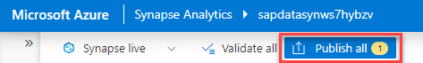

### Task 5: Create integration datasets for sales order header and sales order items

The Copy activity in Azure Synapse Analytics requires the usage of integration datasets to describe both the source and sink data sources. In this task, four integration datasets are defined representing sales order headers and sales order item data (source in S/4HANA OData and sink in dedicated SQL pool tables).

1. In Synapse Studio, select the **Data** hub from the left menu and expand the **+** menu in the center pane. Select **Integration dataset**.

    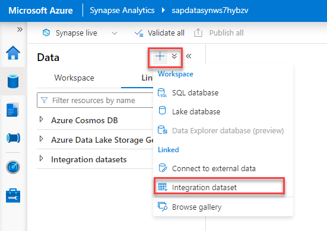

2. In the New integration dataset blade, search for and select **OData**

    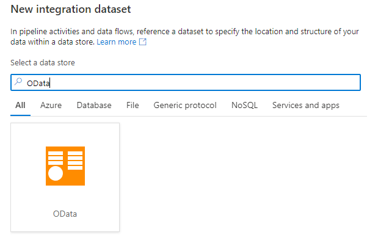

3. On the **Set properties** blade, fill the form as follows and select **OK**. This will create the integration dataset representing sales order header information.

    | Field | Value |
    |-------|-------|
    | Name | Enter `sales_order_headers_odata`. |
    | Linked service | Select **sap_salesorderheader_odata**. |
    | Path | Select **ZBD_I_Salesdocument_E**. |

    

4. Repeat steps 1 and 2 to create a new integration dataset. On the **Set properties** blade, fill the form as follows and select **OK**. This creates the integration dataset for sales item information.

    | Field | Value |
    |-------|-------|
    | Name | Enter `sales_order_items_odata`. |
    | Linked service | Select **sap_salesorderitems_odata**. |
    | Path | Select **C_Salesorderitemfs**. |

    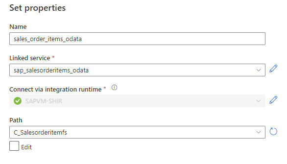

5. Now it is time to create the integration datasets for the sales order tables created in the dedicated SQL pool. In Synapse Studio, select the **Data** hub from the left menu and expand the **+** menu in the center pane. Select **Integration dataset**.

    

6. In the New integration dataset blade, search for and select **Azure Synapse Analytics**. Select **Continue**.

    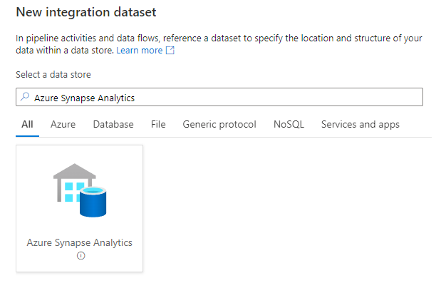

7. On the **Set properties** blade, populate the form as follows and select **OK**.

    | Field | Value |
    |-------|-------|
    | Name | Enter `sales_order_headers_sql`. |
    | Linked service | Select **sales_order_data_sql**. |
    | Table name | Select **dbo.SalesOrderHeaders**. |
    | Import schema | Select **From connection/store**. |

    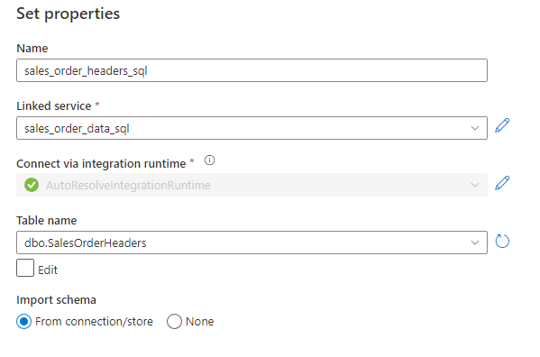

8. Repeat steps 5 and 6 to create a new Azure Synapse Analytics integration dataset. On the **Set properties** blade, populate the form as follows and select **OK**.

    | Field | Value |
    |-------|-------|
    | Name | Enter `sales_order_items_sql`. |
    | Linked service | Select **sales_order_data_sql**. |
    | Table name | Select **dbo.SalesOrderItems**. |
    | Import schema | Select **From connection/store**. |

    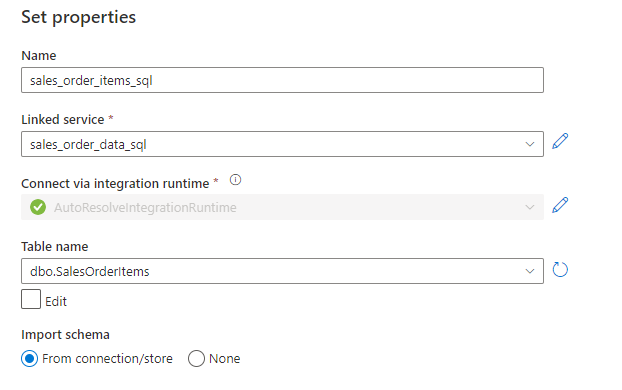

9. On the Synapse Studio toolbar menu, select **Publish all**. Select **Publish** on the verification blade.

    

### Task 6: Create a pipeline to ingest sales data from S/4HANA

An Azure Synapse Analytics pipeline can be used to move data from source to sink. The Copy data activity moves data from a source dataset to a sink dataset. This task creates a pipeline with two Copy data activities to move sales order header and sales order items data from S/4HANA into the dedicated SQL pool tables in Azure Synapse Analytics.

1. In Synapse Studio, select the **Integrate** hub from the left menu. Expand the **+** menu from the center pane, and choose **Pipeline**.

    

2. In the Properties blade, enter the name `IngestSalesOrderData`. Optionally collapse the Properties blade using the button on the toolbar of the pipeline.

    

3. From the Activities menu, expand the **Move & transform** section, then drag-and-drop a **Copy data** activity to the pipeline visual canvas. With the Copy data activity selected, enter `copy_sales_order_headers` in the **Name** field.

    

4. With the **copy_sales_order_headers** activity selected, select the **Source** tab. In the **Source dataset** tab, select **sales_order_headers_odata**.

    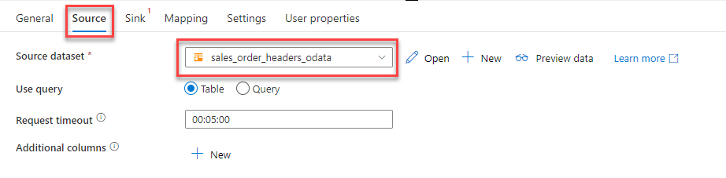

5. With the **copy_sales_order_headers** activity selected, select the **Sink** tab. Select **sales_order_headers_sql** as the Sink dataset, and **PolyBase** as the **Copy method**.

    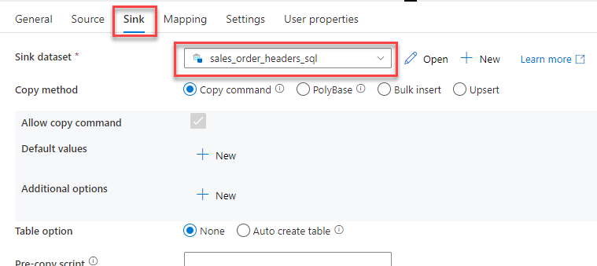

6. With the **copy_sales_order_headers** activity selected, select the **Mapping** tab. Select the **Import schemas** button to review the data mapping.

    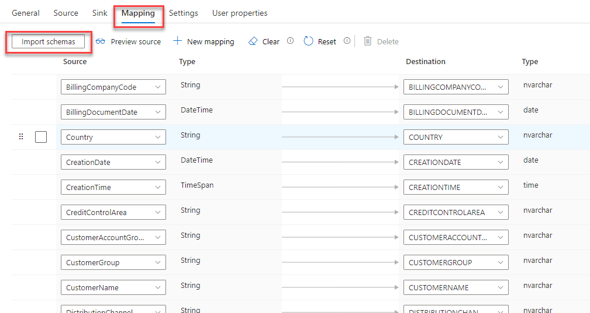

7. With the **copy_sales_order_headers** activity selected, select the **Settings** tab. Check the **Enable staging** checkbox, then select **datalake** for the **Staging account linked service** and enter `staging` in the **Storage Path** field.

    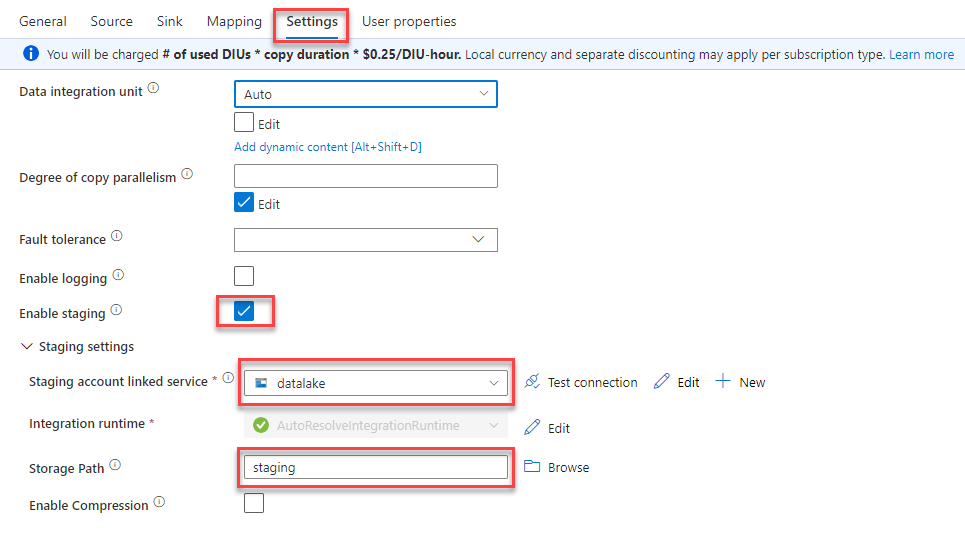

8. Drag-and-drop another instance of the Copy data activity to the pipeline visual canvas. On the **General** tab enter `copy_sales_order_items`.

   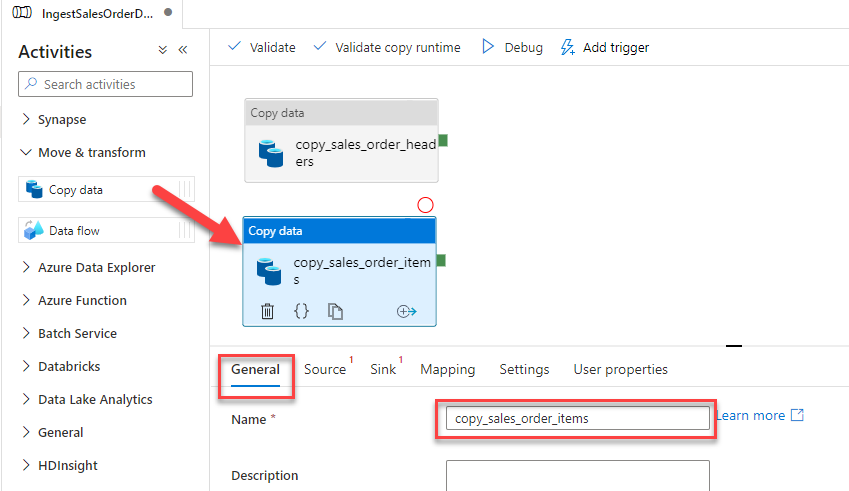  

9. With the **copy_sales_order_items** activity selected, select the **Source** tab. In the **Source dataset** tab, select **sales_order_items_odata**.

    

10. With the **copy_sales_order_items** activity selected, select the **Sink** tab. In the **Sink dataset** tab, select **sales_order_items_sql**.

    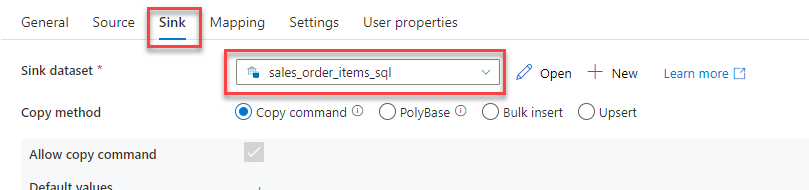

11. With the **copy_sales_order_items** activity selected, select the **Mapping** tab. Select the **Import schemas** button to review the mapping of the data fields.

    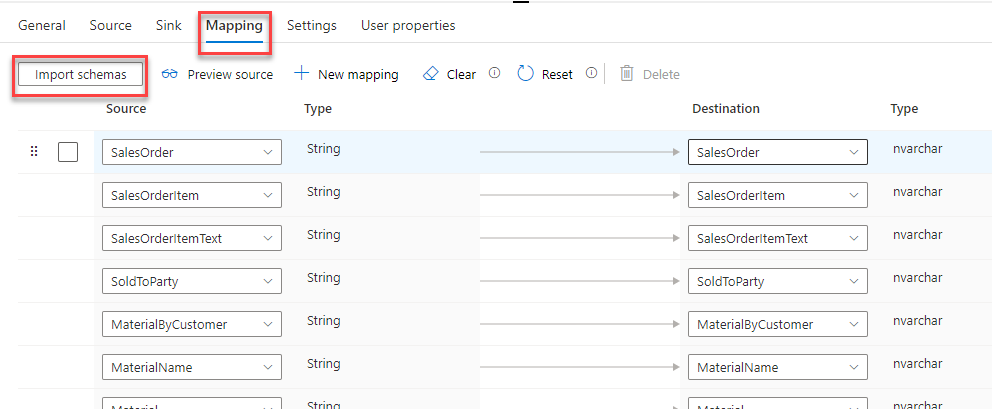

12. With the **copy_sales_order_items** activity selected, select the **Settings** tab. Check the **Enable staging** checkbox, then select **datalake** for the **Staging account linked service** and enter `staging` in the **Storage Path** field.

    

13. On the Synapse Studio toolbar menu, select **Publish all**. Select **Publish** on the verification blade.

    

14. Once published, expand the **Add trigger** item on the pipeline toolbar and select **Trigger now**. Select **OK** on the Pipeline run blade.

    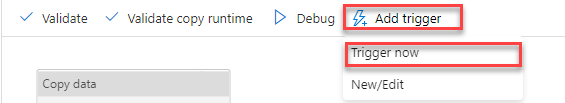

15. On the left menu of Synapse Studio, select the **Monitor** hub. Ensure **Pipeline runs** is selected from the center menu. Observe the IngestSalesOrderData pipeline status over time. Use the **Refresh** button to update the table.

    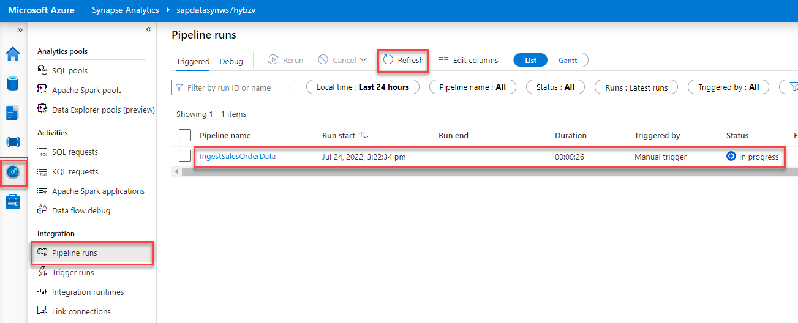

16. Upon successful completion of the pipeline run, verify data was copied by accessing the **Develop** hub from the left menu, expanding the **+** menu and selecting **SQL script**. In the **Connect to** field of the SQL script, select **sapdatasynsql**. In the query window, paste the following SQL commands and run the queries.

    ```sql
    select count(*) from SalesOrderHeaders;
    select count(*) from SalesOrderItems;
    ```

17. Toggle the **Select** drop down to view the results of each query executed. Ensure the values for each query are non-zero.

    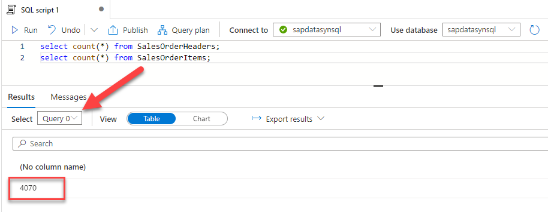  

## Exercise 3: Ingest payment information from Cosmos DB into Azure Synapse Analytics

Estimated time: 30 minutes

Payment history data is required when creating the cash flow prediction model. This data resides in Cosmos DB. In this exercise, a pipeline is created to move payment history data from a Cosmos DB collection into a table in a dedicated SQL pool in Azure Synapse Analytics. In the steps taken in the Before the hands-on lab steps, a linked service for Cosmos DB (payment_data_cosmosdb) and an integration dataset for the paymentData collection (payments_cosmosdb) were created. These assets will be reused in this exercise to implement the payment ingestion pipeline.

### Task 1: Create a dedicated SQL pool table to hold payment information

1. In Synapse Studio, select the **Develop** hub from the left menu, then expand the **+** menu from the center pane and choose **SQL script**.

    

2. In the SQL script tab, choose to connect to the **sapdatasynsql** dedicated SQL pool.

    

3. In the SQL script editor, paste and run the following SQL command to create the Payments table. The Run button is located in the SQL script toolbar menu.

    ```SQL
    CREATE TABLE Payments(
        PaymentNr nvarchar(10),
        SalesOrderNr nvarchar(10),
        CustomerNr nvarchar(10),
        CustomerName nvarchar(80),
        PaymentDate date,
        PaymentValue decimal(15,2),
        Currency nvarchar(5)
    )
    ```

### Task 2: Create the Payments table integration dataset

1. In Synapse Studio, select the **Data** hub from the left menu and expand the **+** menu in the center pane. Select **Integration dataset**.

    

2. In the New integration dataset blade, search for and select **Azure Synapse Analytics**. Select **Continue**.

    

3. On the **Set properties** blade, populate the form as follows and select **OK**.

    | Field | Value |
    |-------|-------|
    | Name | Enter `payments_sql`. |
    | Linked service | Select **sales_order_data_sql**. |
    | Table name | Select **dbo.Payments**. |
    | Import schema | Select **From connection/store**. |

    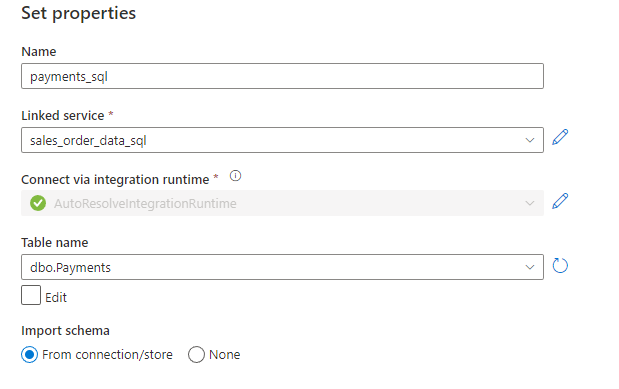

4. On the Synapse Studio toolbar menu, select **Publish all**. Select **Publish** on the verification blade.

    

### Task 3: Create the Payments ingestion pipeline

1. In Synapse Studio, select the **Integrate** hub from the left menu. Expand the **+** menu from the center pane, and choose **Pipeline**.

    

2. In the Properties blade, enter the name `IngestPaymentsData`. Optionally collapse the Properties blade using the button on the toolbar of the pipeline.

    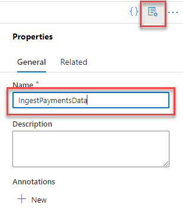

3. From the Activities menu, expand the **Move & transform** section then drag-and-drop a **Copy data** activity to the pipeline visual canvas. With the Copy data activity selected, enter **copy_payments_data** in the **Name** field.

    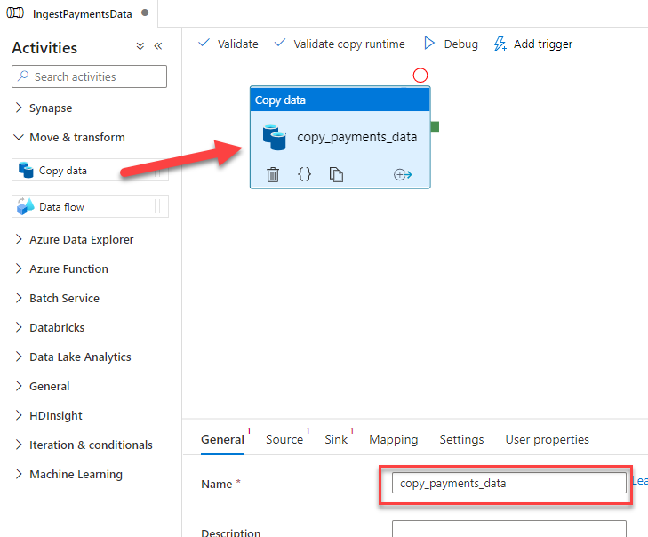

4. With the **copy_payments_data** Copy data activity selected, select the **Source** tab. Select **payments_cosmosdb** as the **Source dataset**.

    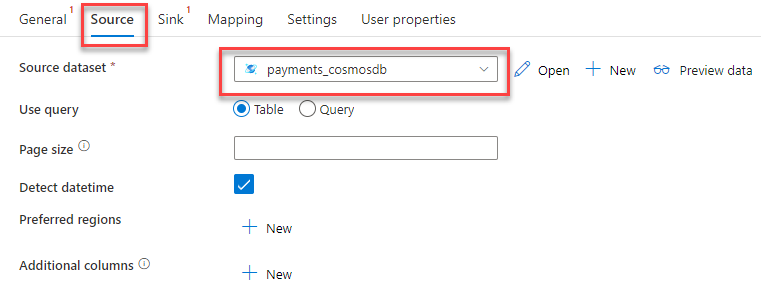

5. With the **copy_payments_data** Copy data activity selected, select the **Sink** tab. Select **payments_sql** as the Sink dataset.

    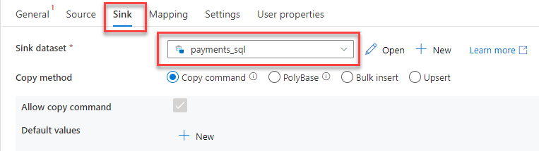

6. With the **copy_payments_data** Copy data activity selected, select the **Mapping** tab. Select the **Import schemas** button.

    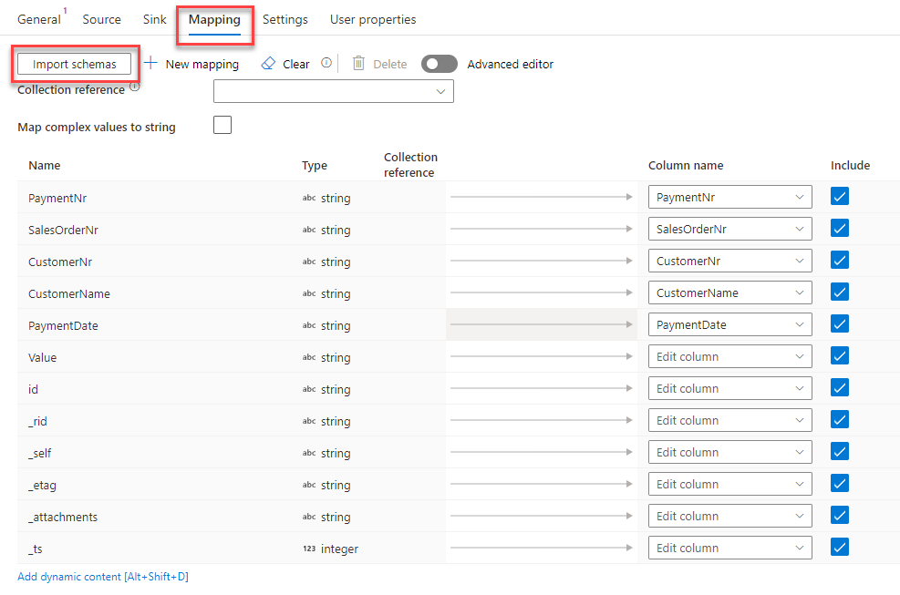

7. On the Mapping tab, locate the field with the name **Value**, and use the dropdown to assign it to the Column name **PaymentValue**. Uncheck the **Include** checkboxes for the **id** field as well as all the fields whose name is prefixed with and underscore (_).

    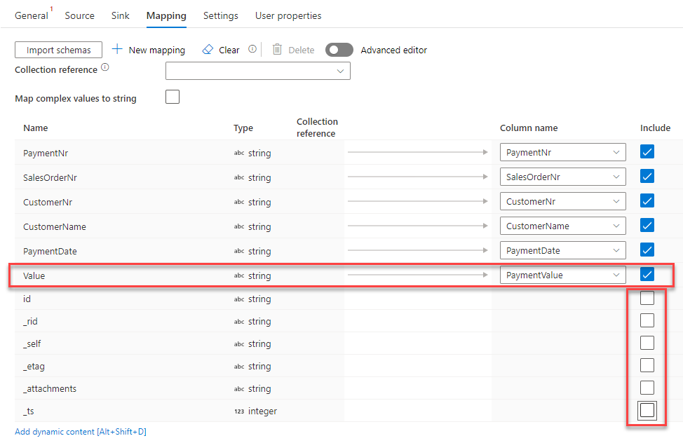

8. With the **copy_payments_data** Copy data activity selected, select the **Settings** tab. Check the **Enable staging** checkbox, then select **datalake** for the **Staging account linked service** and enter `staging` in the **Storage Path** field.

    

9. On the Synapse Studio toolbar menu, select **Publish all**. Select **Publish** on the verification blade.

    

10. Once published, expand the **Add trigger** item on the pipeline toolbar and select **Trigger now**. Select **OK** on the Pipeline run blade.

    

11. On the left menu of Synapse Studio, select the **Monitor** hub. Ensure **Pipeline runs** is selected from the center menu. Observe the IngestPaymentsData pipeline status over time. Use the **Refresh** button to update the table.

    

12. Upon successful completion of the pipeline run, verify data was copied by accessing the **Develop** hub from the left menu, expanding the **+** menu and selecting **SQL script**. In the **Connect to** field of the SQL script, select **sapdatasynsql**. In the query window, paste the following SQL command and run the query. Ensure the value returned is non-zero.

    ```sql
    select count(*) from Payments;
    ```

## Exercise 4: Prepare data for the incoming cashflow prediction model training

Estimated time: 30 minutes

Contoso Retail would like to take advantage of the historical sales order and payment data to create a machine learning model that predicts incoming cashflow. In this exercise, a Sales Order and Payments data are combined in a SQL view whose data is then stored as a parquet file in Azure Data Lake Storage Gen2.

### Task 1: Create a SQL view that combines sales orders with payments data

1. In Synapse Studio, select the **Develop** hub from the left menu, then expand the **+** menu from the center pane and choose **SQL script**.

    

2. In the SQL script tab, choose to connect to the **sapdatasynsql** dedicated SQL pool in the toolbar menu.

    

3. In the SQL script editor, paste and run the following SQL command to create the SalesPaymentsFull view that joins the SalesOrderHeaders and Payments data. The **Run** button is located in the SQL script toolbar menu.

   ```SQL
   CREATE VIEW [dbo].[SalesPaymentsFull]
        AS SELECT s.[SALESDOCUMENT]
        , s.[CUSTOMERNAME]
        , s.[CUSTOMERGROUP]
        , s.[BILLINGCOMPANYCODE]
        , s.[BILLINGDOCUMENTDATE]
        , p.[PaymentDate] as PAYMENTDATE
        , s.[CUSTOMERACCOUNTGROUP]
        , s.[CREDITCONTROLAREA]
        , s.[DISTRIBUTIONCHANNEL]
        , s.[ORGANIZATIONDIVISION]
        , s.[SALESDISTRICT]
        , s.[SALESGROUP]
        , s.[SALESOFFICE]
        , s.[SALESORGANIZATION]
        , s.[SDDOCUMENTCATEGORY]
        , s.[CITYNAME]
        , s.[POSTALCODE]
        , DATEDIFF(dayofyear, s.BILLINGDOCUMENTDATE, p.PaymentDate) as PAYMENTDELAYINDAYS
    FROM [dbo].[SalesOrderHeaders] as s
    JOIN [dbo].[Payments] as p ON REPLACE(LTRIM(REPLACE(s.[SALESDOCUMENT], '0', ' ')), ' ', '0') = p.[SalesOrderNr]
   ```

### Task 2: Move the view data to a parquet file in Azure Data Lake Storage Gen2

In this task, a pipeline is created to copy the SalesPaymentsFull view to a parquet file in storage. To implement this pipeline, two additional integration datasets are required, one that points to the SalesPaymentFull view, and one that points to the desired location of the parquet file in Azure Data Lake Storage Gen2.

1. In Synapse Studio, select the **Data** hub from the left menu and expand the **+** menu in the center pane. Select **Integration dataset**.

    

2. In the New integration dataset blade, search for and select **Azure Synapse Analytics**. Select **Continue**.

    

3. On the **Set properties** blade, populate the form as follows and select **OK**.

    | Field | Value |
    |-------|-------|
    | Name | Enter `sales_payments_full_sql`. |
    | Linked service | Select **sales_order_data_sql**. |
    | Table name | Select **dbo.SalesPaymentsFull**. |
    | Import schema | Select **From connection/store**. |

    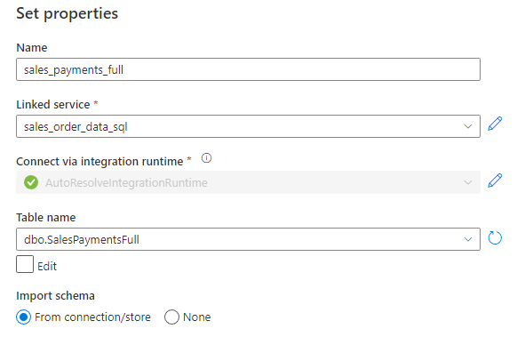

4. Expand the **+** menu in the center pane. Select **Integration dataset**.

    

5. In the New integration dataset blade, search for and select **Azure Data Lake Storage Gen2**. Select **Continue**.

    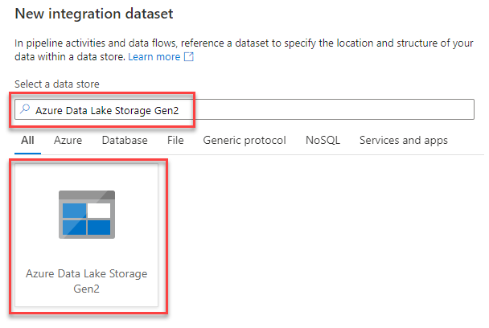

6. On the Select format blade, select **Parquet**. Select **Continue**.

   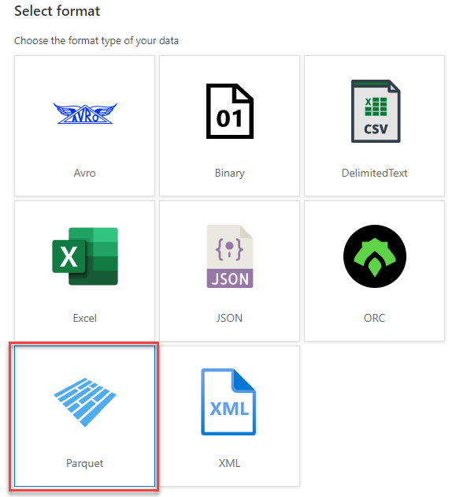

7. On the Set properties blade, complete the form as follows, then select **OK**.

    | Field | Value |
    |-------|-------|
    | Name | Enter `sales_payment_full_parquet`. |
    | Linked service | Select **datalake**. |
    | File path | Enter **sales-payment-parquet**. |
    | Import schema | Select **None**. |

    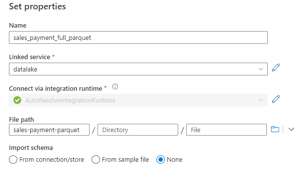

8. On the Synapse Studio toolbar menu, select **Publish all**. Select **Publish** on the verification blade.

    

9. In Synapse Studio, select the **Integrate** hub from the left menu. Expand the **+** menu from the center pane, and choose **Pipeline**.

    

10. In the Properties blade of the pipeline, name the pipeline **CreateSalesPaymentsParquet**. Optionally collapse the Properties blade.

    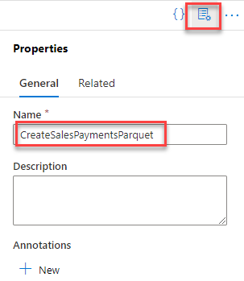

11. In the Activities menu, expand the **Move & Transform** section. Drag-and-drop the **Copy data** activity to the pipeline design canvas. In the General tab of the Copy data activity enter `CopySalesPaymentsAsParquet`.

    

12. With the Copy data activity selected, choose the **Source** tab. Select **sales_payments_full** as the **Source dataset**.

    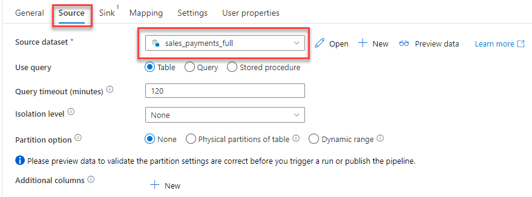

13. With the Copy data activity selected, choose the **Sink** tab. Select **sales_payment_full_parquet** as the **Sink dataset**.

    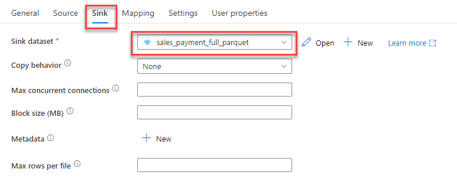

14. With the Copy data activity selected, choose the **Settings** tab. Check the **Enable staging** checkbox, then select **datalake** for the **Staging account linked service** and enter `staging` in the **Storage Path** field.

    

15. On the Synapse Studio toolbar menu, select **Publish all**. Select **Publish** on the verification blade.

    

16. Once published, expand the **Add trigger** item on the pipeline toolbar and select **Trigger now**. Select **OK** on the Pipeline run blade.

    

17. Use the **Monitor** hub to ensure the pipeline run successful completion.

    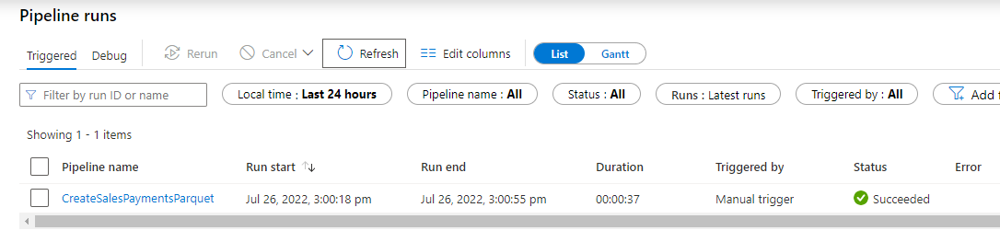

## Exercise 5: Train a regression model to predict incoming cashflow using Azure Machine Learning Studio

Estimated time: 50 minutes

### Task 1: Retrieve the access key for the Azure Data Lake Storage account

1. In the Azure Portal, open the lab resource group **mcw_sap_plus_extend_and_innovate** then search for and select the Storage account **sapadls{SUFFIX}**.

    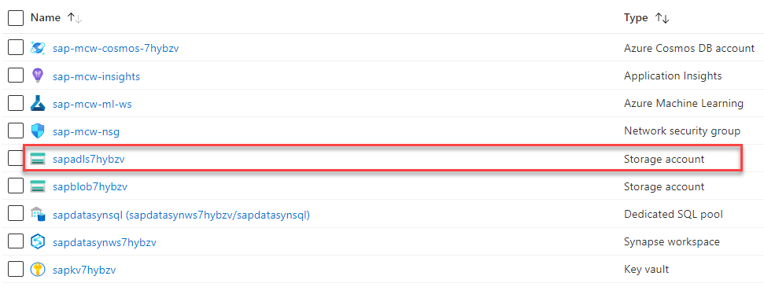

2. From the left menu, select **Access keys**. Below the **key1** heading, select the **Show** button next to the Key field. Use the Copy button in the field to record this value for a future task.

    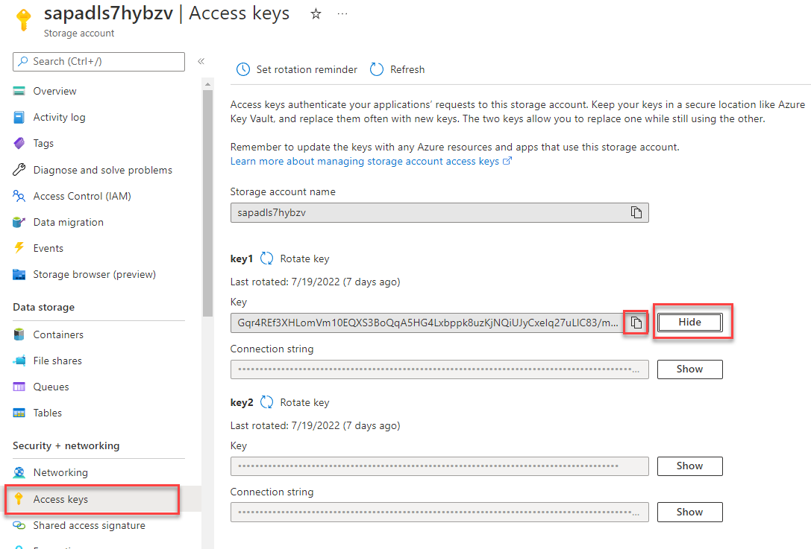

### Task 2: Create an Azure Machine Learning datastore

1. In the Azure Portal, open the lab resource group **mcw_sap_plus_extend_and_innovate** then search for and select the Azure Machine Learning resource **sap-mcw-ml-ws**.

    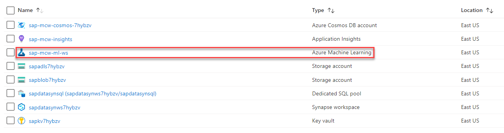

2. On the Azure Machine Learning Overview screen, select the **Studio web URL** to open the workspace.

    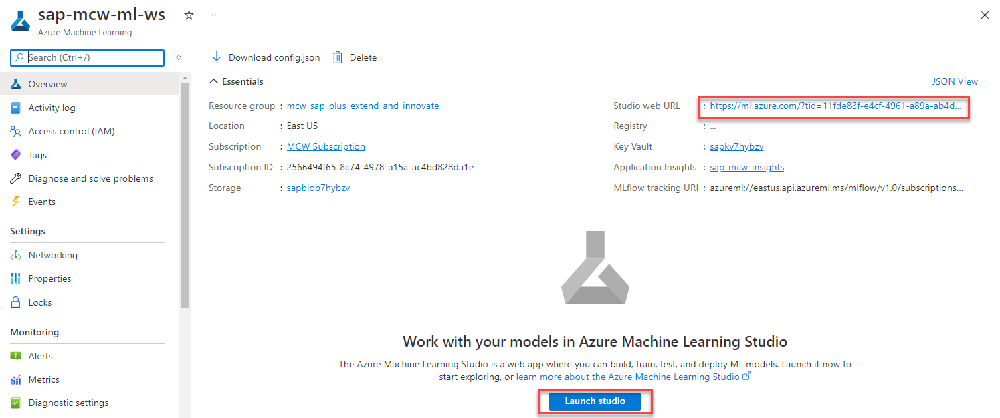

3. From the left menu, select **Datastores**.

   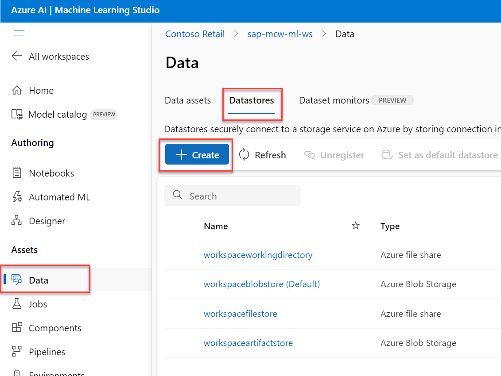

4. On the Datastores screen, select **+ New datastore** from the toolbar menu.

    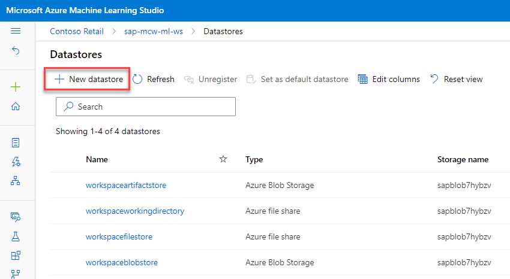

5. On the New datastore blade, fill the form as follows then select **Create**.

    | Field | Value |
    |-------|-------|
    | Datastore name | Enter `sales_payments_full_adls`. |
    | Datastore type | Select **Azure Blob Storage**. |
    | Account selection method | Select **From Azure subscription**. |
    | Subscription ID | Select the lab subscription. |
    | Storage account | Select **sapadls{SUFFIX}(mcw_sap_plus_extend_and_innovate)**. |
    | Blob container | Select **sales-payment-parquet** |
    | Save credentials with the datastore for data access | Select **Yes**. |
    | Authentication type | Select **Account key**. |
    | Account key | Enter the storage account key obtained in the previous task. |
    | Use workspace managed identity for data preview and profiling in Azure Machine Learning studio | Select **No**. |

    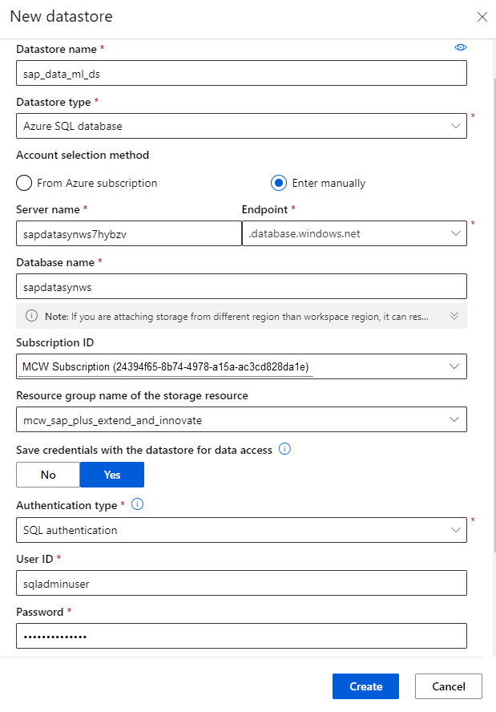

### Task 3: Create and run an Automated ML job

1. In Azure Machine Learning studio, select **Automated ML** from the left menu.

    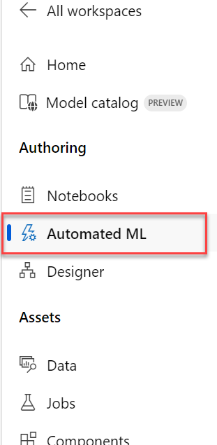

2. On the Automated ML screen, select **+ New Automated ML job** from the toolbar menu.

    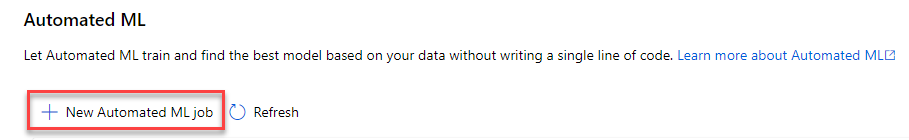

3. On the Create a new Automated ML job Select a data asset step, expand the **Create** menu and select **From datastore**.

    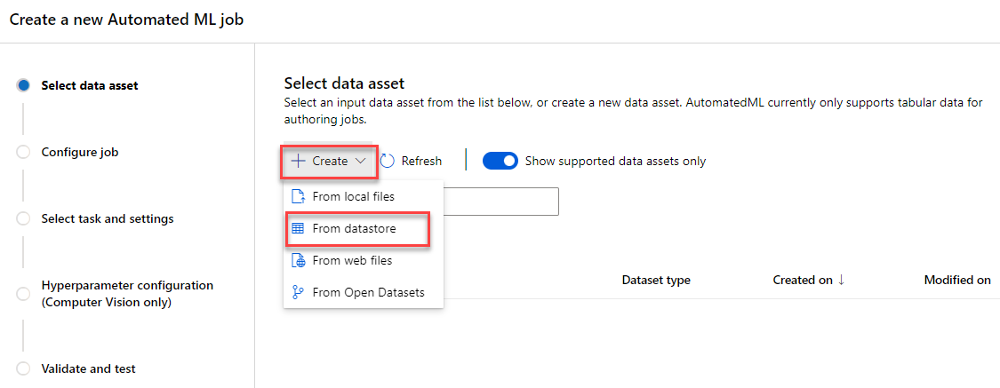

4. On the Create dataset from datastore blade Basic info step, name the dataset `sap-sales-payments-full`. Select **Next**.

    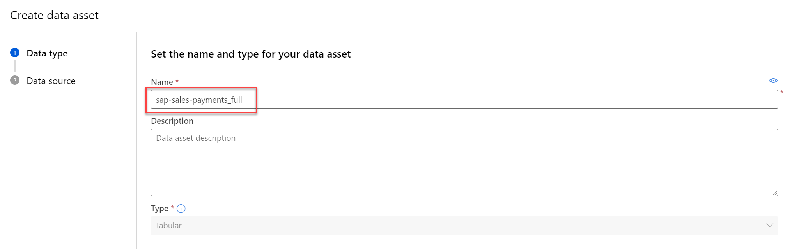

5. On the Create dataset from datastore blade Datastore selection step, select the **sales_payment_full_adls** datastore then use the **Browse** button to select **dbo.SalesPaymentsFull.parquet** file for the **Path** field. Select **Next**.

    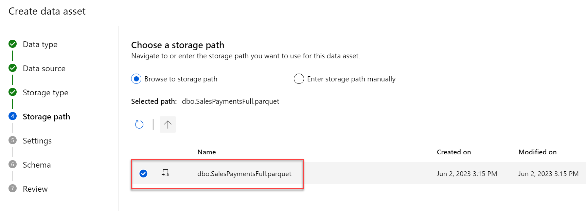  

6. On the Create dataset from datastore blade Settings and preview step, ensure you see data in the table, and select **Next**.

   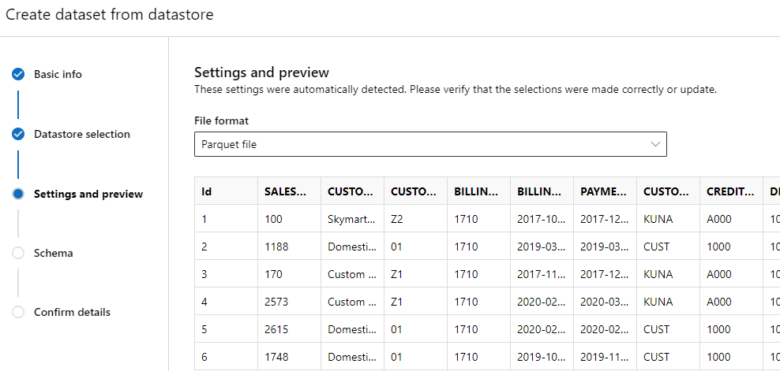

7. On the Create dataset from datastore blade Schema step, toggle the following fields off so that they are not included in the dataset then select **Next**:
   1. SALESDOCUMENT
   2. BILLINGDOCUMENTDATE
   3. PAYMENTDATE
   4. SALESGROUP
   5. SALESOFFICE

    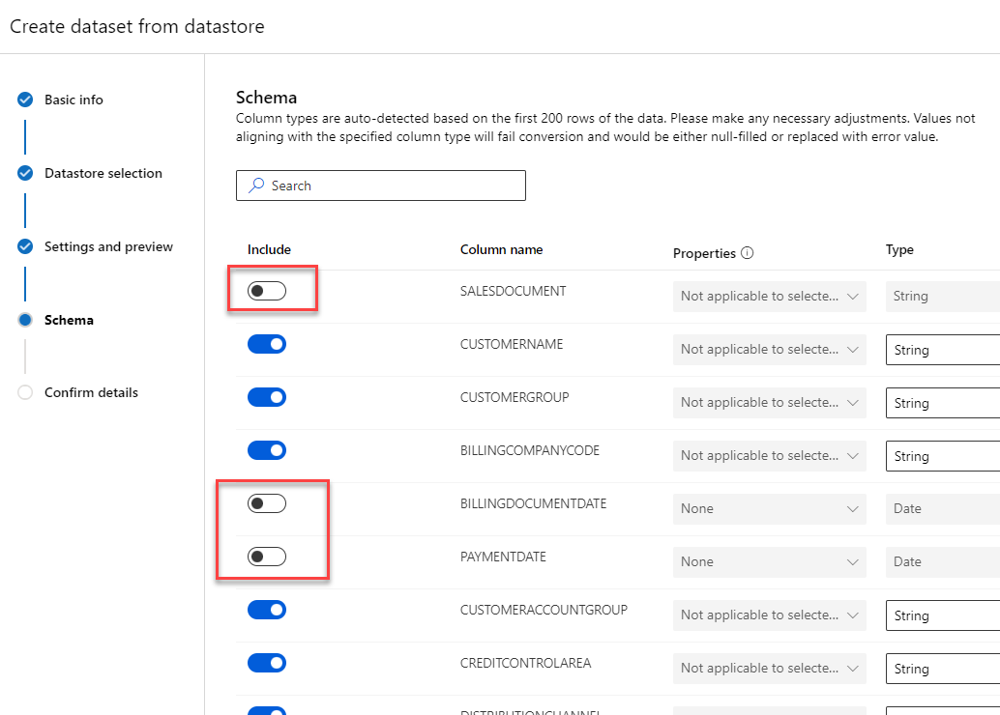

8. On the Create dataset from datastore blade Confirm details step, select **Create**.

9. On the Select data asset step of the Create a new Automated ML job screen, refresh the data asset table.

10. On the Select data asset step, select **sap-sales-payments-full** from the list and select **Next**.

    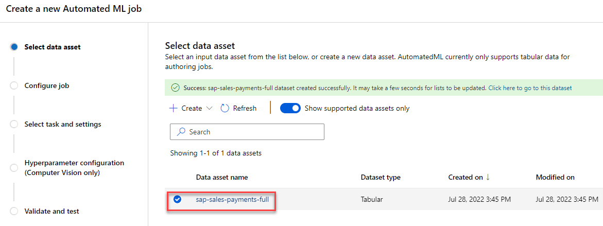

11. On the Configure job step, select the **+ New** button below the **Select Azure ML compute cluster** field.

    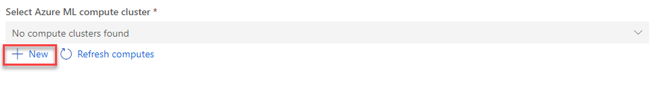

12. On the Create compute cluster blade Virtual machine step, accept the defaults and select **Next**.

13. On the Create compute cluster blade Advanced settings, fill the form as follows then select **Create**. It takes a few moments for the  

    | Field | Value |
    |-------|-------|
    | Compute name | Enter `automlcompute`. |
    | Maximum number of nodes | Enter `3`. |

    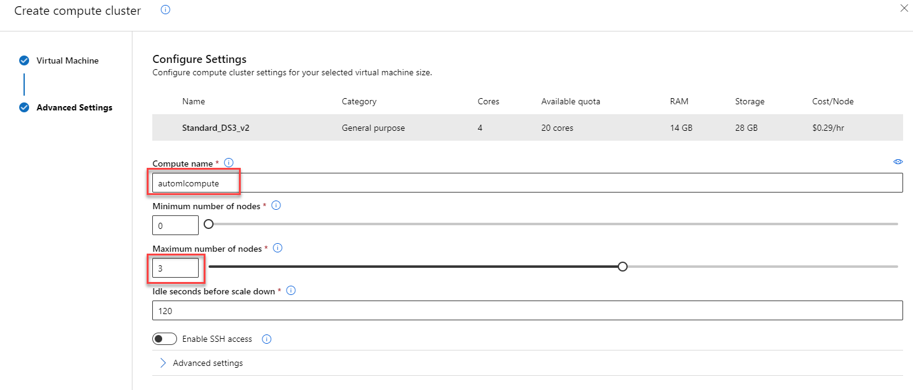

14. On the Configure job step, fill the form as follows, then select **Next**.

    | Field | Value |
    |-------|-------|
    | Experiment name | Enter `predict-incoming-cashflow`. |
    | Target column | Select **PAYMENTDELAYINDAYS**. |
    | Select compute type | Select **Compute cluster**. |
    | Select Azure ML compute cluster | Select **automlcompute**. |

    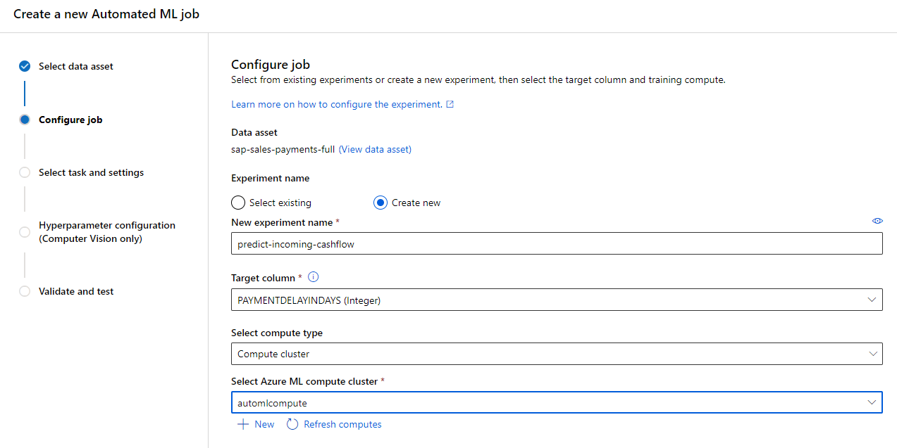

15. On the Select task and settings step, select **Regression**, then select **View additional configuration settings**.

    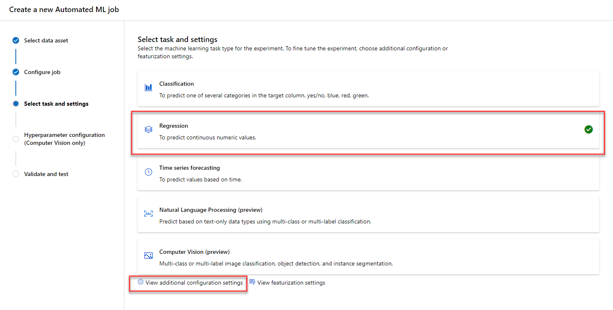

16. On the Additional configurations blade, select the Primary metric of **Normalized root mean squared error**, then expand the Blocked models drop down and check the following items and select **Save**. This will reduce the time to train the model.
    1. ElasticNet
    2. GradientBoosting
    3. KNN
    4. LassoLars
    5. SGD
    6. RandomForest
    7. ExtremeRandomTrees
    8. LightGBM
    9. FastLinearRegressor
    10. OnlineGradientDescentRegressor

    

17. Select **Next** on the Select task and settings step. On the Validate and test step, select **Finish**. The job is then created and opened in the browser. Use the **Refresh** button to monitor the current state.

    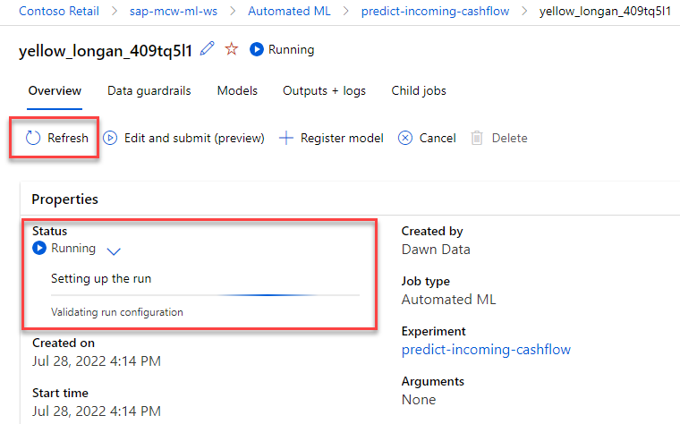

    > **Note**: Training will take approximately 15 minutes. Proceed to [Exercise 7](#exercise-7-visualize-historical-data-with-power-bi) and return here once completed.

### Task 4: Deploy the best model as a web service

1. Once the Automated ML job indicates a status of **Completed**, in the Best model summary card on the screen, select the link beneather the **Algorithm name** heading.

    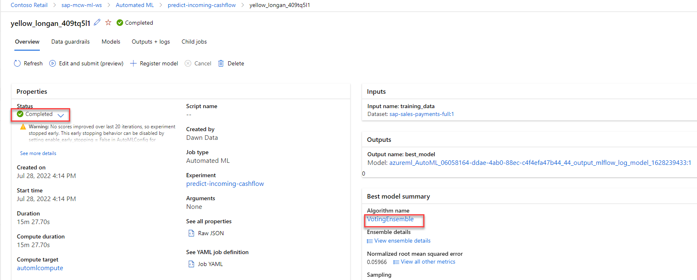

2. On the Model screen, expand the **Deploy** item in the toolbar menu and select **Deploy to web service**.

    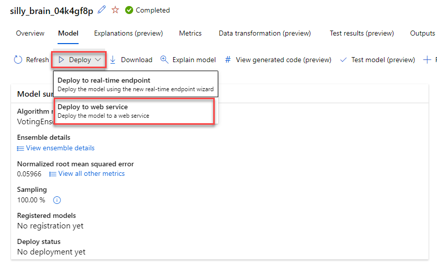

3. On the Deploy a model blade, fill the form as follows then select **Deploy**.

    | Field | Value |
    |-------|-------|
    | Name | Enter `predict-incoming-cashflow-svc`. |
    | Compute type | Select **Azure Container Instance**. |

    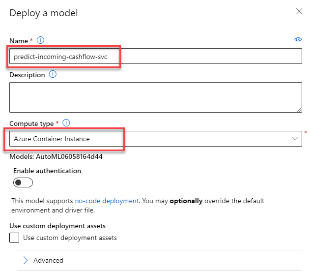

4. On the Model screen, monitor the Deploy status at the bottom of the Model summary card. It will indicate a status of **Completed** in a few minutes time.

    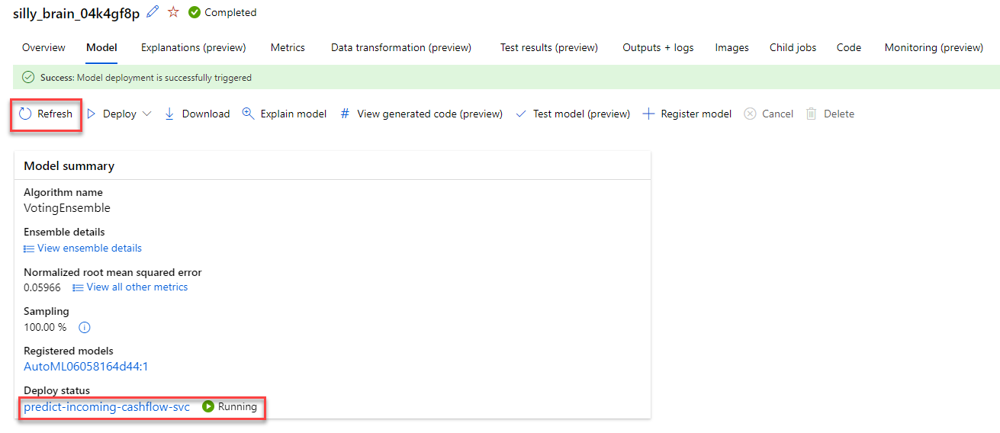

5. Select the link below **Deploy status** to go to the deployed service endpoint screen.

6. On the predict-incoming-cashflow-svc endpoint screen, select the **Test** tab. Replace the contents of the input data with the following and select **Test**.

    ```json
    {
        "Inputs": {
            "data": [
            { 
                "CUSTOMERNAME": "Westend Cycles",
                "CUSTOMERGROUP": "Z1",
                "BILLINGCOMPANYCODE": 1710,
                "CUSTOMERACCOUNTGROUP": "KUNA",
                "CREDITCONTROLAREA": "A000",
                "DISTRIBUTIONCHANNEL": 10,
                "ORGANIZATIONDIVISION": 0,
                "SALESDISTRICT": "US0003",
                "SALESORGANIZATION": 1710,
                "SDDOCUMENTCATEGORY": "C",
                "CITYNAME": "RALEIGH",
                "POSTALCODE": "27603"
            },
            { 
                "CUSTOMERNAME": "Skymart Corp",
                "CUSTOMERGROUP": "Z2",
                "BILLINGCOMPANYCODE": 1710,
                "CUSTOMERACCOUNTGROUP": "KUNA",
                "CREDITCONTROLAREA": "A000",
                "DISTRIBUTIONCHANNEL": 10,
                "ORGANIZATIONDIVISION": 0,
                "SALESDISTRICT": "US0004",
                "SALESORGANIZATION": 1710,
                "SDDOCUMENTCATEGORY": "C",
                "CITYNAME": "New York",
                "POSTALCODE": "10007"
            }
            ]
        },
        "GlobalParameters": 1.0
    }
    ```

    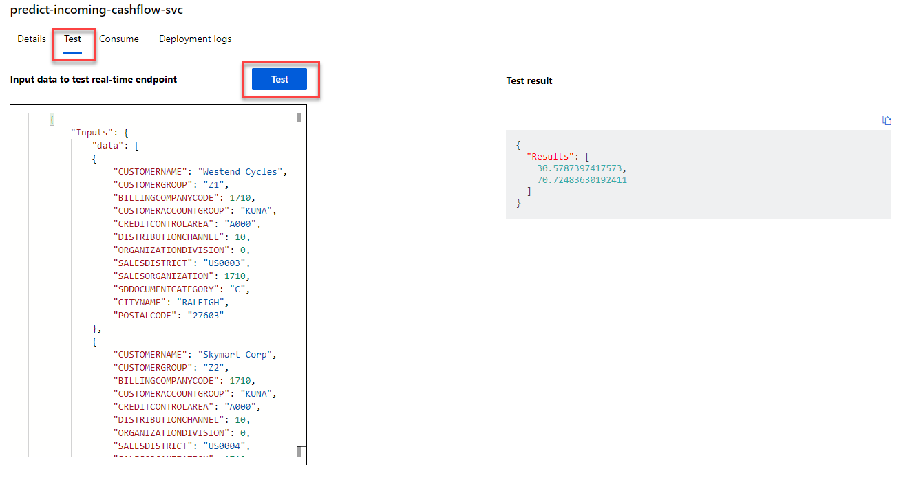

## Exercise 6: Train a regression model to predict incoming cashflow using Azure Synapse Analytics (OPTIONAL)

Estimated time: 50 minutes

### Task 1: Create the SalesPaymentsFull Spark table from the parquet file

1. In Synapse Studio, select the **Data** hub, then choose the **Linked** tab from the center pane. Expand the **Azure Data Lake Storage Gen2** item followed by the **datalake** account. Select the **sales-payment-parquet** container. In the data explorer tab, right-click on the **dbo.SalesPaymentsFull.parquet** and expand **New notebook** then choose the **New Spark table** item.

    

2. This will open a notebook with some code scaffolded. In the Notebook toolbar, select to Attach to **SparkPoolSmall**. In the code cell, change the table name that is being saved to `default.SalesPaymentsFull`. Select the **Run all** button from the toolbar. **Note**: It will take a few minutes for the Spark cluster to be provisioned.

    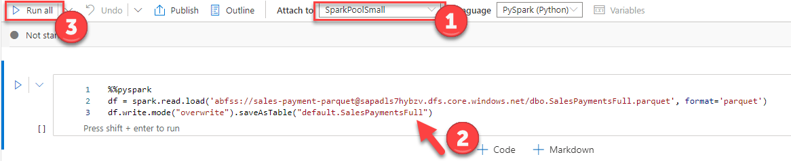

### Task 2: Create an Azure Machine Learning linked service

1. In Synapse Studio, select the **Manage** hub, then choose **Linked services** from the center menu. Select **+ New** in the Linked services screen toolbar menu.

    

2. In the New linked service blade, search for and select **Azure Machine Learning**. Select **Continue**.

    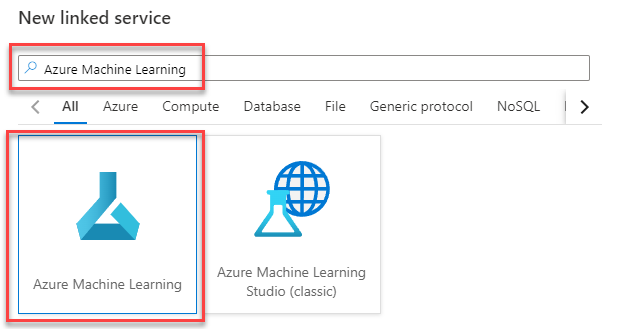

3. Fill the New linked service - Azure Machine Learning form as follows, then select **Create**.

    | Field | Value |
    |-------|-------|
    | Name | Enter `cashflow_aml`. |
    | Azure Subscription | Select the lab subscription. |
    | Azure Machine Learning workspace name | Select **sap-mcw-ml-ws** |

    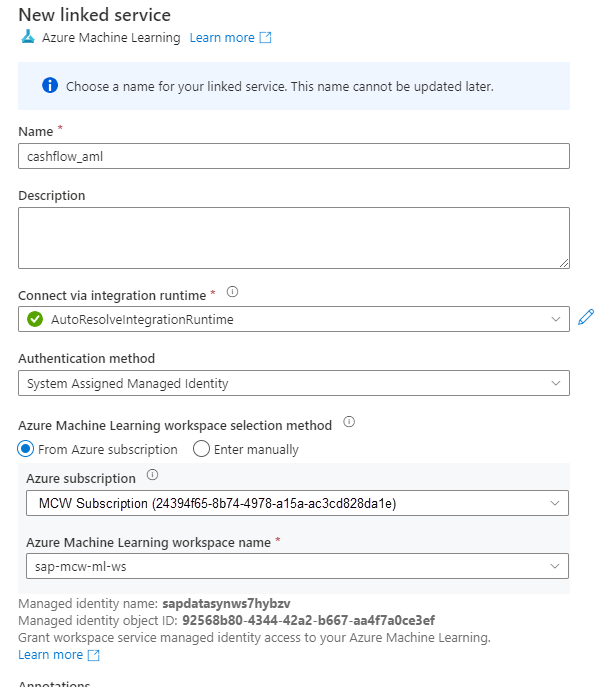

4. On the Synapse Studio toolbar menu, select **Publish all**. Select **Publish** on the verification blade.

    

### Task 3: Train a new regression model for incoming cash flow

1. In Synapse Studio, select the **Data** hub, select the **Workspace** tab. Expand the **Lake database** section. Expand the **default** database and **Tables**. Right-click on the **salespaymentsfull** table, and expand the **Machine Learning** item and choose **Train a new model**.

    

2. In the Train a new model blade, select **Regression** then **Continue**.

    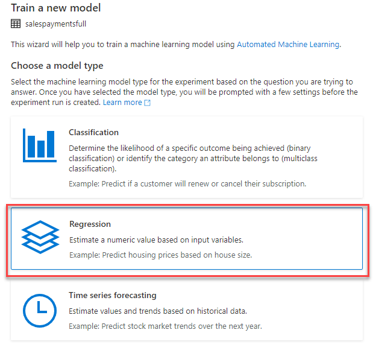

3. On the Train a new model (Regression) blade, select **PAYMENTDELAYINDAYS** for the **Target column** field. Ensure the Azure Machine Learning workspace is set to **sap-mcw-ml-ws** and the Apache Spark pool field is set to **SparkPoolSmall**. Select **Continue**.

    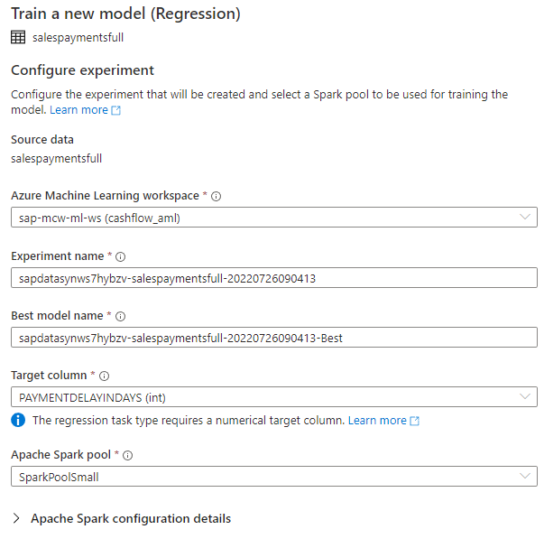

4. On the Train a new model (Regression) blade, select **Normalized root mean squared error** as the Primary metric and set the Maximum training job time (hours) to `0.25`. Enable the ONNX model compatibility option. Select **Open in notebook**.

    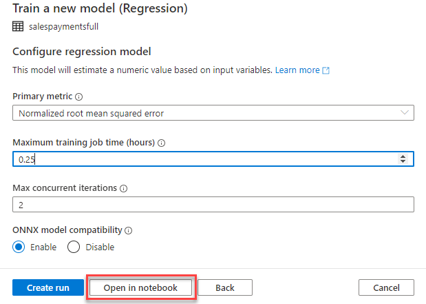

5. In the scaffolded notebook, change the SQL query in the third code cell (line 1) to the following. This will reduce the number of columns being used to train the model.

    ```SQL
    SELECT CUSTOMERNAME, CUSTOMERGROUP, BILLINGCOMPANYCODE, CUSTOMERACCOUNTGROUP,    CREDITCONTROLAREA, DISTRIBUTIONCHANNEL, ORGANIZATIONDIVISION, SALESDISTRICT,SALESORGANIZATION, SDDOCUMENTCATEGORY, CITYNAME, POSTALCODE, PAYMENTDELAYINDAYS FROM default.salespaymentsfull
    ```

    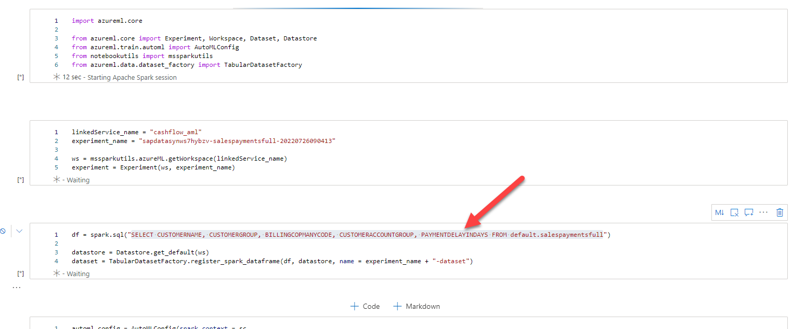

6. From the notebook toolbar menu, select **Run all** to execute all cells in the notebook. This notebook registers the dataset with Azure Machine Learning and creates an AutoML experiment to determine the best model to determine the incoming cashflow via predicting the payment delay in days. The best model is then registered with the Azure Machine Learning workspace.

    > **Note**: this notebook will run for approximately 20 minutes. Proceed to [Exercise 7](#exercise-7-visualize-historical-data-with-power-bi) and return here once completed.

7. Once the notebook has completed running, the output of the last cell will indicate the best model that is registered in the Azure Machine Learning workspace.

    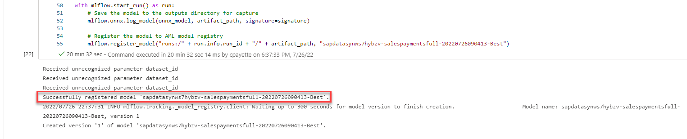  

### Task 4: Deploy and test the regression model in the dedicated SQL pool

1. In Synapse Studio, select the **Develop** hub from the left menu, then expand the **+** menu from the center pane and choose **SQL script**.

    

2. In the SQL script tab, choose to connect to the **sapdatasynsql** dedicated SQL pool in the toolbar menu.

    

3. In the SQL script editor, paste and run the following SQL command to create and populate a table with model test data. The **Run** button is located in the SQL script toolbar menu.

   ```SQL
   CREATE TABLE cashflow_prediction_tests
    (
        [CUSTOMERNAME] [nvarchar](80)  NULL,
        [CUSTOMERGROUP] [nvarchar](2)  NULL,
        [BILLINGCOMPANYCODE] [nvarchar](4)  NULL,
        [CUSTOMERACCOUNTGROUP] [nvarchar](4)  NULL,
        [CREDITCONTROLAREA] [nvarchar](4)  NULL,
        [DISTRIBUTIONCHANNEL] [nvarchar](2)  NULL,
        [ORGANIZATIONDIVISION] [nvarchar](2)  NULL,
        [SALESDISTRICT] [nvarchar](6)  NULL,
        [SALESORGANIZATION] [nvarchar](4)  NULL,
        [SDDOCUMENTCATEGORY] [nvarchar](4)  NULL,
        [CITYNAME] [nvarchar](35)  NULL,
        [POSTALCODE] [nvarchar](10)  NULL
    );

    INSERT INTO cashflow_prediction_tests VALUES ('Westend Cycles', 'Z1', '1710', 'KUNA','A000', '10', '0', 'US0003', '1710','C', 'RALEIGH', '27603');
    INSERT INTO cashflow_prediction_tests VALUES ('Skymart Corp', 'Z2', '1710', 'KUNA','A000', '10', '0', 'US0004', '1710','C', 'New York', '10007');
   ```

4. Select the **Data** hub from the left menu, ensure the **Workspace** tab is selected in the center pane. Expand **SQL database**, the **sapsynsql** database and the **Tables** items. Right-click the newly created **dbo.cashflow_prediction_tests** table and expand the **Machine Learning** item and select **Predict with a model**.

    

5. On the Predict with a model blade, select the pre-trained model that was created in the previous task then select **Continue**.

   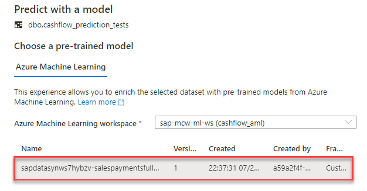

6. On the Predict with a model blade, keep all the mappings at their default values and select **Continue**.

    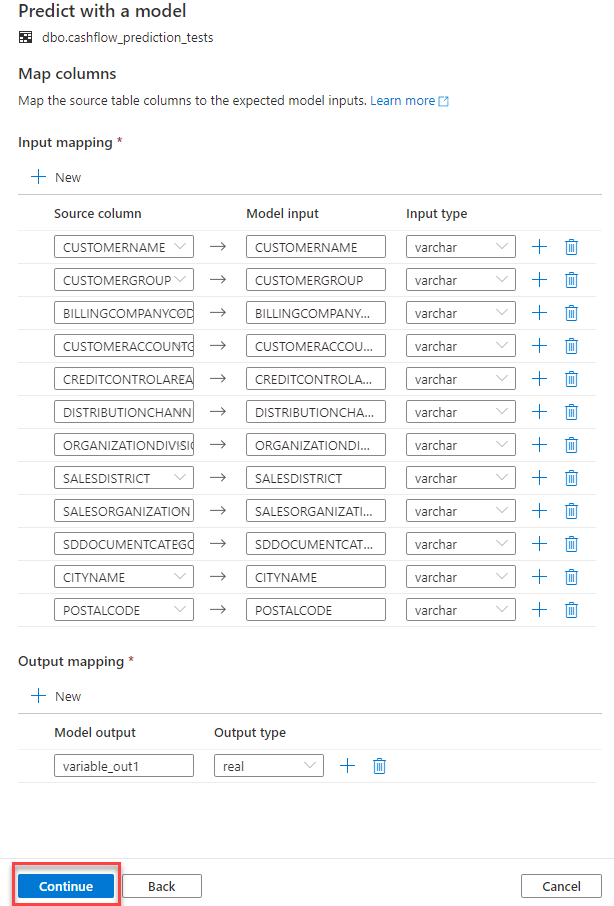

7. On the Predict with a model blade, fill the database form as follows then select **Deploy model + open script**. This will create a table to hold the trained models as well as encapsulate the calling of the model with a stored procedure.

    | Field | Value |
    |-------|-------|
    | Script type | Select **Stored procedure**. |
    | Stored procedure name | Enter `[dbo].[predict_cashflow]`. |
    | Database table | Select **Create new**. |
    | New table | Enter `[dbo].[ml_models]`. |

    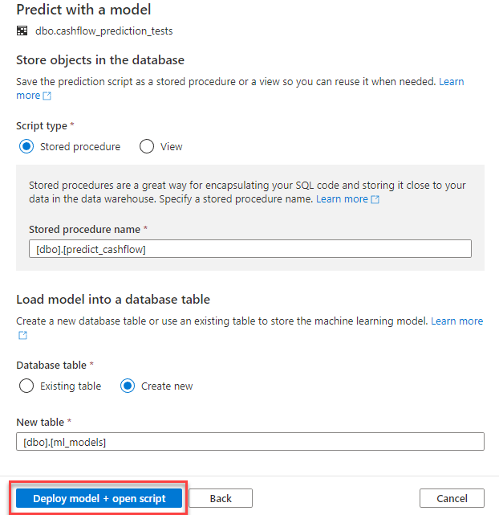

8. A script window opens with a query to create the stored procedure that leverages the trained regression model using the dbo.cashflow_prediction_tests table as input. At the end of the script the stored procedure is executed. The resulting values will include the predicted payment delay in days for each row in the **variable_out1** column. Execute the generated script and view the results.

    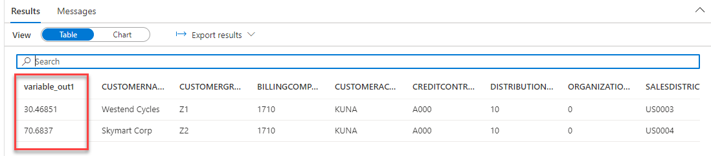

## Exercise 7: Visualize historical data with Power BI

Estimated time: 40 minutes

Contoso Retail would like to gain insights into historical sales order and payments data.

### Task 1: Retrieve the database connection information for the dedicated SQL pool

1. In Synapse Studio, open the **Manage** hub from the left menu, choose **SQL pools** from the center menu and select the **sapdatasynsql** dedicated SQL pool from the list.

    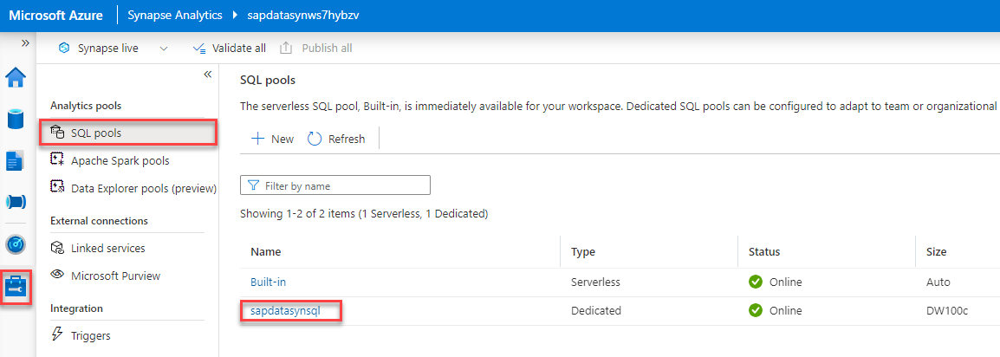

2. On the Properties blade, record the values for the **Name** and **Workspace SQL endpoint** fields.

    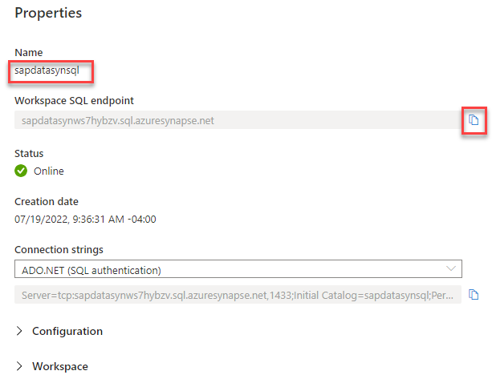

### Task 2: Import data into Power BI

1. Open **Power BI Desktop**. On the splash screen, select the **Get Data** item.

    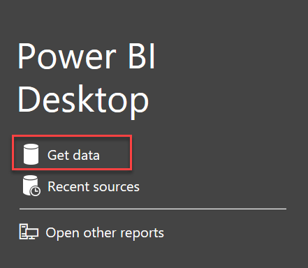

2. On the Get Data dialog, select **Azure** from the left menu and select **Azure Synapse Analytics SQL** from the listing. Select the **Connect** button.

    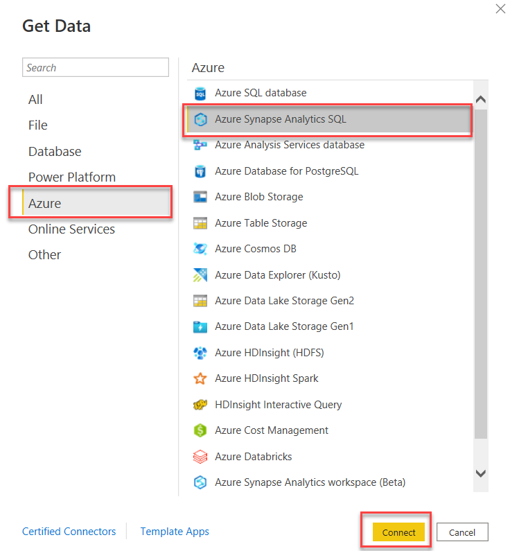

3. On the SQL Server database dialog, populate the form as follows and select **OK**.

    | Field | Value |
    |-------|-------|
    | Server | Enter the **Workspace SQL endpoint** value recorded in the previous task. |
    | Database | Enter the **Name** value recorded in the previous step. |
    | Data Connectivity mode | Select **Import**. |

    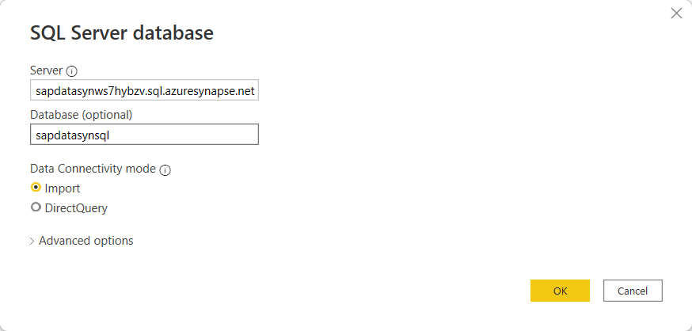

4. An authentication dialog displays, select **Microsoft account** from the left menu, then select the **Sign in** button. Authenticate with your Azure credentials.

    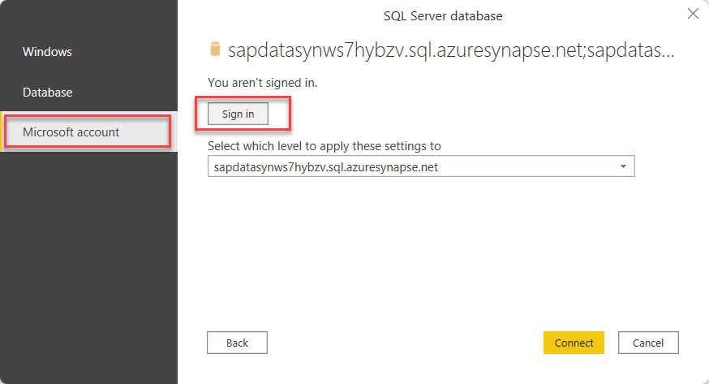

5. Once signed in, select the **Connect** button on the dialog.

6. On the Navigator dialog, check the box next to all three tables, then select the **Transform Data** button.

    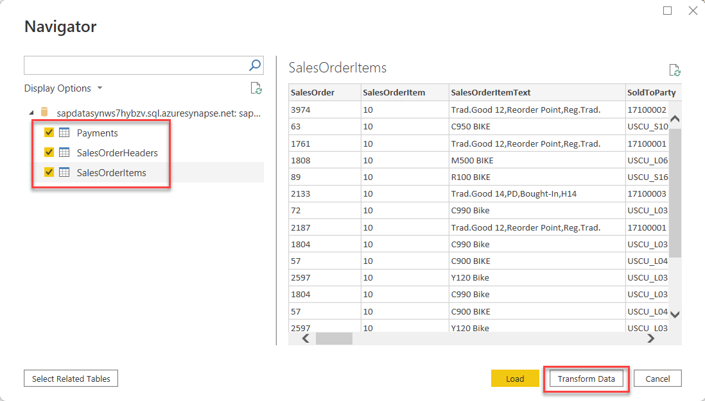

7. The columns in the tables representing sales order numbers were incorrectly interpreted as strings by Power BI. In the Power Query editor screen, select **SalesOrderItems** from the Queries pane, then right-click on the **SalesOrder** field and expand the **Change Type** item and choose **Whole Number**.

    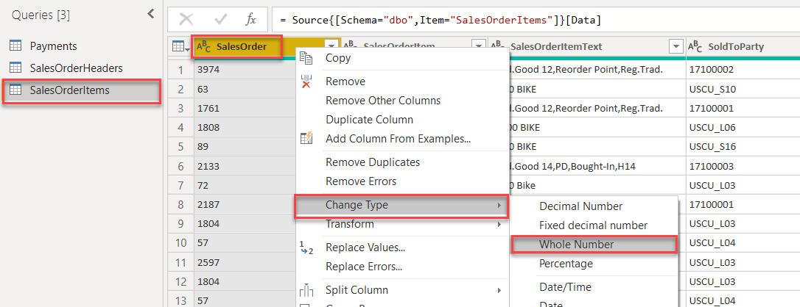

8. Repeat the previous step, this time changing the type of the following table columns to Whole Number.

    | Table (Queries pane) | Column |
    |-------|-------|
    | SalesOrderHeaders | SALESDOCUMENT |
    | Payments | SalesOrderNr |

9. Select **Close & Apply** in the Power Query editor toolbar.

    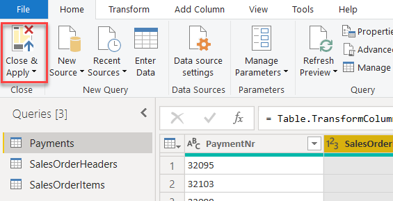

### Task 3: Create the relational model

1. From the left menu, select the **Model** item. This will switch to the Model view.

    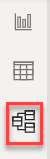

2. On the Model design canvas, drag the SALESDOCUMENT field from the SalesOrderHeaders table and drop it on the SalesOrder field of the SalesOrderItems table. This establishes a one-to-many relationship (1:*) between the tables.

    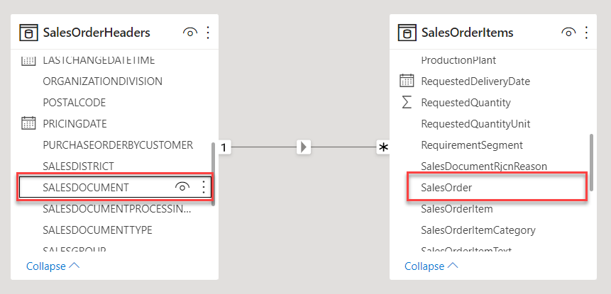

3. On the Model design canvas, drag the SalesOrderNr field from the Payments table and drop it on the SALESDOCUMENT field in the SalesOrderHeaders table. This establishes a one-to-one relationship (1:1) between the tables.

   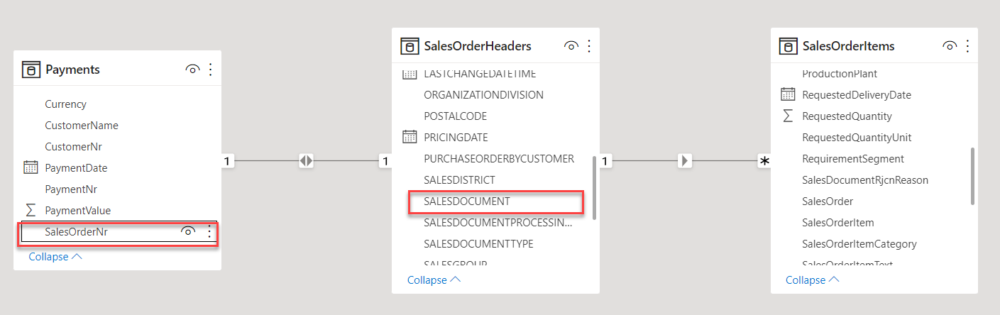

### Task 4: Create a sales per data and customer group visualization

1. In the Visualizations pane, select **Stacked column chart**.

2. From the **Fields** pane, drag-and-drop the SalesOrderHeaders.CREATIONDATE field to the X-axis box, the SalesOrderHeaders.TOTALNETAMOUNT field to the Y-axis box and the SalesOrderHeaders.CUSTOMERGROUP field to the Legend box.

    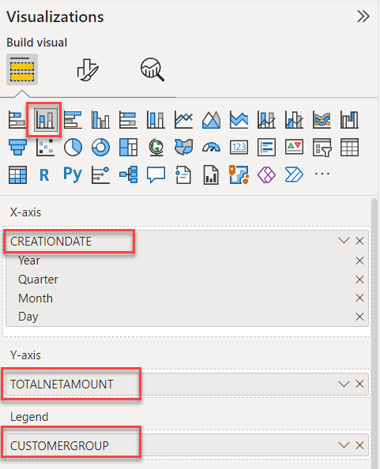

3. Adjust the sizing of the chart on the report canvas as desired.

    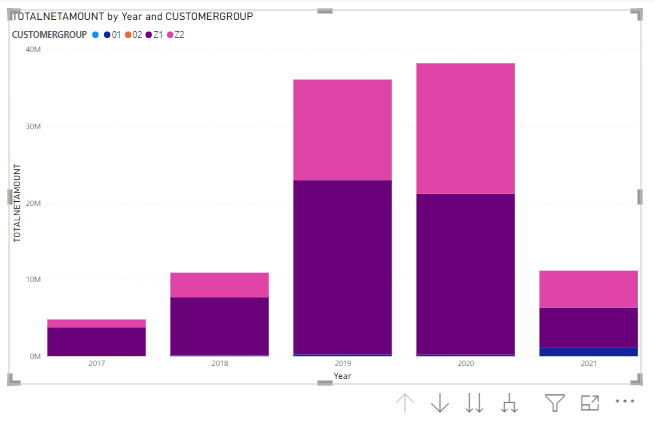

### Task 5: Create a sales per region and customer group visualization

1. In the Visualizations pane, select **Map**.

2. From the **Fields** pane, drag-and-drop the SalesOrderHeaders.CITYNAME field to the Location box, the SalesOrderHeaders.CUSTOMERGROUP field to the Legend box and the SalesOrderHeaders.TOTALNETAMOUNT to the Bubble size box.

   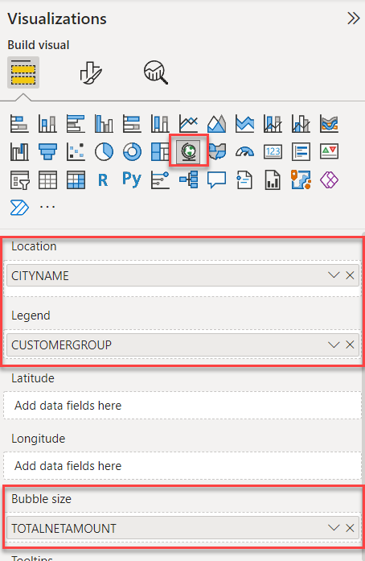

    > **Note**: Map visuals are disabled by default, access File -> Options and Settings -> Options -> Global - Security to enable. After updating Options in Power BI, you may need to close and reopen the report for the settings change to take effect.
    > 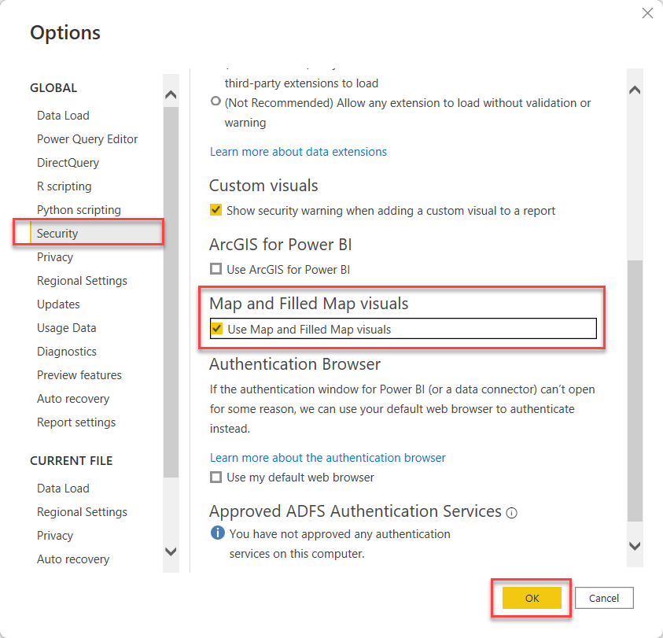

3. Adjust the sizing and zoom of the map on the report canvas as desired.

    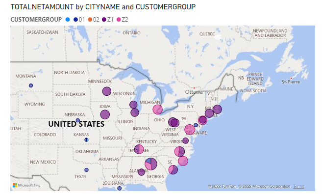

### Task 6: Create a payments per date and customer group visualization

1. In the Visualizations pane, select **Stacked Column Chart**.

2. From the **Fields** pane, drag-and-drop the Payments.PaymentDate field to the X-axis box, the Payments.PaymentValue field to the Y-axis box and the SalesOrderHeaders.CUSTOMERGROUP field to the Legend box.

    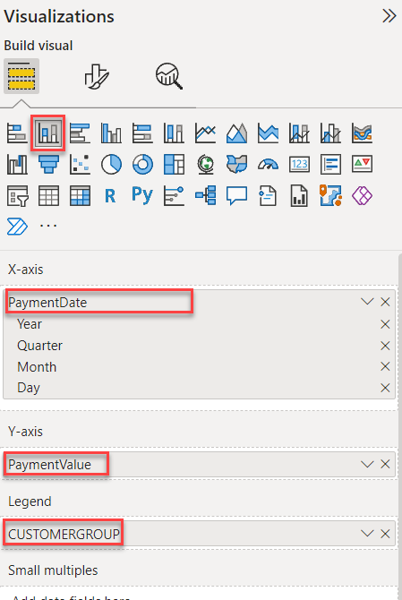

3. Adjust the sizing of the chart on the report canvas as desired.

    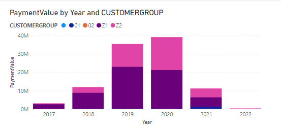

### Task 7: Create a sales per customer group and material group visualization

1. In the Visualizations pane, select **Stacked Bar Chart**.

2. From the **Fields** pane, drag-and-drop the SalesOrderHeaders.CUSTOMERGROUP field to the Y-axis box, the SalesOrderItems.NetAmount field to the Y-axis box and the SalesOrderItems.MaterialGroup field to the Legend box.

    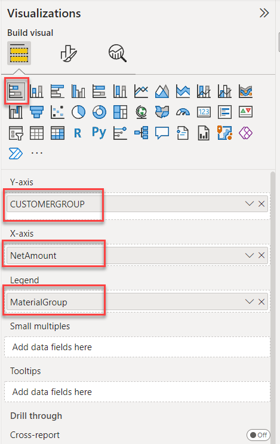

3. Adjust the sizing of the chart on the report canvas as desired.

    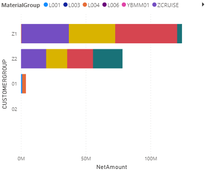

### Task 8: Create a payment offset per customer group visualization

This report shows the average number of days by which each customer group pays their SalesOrders. Afterwards a comparison can be made with the outcome of the Machine Learning Model built in the next exercise. SalesOrderHeaders and the Payment data are combined to calculate the number of days between the billing date and the payment date.

1. In Power BI Desktop, expand the **Transform data** item on Home tab toolbar menu. Select **Transform data**.

   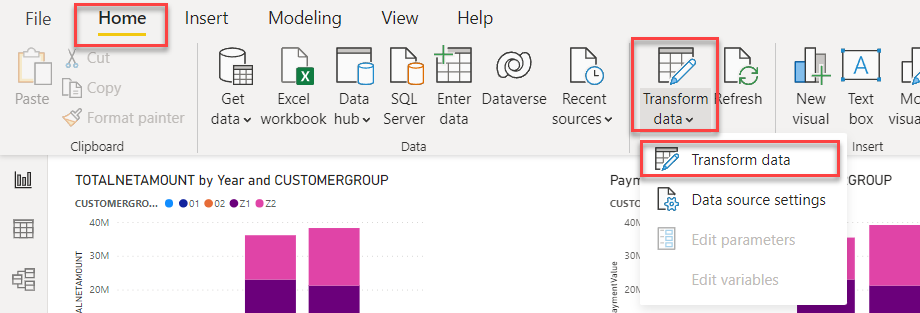

2. In the Power Query Editor window, select the **SalesOrderHeaders** table from the Queries pane, and expand the **Merge Queries** option on the Home toolbar menu. Select the **Merge Queries as New** option.

    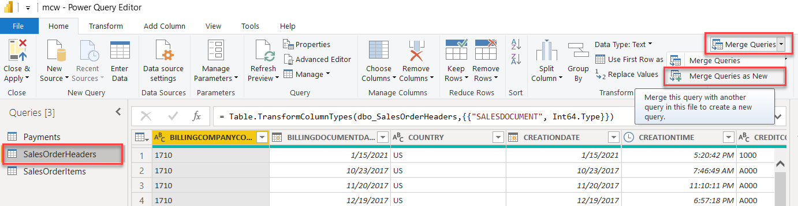  

3. In the Merge window, select the SALESDOCUMENT column of the SalesOrderHeaders table. Select the **Payments** table as the second table, and select the SalesOrderNr field. Select **OK**.

    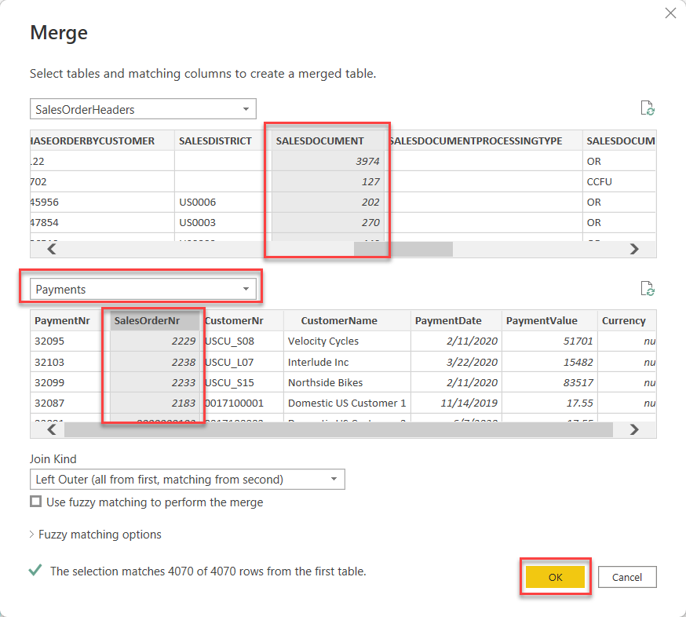

4. Rename the Merge query by right-clicking the Merge query in the Queries pane, and selecting **Rename**. Name the merged query **SalesOrderPayments**.

5. With the SalesOrderPayments query selected, scroll the table completely to the right. Expand the **Payments** column menu, and choose to include the following fields: **PaymentNr**, **PaymentDate**, **PaymentValue** and **Currency**. Select **OK**.

    

6. Select **Close & Apply** in the Power Query editor toolbar.

    

7. From the report designer, expand the **Transform data** item on Home tab toolbar menu. Select **Transform data**.

   

8. In the Power Query Editor window, select the **SalesOrderPayments** table from the Queries pane. A new column is required to calculate the difference between the billing date and the actual payment data. Select the **Add Column** tab and select the **Custom Column** button on the toolbar menu.

    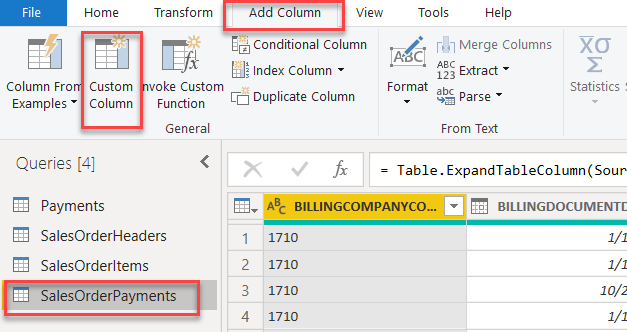

9. In the Custom Column window, enter `Offset` for the New column name. In the Custom column formula field, enter the following formula. Select **OK**.

    ```vb
    Duration.Days([PaymentDate] - [BILLINGDOCUMENTDATE])
    ```

    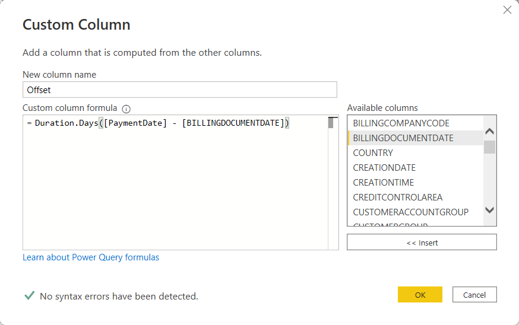

10. In the table, right-click on the newly created Offset field and expand the **Change Type** option. Select **WholeNumber** to convert this column to integer.

    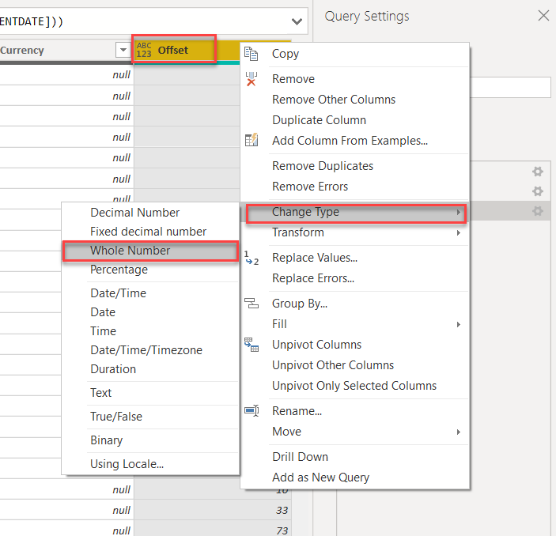

11. Return to the Home tab and select **Close & Apply** in the Power Query editor toolbar.

    

12. On the report canvas, add a **Stacked Column** chart. Drag-and-drop the SalesOrderPayments.CUSTOMERGROUP to the X-axis box and SalesOrderPayments.Offset to the Y-axis box. Expand the chevron menu next to the Offset column and choose to report the **Average**.

    

13. Adjust the sizing of the chart on the report canvas as desired.

    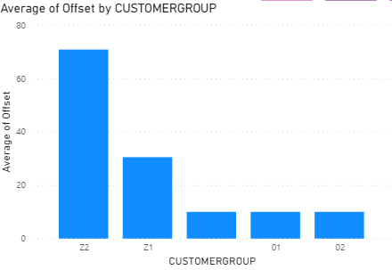

### Task 9: Create a payment offset per customer group box plot visualization (Optional)

A box plot can provide a more detailed view of the payment offset by customer group data.

1. In the Visualizations pane, expand the ellipsis menu and select **Get more visuals**.

    

2. On the Power BI visuals window, search for **Box and Whisker**. Then choose the **Box and Whisker chart** by DataScenarios.

    

3. On the AppSource window, select the **Add** button to add the Box and Whisker chart.

    

4. On the Visualizations pane, select the newly added **Box and Whisker** chart. In the Category field, drag-and-drop the SalesOrderPayments.CUSTOMERGROUP, SalesOrderPayments.Offset into the Sampling field, and SalesOrderPayments.Offset into the Value field. Expand the chevron menu in the Value field and select the **Average** option.

    

5. Adjust the sizing of the chart on the report canvas as desired.

    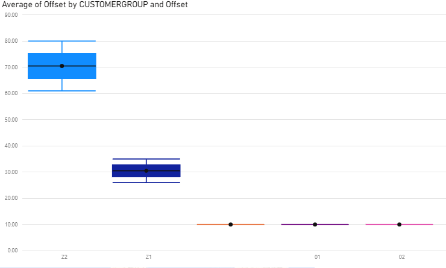

    > **Note**: From this diagram you can see that:

    > - CustomerGroup1 pays within 70 days +/- 10 days
    > - CustomerGroup2 pays within 30days +/- 5 days
    > - Other customergroups pay after 10 days

6. Keep this report open in Power BI desktop for future exercises.

## Exercise 8: Integrate Azure Machine Learning and Power BI

Estimated time: 25 minutes

Contoso retail would like to augment their Power BI report with data enriched with predictions from the machine learning model trained in [Exercise 5](#exercise-5-train-a-regression-model-to-predict-incoming-cashflow-using-azure-machine-learning-studio) to predict incoming cashflow.

### Task 1: Add the deployed model to the Power BI report

1. On the Power BI report, expand the **Transform data** item on Home tab toolbar menu. Select **Transform data**.

   

2. In the Power Query Editor window, select the **SalesOrderPayments** table from the Queries pane and select the **Azure Machine Learning** item from the Home toolbar menu.

    

3. In the Azure Machine Learning Models dialog, select the **AzureML.predict-incoming-cashflow-svc** item, then select **OK**.

    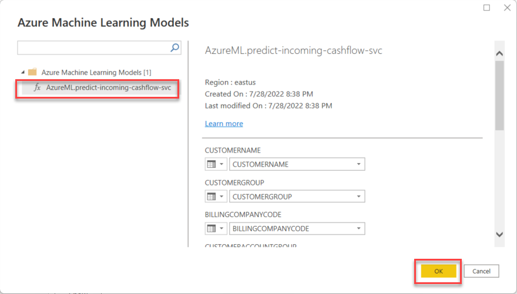

    > **Note**: If the **Information is required about data privacy** message appears, select **Continue**, then check the checkbox to Ignore Privacy Levels, select **Save**.

4. In the Power Query Editor, with the SalesOrderPayments table selected in the Queries pane, scroll all the way to the right of the displayed table. Right-click the **AzureML.predict-incoming-cashflow-svc** field menu and choose to rename the field `predOffset`.

    

5. Right-click the **predOffset** column, and expand the **Change Type** option and select **Whole Number**.

    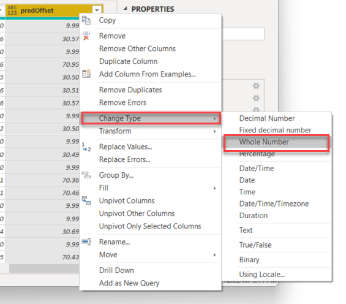

6. On the Power Query Editor, select the **Add Column** tab, select **Custom Column**.

    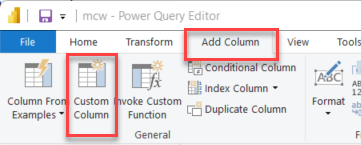

7. On the Custom Column dialog, name the new column `predPaymentDate` and set the formula to the following and select **OK**.

    ```vb
    Date.AddDays([BILLINGDOCUMENTDATE], [predOffset])
    ```

8. Right-click the new predPaymentDate and expand the **Change Type** option and choose **Date**.

    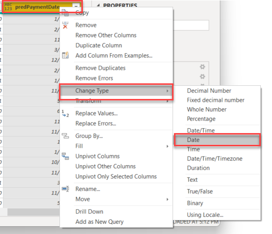

9. Select the **Home** tab then **Close & Apply**.

    

### Task 2: Create a Date table for report aggregation

Contoso retail wants to display the Sales and Payment figures aggregated by different days (BILLINGDOCUMENTDATE, predPaymentDate), this requires the creation of a calendar table with the timeslots by which to aggregate.

1. In Power BI, select the **Data** item from the left menu.

    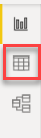

2. From the Table tools menu, select **New table**.

    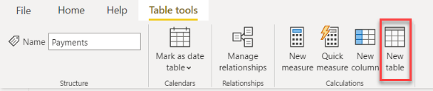

3. In the formula textbox, paste the following and select the checkmark button to execute the formula and create the table.

    ```vb
    Date= 
    VAR MinYear = YEAR ( MIN ( 'SalesOrderPayments'[CREATIONDATE]) )
    VAR MaxYear = YEAR ( MAX ( 'SalesOrderPayments'[predPaymentDate] ) )
    RETURN
    ADDCOLUMNS (
    FILTER (
    CALENDARAUTO( ),
    AND ( YEAR ( [Date] ) >= MinYear, YEAR ( [Date] ) <= MaxYear )
    ),
    "Calendar Year", "CY " & YEAR ( [Date] ),
    "Year", YEAR ( [Date] ),
    "Month Name", FORMAT ( [Date], "mmmm" ),
    "Month Number", MONTH ( [Date] ),
    "Year & Month", YEAR([Date]) & " - " & FORMAT ( [Date], "mmmm" )
    )
    ```

    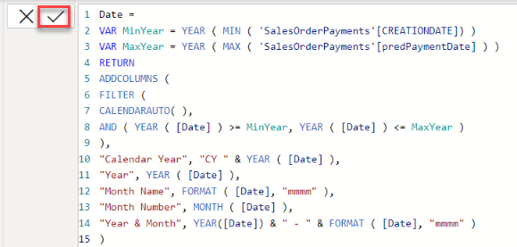

4. From the left menu, select the **Models** option. Establish the following relationships from the **Date.Date** field using drag and drop to the following table.fields:
   1. SalesOrderPayments.CREATIONDATE
   2. SalesOrderPayments.BILLINGDOCUMENTDATE
   3. SalesOrderPayments.PaymentDate
   4. SalesOrderPayments.predPaymentDate

    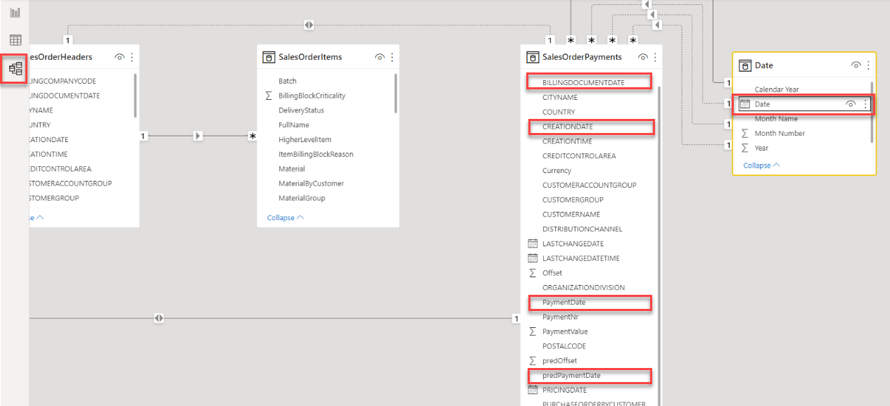

5. Select the **Data** from the left hand menu once more, and in the Table tools menu select the **New measure** button.

    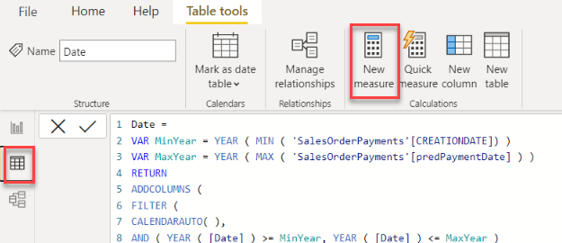

6. In the formula textbox paste the following code then select the checkmark button to execute the formula and create the measure. Verify the new measure displays in the Fields pane.

   ```vb
   Sales at CreationDate = sum('SalesOrderPayments'[TOTALNETAMOUNT])
   ```

    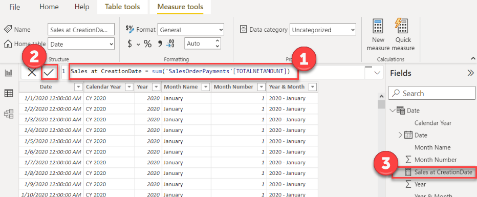

7. Repeat steps 5 and 6 and create new measures with the following formulas.

    ```vb
    Sales at BillingDate = CALCULATE(sum(SalesOrderPayments[TOTALNETAMOUNT]),USERELATIONSHIP('Date'[Date],SalesOrderPayments[BILLINGDOCUMENTDATE]))
    ```

    ```vb
    Payment at Actual Date = CALCULATE(sum('SalesOrderPayments'[PaymentValue]), USERELATIONSHIP('Date'[Date],SalesOrderPayments[PaymentDate]))
    ```

    ```vb
    Payment at pred Date = CALCULATE(sum('SalesOrderPayments'[PaymentValue]), USERELATIONSHIP('Date'[Date], SalesOrderPayments[predPaymentDate]))
    ```

### Task 3: Create the Sales and Payment Forecast visualization

1. From the left menu, select the **Report** item.

    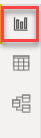

2. In the Visualizations pane, select **Clustered Column Chart**. Drag-and-drop the **Date.Date** field to the **X-axis** box. Drag-and-drop the **Date.Sales at Billing Date**, **Date.Payment at pred Date**, and **Date.Payment at actual Date** to the **Y-axis** box.

    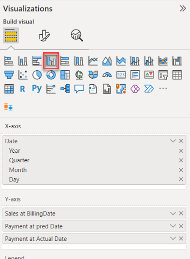

    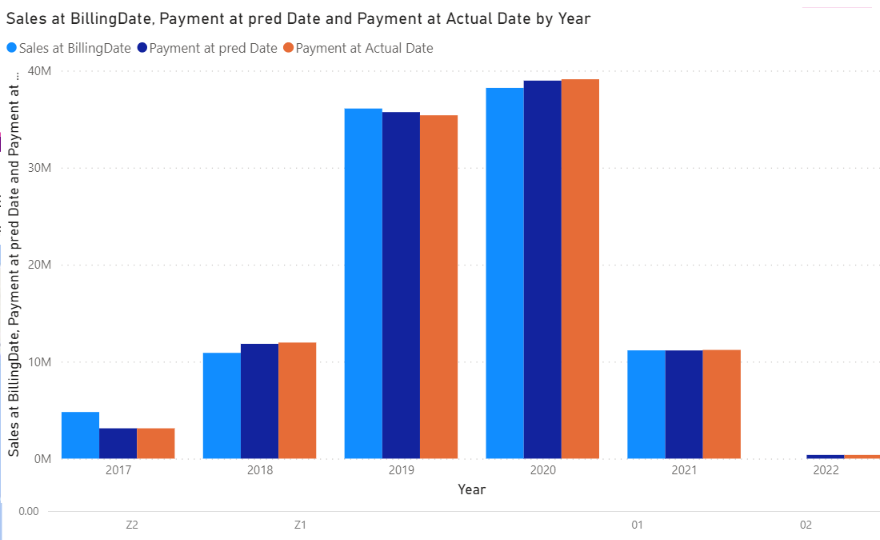

## Exercise 9: Create an alert in Power BI

Estimated time: 30 minutes

In this exercise, a Power BI and Power Automate subscription are used to create an alert and trigger a Power Automate flow to send an email.

### Task 1: Publish the Power BI report to an online workspace

1. Ensure the Power BI report file is saved.

2. On the Power BI Home tab menu, select **Publish**.

   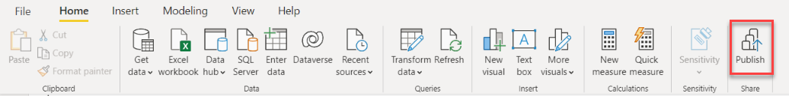

3. On the Publish to Power BI dialog, select **My workspace** as the destination and choose the **Select** button.

    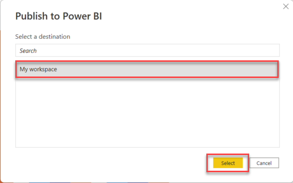

4. Wait a few moments for the publishing to complete. Select the **Open '{REPORT NAME}.pbix' in Power BI** link. The report will open in a browser window.

    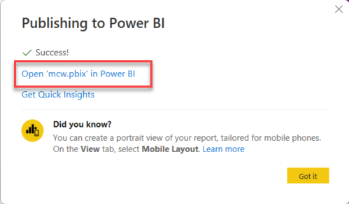

### Task 2: Create a gauge visualization to be used as the notification trigger

1. In the online Power BI report editor in the web browser, select the **Edit** button from the top toolbar menu.

    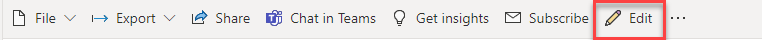

2. In the Visualizations pane, select **Gauge**. Drag-and-drop the **SalesOrderPayments.predOffset** from the Fields pane to the **Value** box. Expand the **Value** field using the chevron menu, and select **Maximum**.

    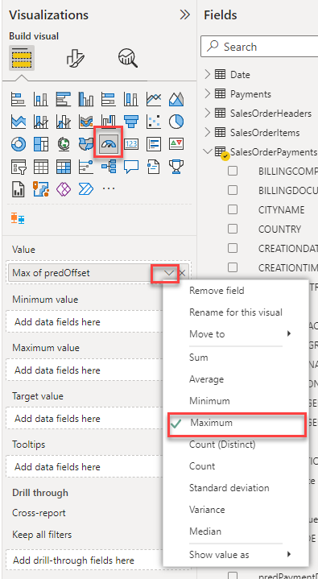

3. From the toolbar menu, select **Reading view**. Save the changes when prompted.

    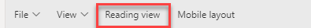

    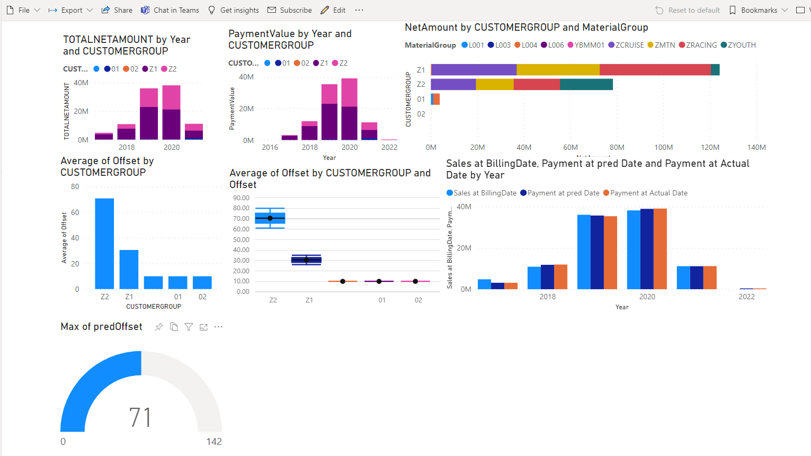

### Task 3: Create an alerting dashboard to send email with Power Automate

1. On the report, select to **Pin** the Gauge visulization to a new dashboard.

    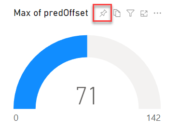

2. On the **Pin to dashboard** dialog, select **New dashboard** and enter the name `Alerting Dashboard` and select **Pin**.

    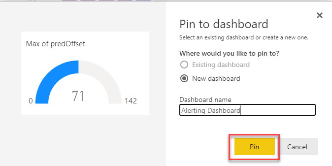

3. From the left menu, select **My workspace**, then in the listing of items select **Alerting Dashboard**.

   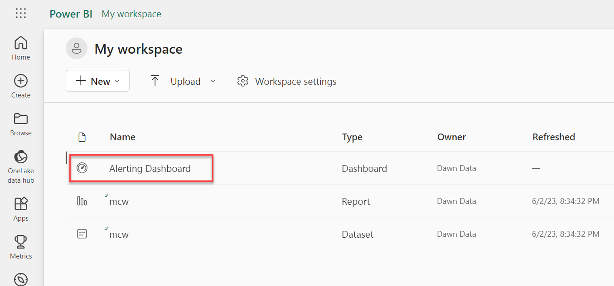

4. On the gauge visualization, expand the ellipsis menu and choose **Manage alerts**.

    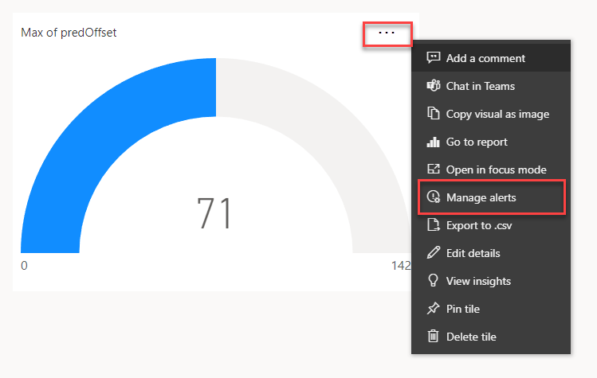

5. On the Manage alerts blade, select **+ Add alert rule**.

    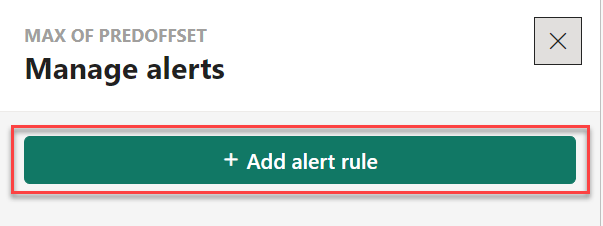

6. Set the condition to trigger when the threshold is **lower than the value currently indicated in the gauge**, this will ensure it triggers immediately. Set the maximum notification frequency to once per hour. Near the bottom of the blade select the **Use Microsoft Power Automate to trigger additional actions** link.

    

7. A new web browser tab opens displaying an overview of a Power Automate Template. Select **Try it now** beneath the **Trigger a flow with a Power BI data-driven alert**. Sign in if required.

    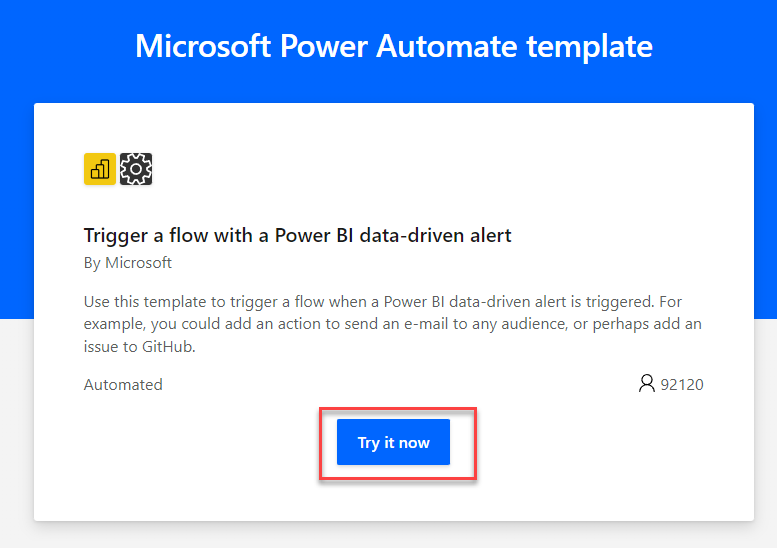

8. On the Trigger a flow with a Power BI data-driven alert screen, select **Sign in** on the **This flow will connect to field**. Once signed in, select **Continue**.

    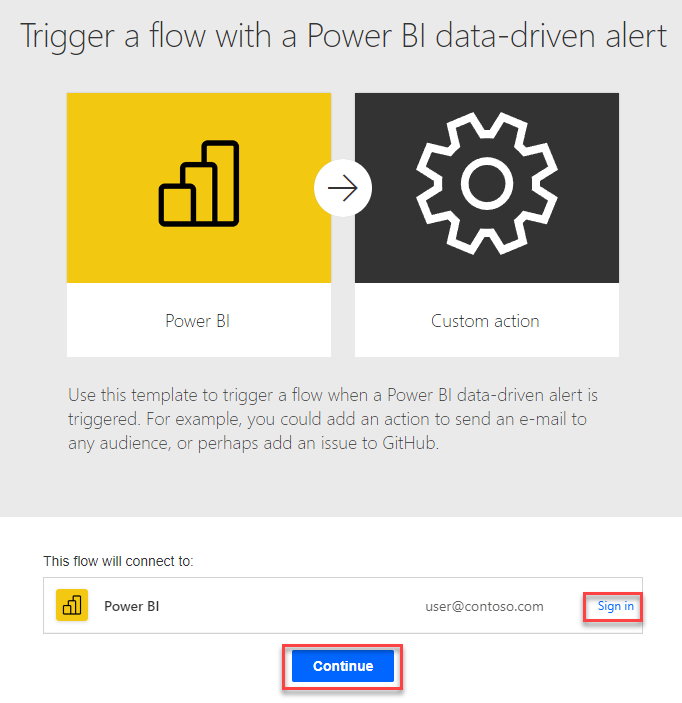

9. In the flow designer, in the When a data driven alert is triggered step, expand the Alert id field and select **Max of predOffset**.

    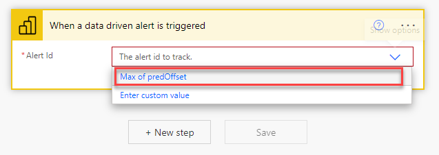

10. Select **+ New step**, and search for `send email`. From the results select **Send an email (V2) - Office 365 Outlook**.

    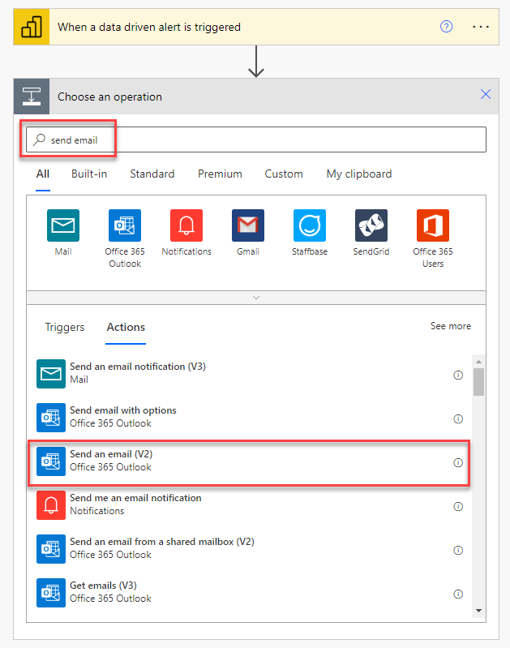

11. The step will transform to a Send an email (V2) step. It will automatically connect to Office 365 using the signed in user account, this will only take a moment. In the **To** field, enter your email address.

    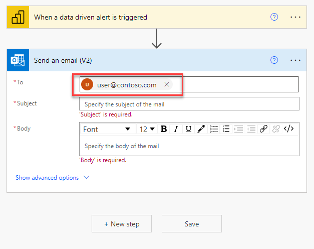

12. Select the **Subject** text box and the Dynamic content pane will display. Select **Alert title**.

    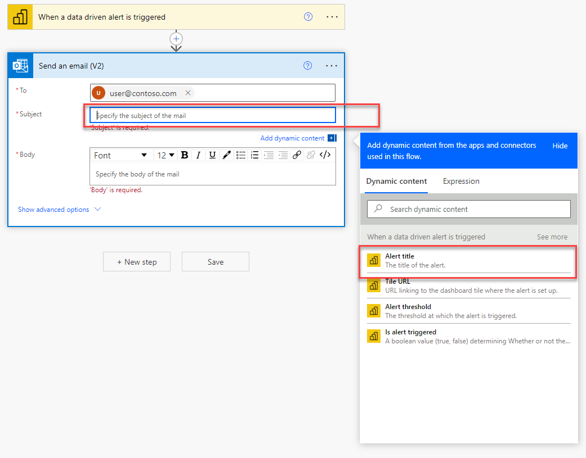

13. Select the **Body** text box and in the Dynamic content pane select **Tile URL**.

    

14. At the bottom of the flow designer select **Save**.

    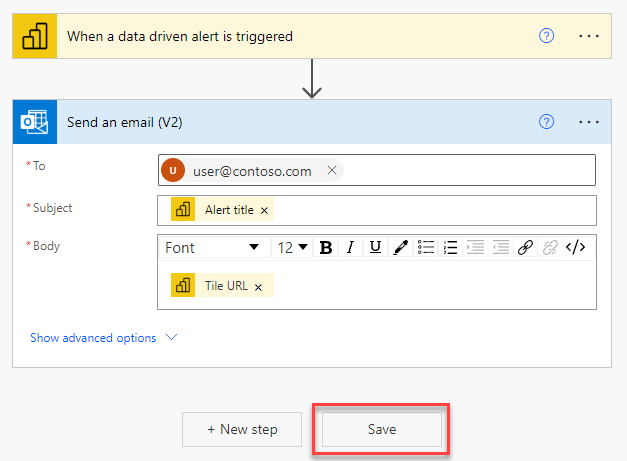

15. An email is sent to the email address from the trigger.

    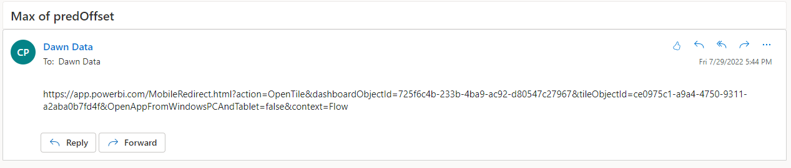

    > **Note**: To retrigger the alert a data update must occur. Execute the following SQL script in the dedicated SQL pool of Azure Synapse Analytics to change data.

    ```SQL
    UPDATE dbo.Payments SET PaymentDate = DATEADD(DAY, 1, PaymentDate)
    ```

## Exercise 10: Update SAP from Power BI

Estimated time: 30 minutes

Contoso Retail also needs a way to flag risky customers in the SAP system whose payments tend to arrive late. In this exercise, a Power Automate flow is added in the Power BI report that initiates a business partner update in SAP using OData.

### Task 1: Import a Power Automate flow

1. In a web browser, access the following link and select **Download** to download the UpdateBusinessPartnerFromPowerBI.zip file. This file contains the exported flow that is used in this exercise.

    ```text
    https://github.com/codingbandit/MCW-SAP-plus-extend-and-innovate/blob/feature/exercise10/Hands-on%20lab/Resources/powerautomate/UpdateBusinessPartnerFromPowerBI.zip
    ```

    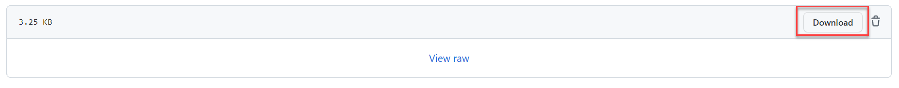

2. Access and log into [Power Automate](https://make.powerautomate.com).

3. From the left menu, select **My flows**. Expand the **Import** menu item on the toolbar menu and select **Import Package (Legacy)**.

    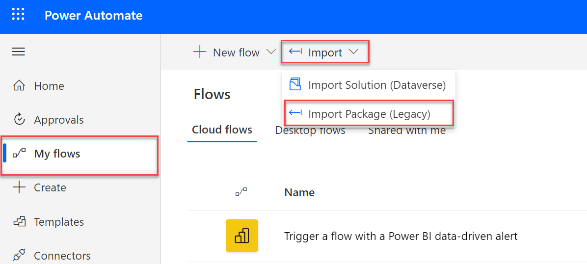

4. On the Import package screen, select the **Upload** button then choose to upload the file that was downloaded in the first step of this task: **UpdateBusinessPartnerFromPowerBI.zip**. The file will automatically start uploading.

    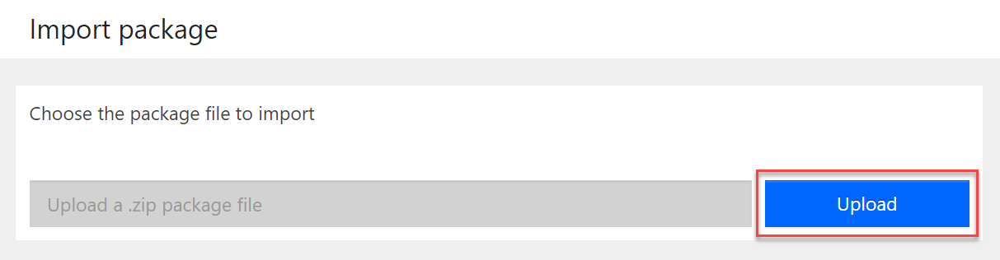

5. In the Import package review screen, select the wrench icon next to the Power BI Connection under the Related resources section.

   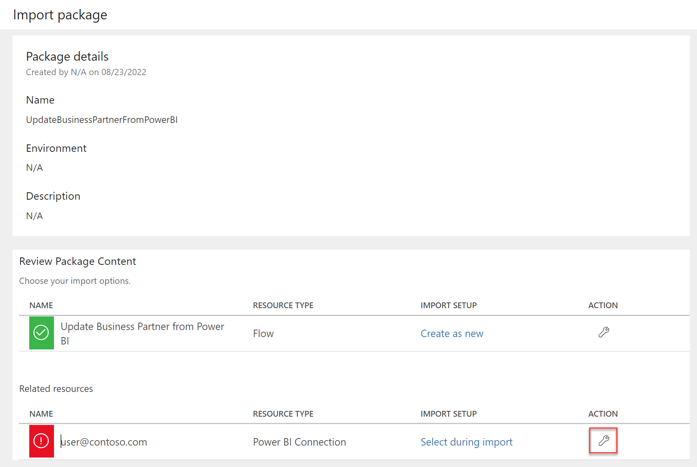

6. On the Import Setup blade, choose the Power BI user account utilized during this lab and select **Save**.

    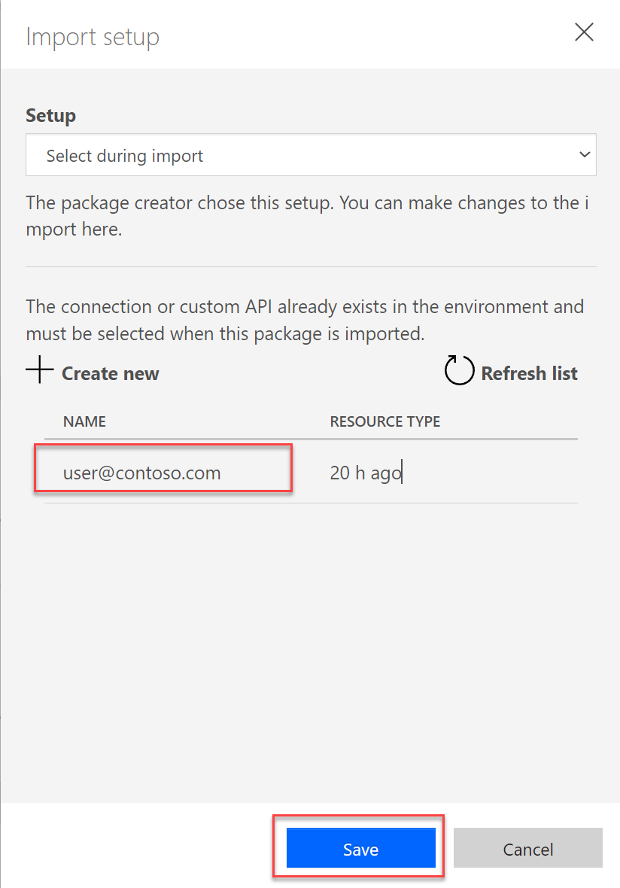

7. Select **Import** to comlete the import of the flow.

    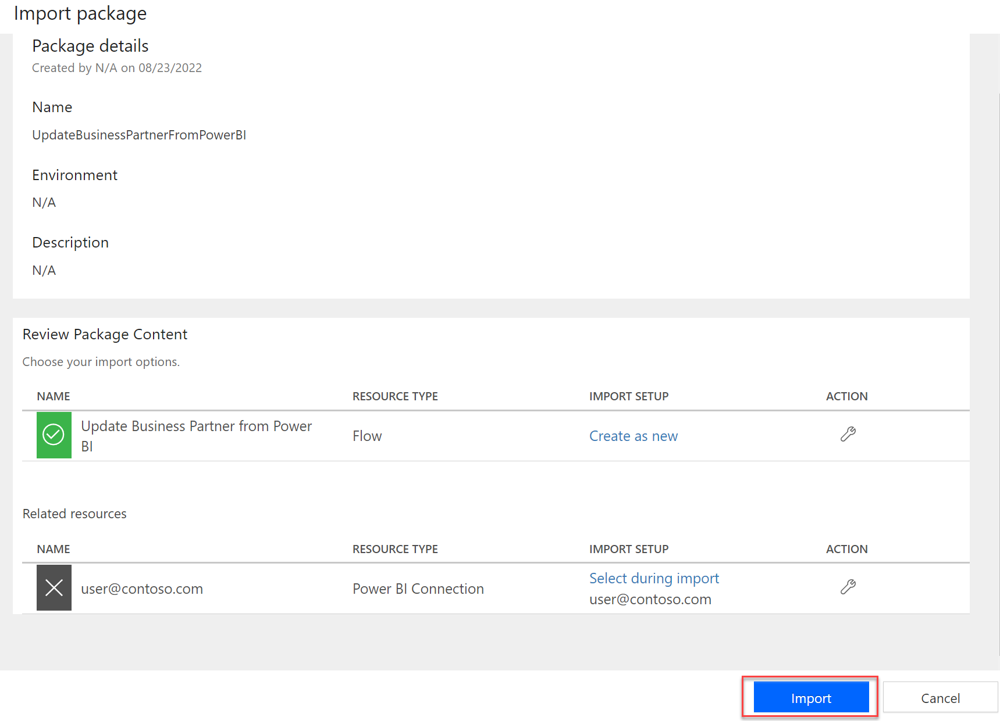

8. A message indicating successful import will display at the top of the screen. Select the **Open flow** link from this message.

    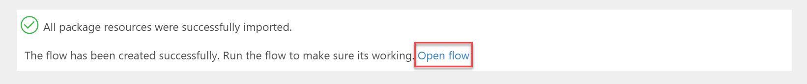

9. On the flow design canvas, expand the second step **Initialize variable** and replace the Value field with the IP address of the MCWSAP-SAP1 virtual machine. Select **Save** from the toolbar menu.

    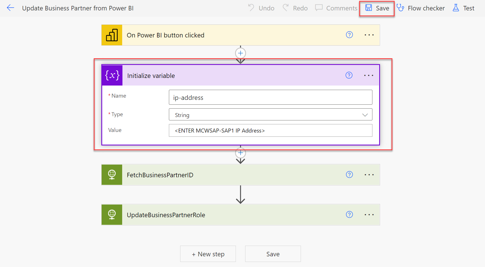

    >**Note**: This flow initiates a get request to the SAP service to retrieve a business partner by name using the CUSTOMERNAME value passed in by Power BI. This request also requests a X-CSRF-Token that will allow the current sesstion to perform an update. The last HTTP call issues the update of the business partner record found in the first HTTP activity to 02, indicating a risky customer.

10. Select the back arrow icon next to the Update Business Partner from Power BI title in the toolbar.

    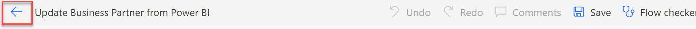

11. On the Flows &gt; Update Business Partner from Power BI screen, select **Turn on** from the toolbar menu.

    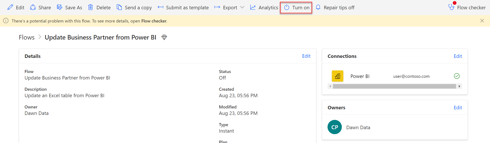

12. Keep this screen open for a future task.

### Task 2: Add a Power Automate visual and author the update flow

1. Access and log into [Power BI](https://app.powerbi.com).

2. Open the report from the earlier exercises, under **My workspace**.

3. In the online Power BI report editor in the web browser, select the **Edit** button from the top toolbar menu.

    

4. From the Visualizations panel, select the **Table** item. Drag-and-drop the SalesOrderPayments.CUSTOMERNAME to the Columns box.

   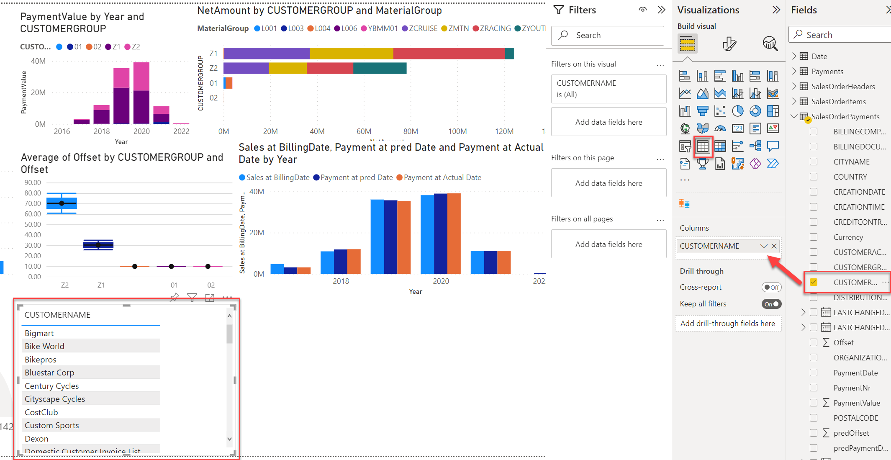

5. Ensure no other visualization is selected, then choose the **Power Automate** item from the Visualizations panel. Drag-and-drop the SalesOrderPayments.CUSTOMERNAME to the Power Automate data box.

    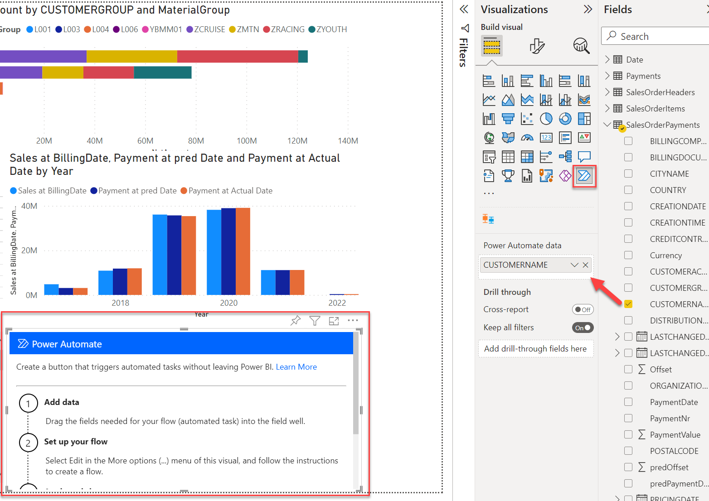

6. Expand the ellipsis menu on the Power Automate visualization on the report and select **Edit**.

    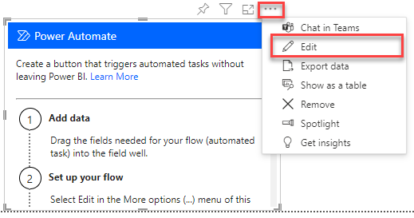

7. On the Microsoft Power Automate screen, select the **Update Business Partner from Power BI** flow then choose **Apply** on the toolbar menu. Once applied, select the **Back to report** link at the top of the screen.

   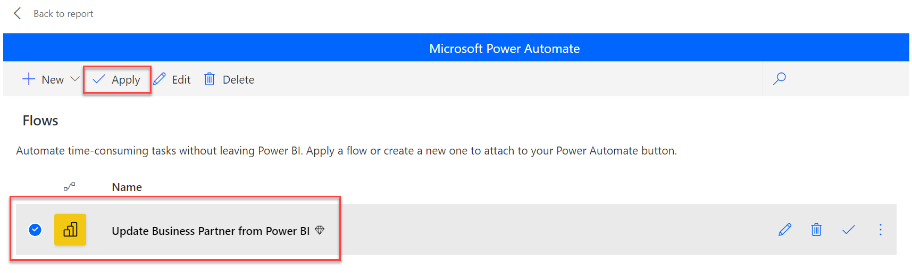

8. Select **Save** then **Reading view** from the report toolbar menu.

    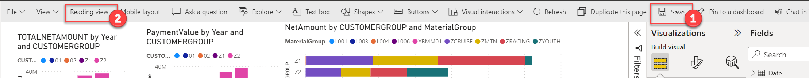

9. Switch to the Postman application, issue the **GET Customer** request from the SAP MCW collection. Refer to the [Before the hands-on-lab](#task-5-prepare-the-business-partner-service-in-sap) step 17 through 21 for guidance if necessary. Make note that in the response, the **BusinessPartnerRole** indicates **01** for **Bigmart** - this indicates a customer in good standing.

    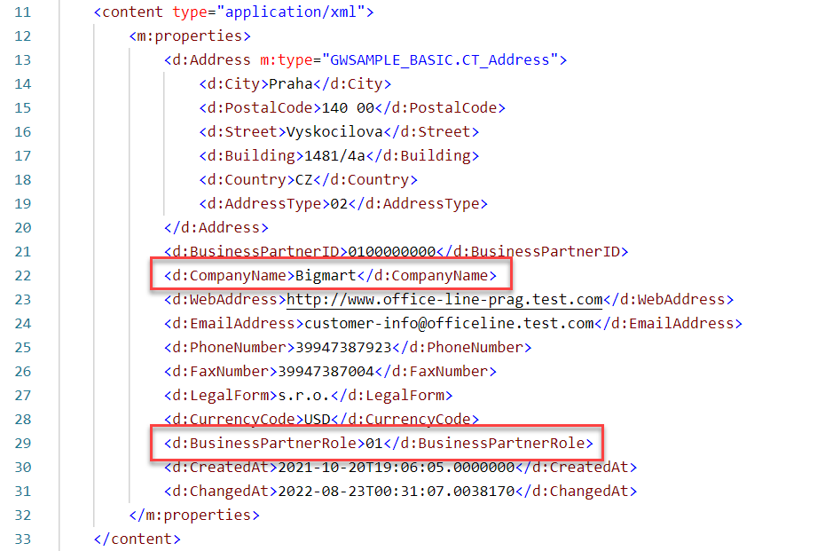

10. Switch back to the Power BI report, from the CUSTOMERNAME table, select **Bigmart**. This will filter the report visualizations by that customer.

    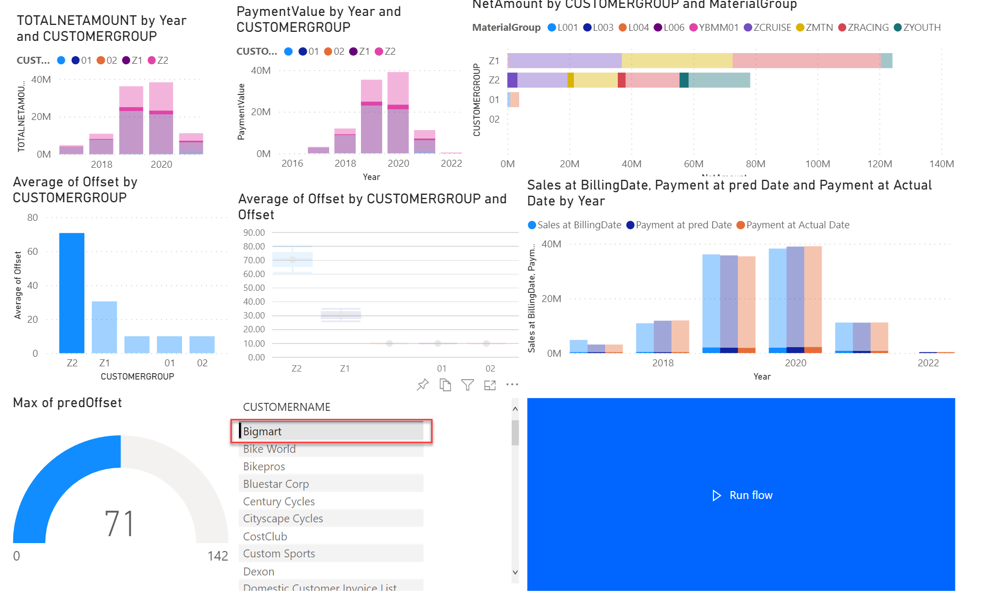

11. Select the **Run flow** button (anywhere in the blue area), and the Update Business Partner from Power BI flow will be triggered.

12. Return to the Power Automate Update Business Partner from Power BI flow screen (left open in Task 1). The history displays the status of the run as succeeded. Optionally, drill into the the Date link beneath the Start header to view the run details.

    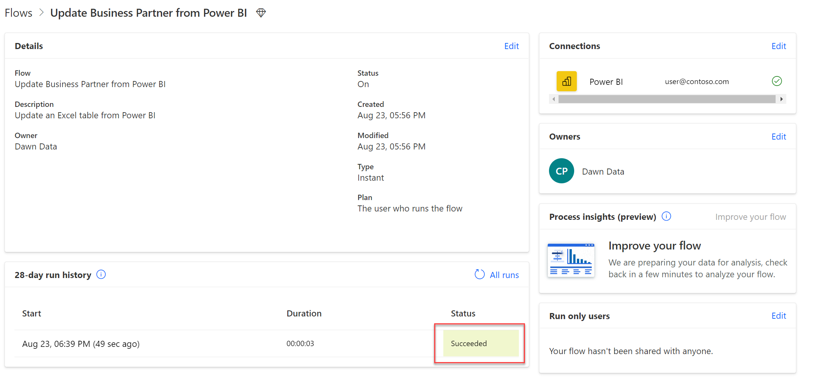

13. Switch back to the Postman application, issue the **GET Customer** request from the SAP MCW collection. Notice how the BusinessPartnerRole value now indicates **02**. This role indicates this customer is now flagged as a risky customer in SAP.

    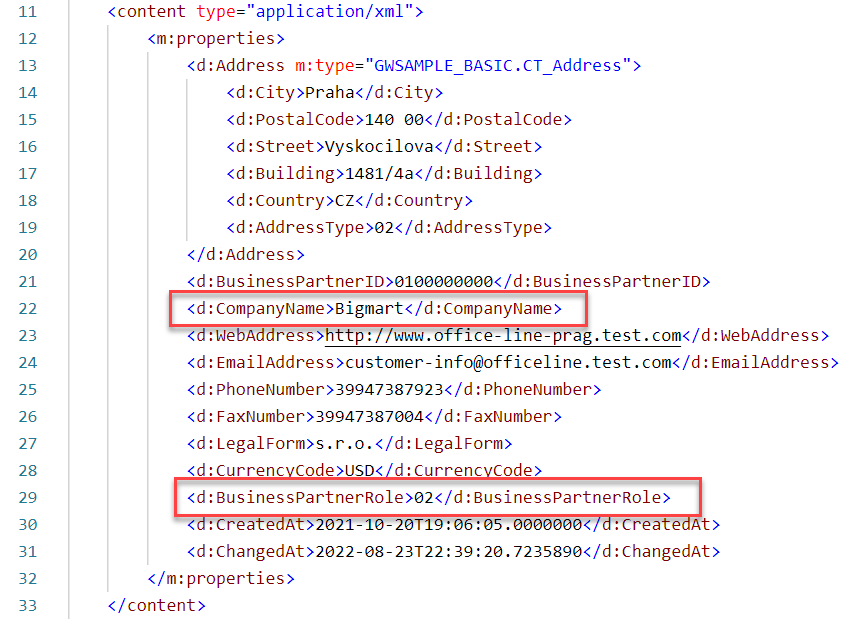

## After the hands-on lab

Duration: 10 minutes

### Task 1: Delete the Power Automate flows

1. In Power Automate, select **My flows** locate the **Trigger a flow with a Power BI data-driven alert** item, expand the ellipsis menu and choose **Delete**.

   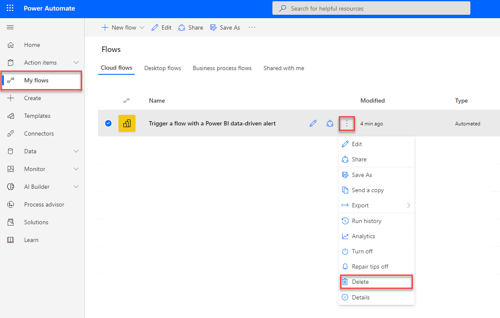

2. Repeat the previous step to delete the **Update Business Partner from Power BI** flow.

### Task 2: Delete the Power BI workspace report and dataset

1. In the Power BI workspace, select **My workspace** from the left menu to get a listing of items. Delete the report, dataset and the Alerting dashboard items by expanding the ellipsis menu and choosing Delete.

    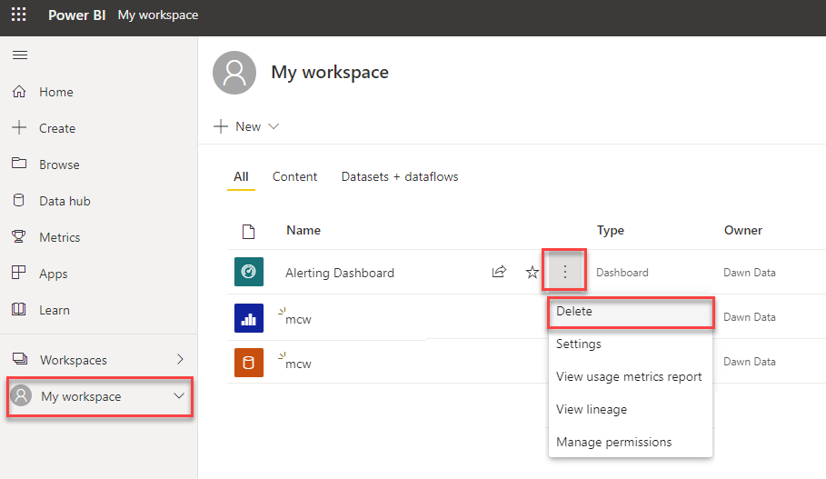

### Task 3: Remove deployed Azure resources with Terraform

1. In the Azure portal, select the cloud shell button from the upper-right toolbar menu options.

    

2. Navigate to the Terraform directory by executing the following command.

    ```PowerShell
    cd 'MCW-SAP-plus-extend-and-innovate/Hands-on lab/Resources/terraform'
    ```

3. Enter the following command to remove all deployed resources, type `yes` and <kbd>Enter</kbd> when prompted.

    ```PowerShell
    terraform destroy
    ```

    > **Note**: Ensure the proper subscription is set using `az account set --subscription {SUBSCRIPTION_ID_GOES_HERE} if experiencing difficulties.

4. Execute the following command **two times** to retun to the user directory.

    ```PowerShell
    cd..
    ```

5. Delete the cloned source code repository with the following command.

   ```PowerShell
   Remove-Item -Path .\MCW-SAP-plus-extend-and-innovate -recurse -force  
   ```

### Task 4: Terminate the SAP CAL appliance

1. Log into the [SAP Cloud Appliance Library](https://cal.sap.com/) web site.

2. From the left menu, select **Appliances**, locate the **MCW SAP** appliance and expand the ellipsis menu. Select **Terminate** to delete the appliance.

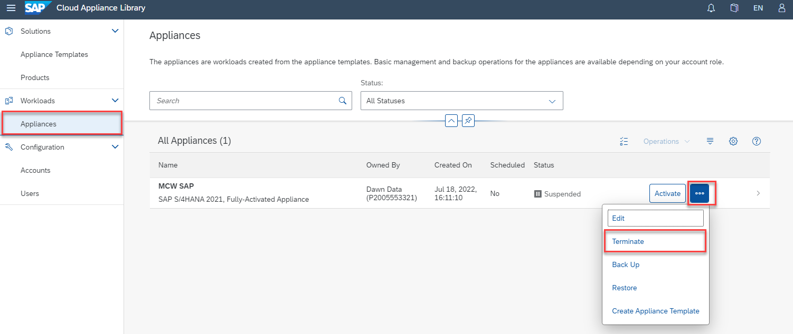

You should follow all steps provided *after* attending the Hands-on lab.
