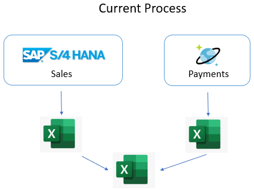
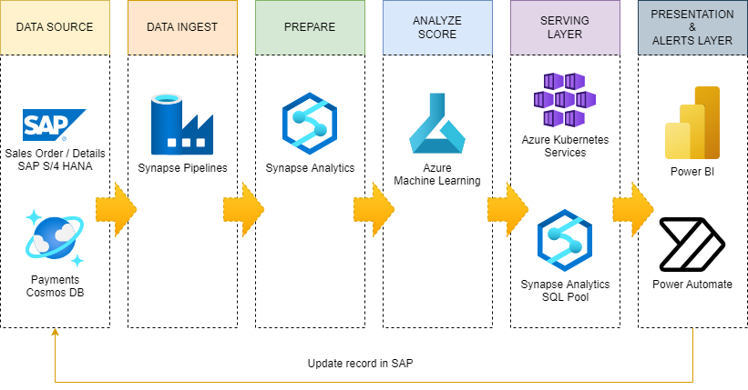

SAP plus extend and innovate with Data and AI

Whiteboard design session trainer guide

August 2022

Information in this document, including URLs and other Internet Web site references, is subject to change without notice. Unless otherwise noted, the example companies, organizations, products, domain names, e-mail addresses, logos, people, places, and events depicted herein are fictitious, and no association with any real company, organization, product, domain name, e-mail address, logo, person, place or event is intended or should be inferred. Complying with all applicable copyright laws is the responsibility of the user. Without limiting the rights under copyright, no part of this document may be reproduced, stored in or introduced into a retrieval system, or transmitted in any form or by any means (electronic, mechanical, photocopying, recording, or otherwise), or for any purpose, without the express written permission of Microsoft Corporation.

Microsoft may have patents, patent applications, trademarks, copyrights, or other intellectual property rights covering subject matter in this document. Except as expressly provided in any written license agreement from Microsoft, the furnishing of this document does not give you any license to these patents, trademarks, copyrights, or other intellectual property.

The names of manufacturers, products, or URLs are provided for informational purposes only and Microsoft makes no representations and warranties, either expressed, implied, or statutory, regarding these manufacturers or the use of the products with any Microsoft technologies. The inclusion of a manufacturer or product does not imply endorsement of Microsoft of the manufacturer or product. Links may be provided to third party sites. Such sites are not under the control of Microsoft and Microsoft is not responsible for the contents of any linked site or any link contained in a linked site, or any changes or updates to such sites. Microsoft is not responsible for webcasting or any other form of transmission received from any linked site. Microsoft is providing these links to you only as a convenience, and the inclusion of any link does not imply endorsement of Microsoft of the site or the products contained therein.

© 2022 Microsoft Corporation. All rights reserved.

Microsoft and the trademarks listed at https://www.microsoft.com/en-us/legal/intellectualproperty/Trademarks/Usage/General.aspx are trademarks of the Microsoft group of companies. All other trademarks are property of their respective owners.

**Contents**

<!-- TOC -->

- [Trainer information](#trainer-information)
  - [Role of the trainer](#role-of-the-trainer)
  - [Whiteboard design session flow](#whiteboard-design-session-flow)
  - [Before the whiteboard design session: How to prepare](#before-the-whiteboard-design-session-how-to-prepare)
  - [During the whiteboard design session: Tips for an effective whiteboard design session](#during-the-whiteboard-design-session-tips-for-an-effective-whiteboard-design-session)
- [SAP plus extend and innovate with Data and AI student guide](#sap-plus-extend-and-innovate-with-data-and-ai-student-guide)
  - [Abstract and learning objectives](#abstract-and-learning-objectives)
  - [Step 1: Review the customer case study](#step-1-review-the-customer-case-study)
    - [Customer situation](#customer-situation)
    - [Customer needs](#customer-needs)
    - [Customer objections](#customer-objections)
    - [Infographic for common scenarios](#infographic-for-common-scenarios)
  - [Step 2: Design a proof of concept solution](#step-2-design-a-proof-of-concept-solution)
  - [Step 3: Present the solution](#step-3-present-the-solution)
  - [Wrap-up](#wrap-up)
  - [Additional references](#additional-references)
- [SAP plus extend and innovate with Data and AI trainer guide](#sap-plus-extend-and-innovate-with-data-and-ai-trainer-guide)
  - [Step 1: Review the customer case study](#step-1-review-the-customer-case-study-1)
  - [Step 2: Design a proof of concept solution](#step-2-design-a-proof-of-concept-solution-1)
  - [Step 3: Present the solution](#step-3-present-the-solution-1)
  - [Wrap-up](#wrap-up-1)
  - [Preferred target audience](#preferred-target-audience)
  - [Preferred solution](#preferred-solution)
    - [Customer Needs](#customer-needs-1)
    - [Checklist of preferred objection handling](#checklist-of-preferred-objection-handling)
  - [Customer quote (to be read back to the attendees at the end)](#customer-quote-to-be-read-back-to-the-attendees-at-the-end)

<!-- /TOC -->

# Trainer information

Thank you for taking time to support the whiteboard design sessions as a trainer!

## Role of the trainer

An amazing trainer:

- Creates a safe environment in which learning can take place.

- Stimulates the participant's thinking.

- Involves the participant in the learning process.

- Manages the learning process (on time, on topic, and adjusting to benefit participants).

- Ensures individual participant accountability.

- Ties it all together for the participant.

- Provides insight and experience to the learning process.

- Effectively leads the whiteboard design session discussion.

- Monitors quality and appropriateness of participant deliverables.

- Effectively leads the feedback process.

## Whiteboard design session flow

Each whiteboard design session uses the following flow:

**Step 1: Review the customer case study (15 minutes)**

**Outcome**

Analyze your customer's needs.

- Customer's background, situation, needs and technical requirements

- Current customer infrastructure and architecture

- Potential issues, objectives and blockers

**Step 2: Design a proof of concept solution (120-180 minutes)**

**Outcome**

Design a solution and prepare to present the solution to the target customer audience in a 15-minute whiteboard format.

- Determine your target customer audience.

- Determine customer's business needs to address your solution.

- Design and diagram your solution.

- Prepare to present your solution.

**Step 3: Present the solution (30 minutes)**

**Outcome**

Present solution to your customer:

- Present solution

- Respond to customer objections

- Receive feedback

**Wrap-up (15 minutes)**

- Review preferred solution

## Before the whiteboard design session: How to prepare

Before conducting your first whiteboard design session:

- Read the Student guide (including the case study) and Trainer guide.

- Become familiar with all key points and activities.

- Plan the point you want to stress, which questions you want to drive, transitions, and be ready to answer questions.

- Prior to the whiteboard design session, discuss the case study to pick up more ideas.

- Make notes for later.

## During the whiteboard design session: Tips for an effective whiteboard design session

**Refer to the Trainer guide** to stay on track and observe the timings.

**Do not expect to memorize every detail** of the whiteboard design session.

When participants are doing activities, you can **look ahead to refresh your memory**.

- **Adjust activity and whiteboard design session pace** as needed to allow time for presenting, feedback, and sharing.

- **Add examples, points, and stories** from your own experience. Think about stories you can share that help you make your points clearly and effectively.

- **Consider creating a "parking lot"** to record issues or questions raised that are outside the scope of the whiteboard design session or can be answered later. Decide how you will address these issues, so you can acknowledge them without being derailed by them.

***Have fun**! Encourage participants to have fun and share!*

**Involve your participants**. Talk and share your knowledge but always involve your participants, even while you are the one speaking.

**Ask questions** and get them to share to fully involve your group in the learning process.

**Ask first**, whenever possible. Before launching into a topic, learn your audience's opinions about it and experiences with it. Asking first enables you to assess their level of knowledge and experience and leaves them more open to what you are presenting.

**Wait for responses**. If you ask a question such as, "What's your experience with (fill in the blank)?" then wait. Do not be afraid of a little silence. If you leap into the silence, your participants will feel you are not serious about involving them and will become passive. Give participants a chance to think, and if no one answers, patiently ask again. You will usually get a response.

# SAP plus extend and innovate with Data and AI student guide

## Abstract and learning objectives

Contoso Food Distribution (CFD), Inc., subsidiary of Contoso Retail Inc.,  processes and distributes food to supermarkets and other small-to-medium sized companies.  Generous credit terms based on relationships instead of data analytics has put the company in financial difficulty.  They have challenges identifying customers’ payment behaviors and notifying customers when they are behind on invoice payments.  The accounting department uses manual processes to identify delinquent accounts making the accounts receivable (AR) management time consuming.  Also, lenders and have capped CFD’s line of credit and increased the interest rate until they can lower their AR balance and be able to predict near term future cash flow.

In this whiteboard design session, you will work in a group to design the data pipeline PoC that could support the needs of Contoso Retail.

At the end of this workshop, you’ll have the knowledge necessary to build a data pipeline that will ingest SAP and Cosmos DB data into a common Azure Synapse data warehouse.  You will be able analyze AR and sales data to deliver a 360-degree view of customers’ accounts.  Using Power BI and Power Automate, you will be able to optimize company operations through data analytics and process automation.

## Step 1: Review the customer case study 

**Outcome**

Analyze your customer's needs.

Timeframe: 15 minutes

Directions:  With all participants in the session, the facilitator/SME presents an overview of the customer case study along with technical tips.

1. Meet your team members and trainer.

2. Read all directions for steps 1-3 in the student guide.

3. As a team, review the following customer case study.

### Customer situation

Contoso Food Distribution (CFD), Inc., subsidiary of Contoso Retail Inc., has been selling goods through various channels for the past 15 years. Their primary customer segments are supermarkets, retail chains, and small- to mid-size enterprise stores.  The business has been built on great customer service and relationships.  They have been facing recent challenges leveraging their SAP and Azure Cosmos DB investments to manage their accounts receivable (AR) and customer accounts.

Food processing and distribution has small profit margins and large transaction volume.  Inventory is perishable and needs to be delivered quickly.  CFD's CEO, Jan Smith, has chosen to deliver product first and manage account details later.  Unfortunately, CFD is having issues with high accounts receivables and rising inventory finance costs.  Mari Stephens, the CFO, is frustrated CFD operational credit line is being capped and the interest rate increased until they can lower their accounts receivable balances and predict their future cash flow is healthy.  This small interest expense increase is a problem given the industry’s thin profit margins.

The accounting department director, Sarah Smith, says customer AR management has always been a problem.  The AR and sales data is spread across different systems. Manually merging and analyzing the data sources is time consuming and error prone.  Accounting runs reports from the two different systems and exports the data into spreadsheets.

By the time a problem is identified, it becomes more difficult to correct.  Valuable constrained accounting resources are manually contacting delinquent accounts weeks after the problem has started, making it more difficult to correct. Some existing customers are habitually late payers and new accounts drift into this problem behavior.

Contoso needs cash now and is considering selling some of its accounts receivables to outside debt collection agencies for a short-term cash infusion and is thinking about enforcing late payment fees for customers with balances beyond 50 days.  This type of option would have a positive cash flow, but might lead to weakening customer relationships and sales reductions.  Correcting customer payment behavior problems early is critical. The invoice late payment fees are substantial and could help manage customer paying behaviors. Also, the account managers believe it would be useful to notify customers when they are approaching an invoice due date.

Large supermarkets and retail chains, hold the upper hand in negotiations due to their large purchasing power and number of competing product suppliers.  Generous credit limits and payment terms are offered by Contoso to entice customers in exchange for high sales volume. The finance department would like the ability to use data analytics to determine a consistent amount of customer credit based on sales data and payment history. Finance and accounting want to identify delinquent accounts easily and adjust the amount of credit offered based on payment behaviors.

Timely and accurate AR and sales reports are required to support difficult decisions, like changing a customer from credit to cash only basis. Downgrading a customer’s credit may result in reduced sales but would improve the organization’s overall financial health.  Customer AR and sales data must be correlated and reviewed when these account decisions are made.

Contoso is looking for the ability to integrate relevant sources of data into a central data warehouse. They are looking forward to data analytics and automation tools. For example, the accounting department would like to be notified by email quickly when customer AR balances reach certain payment delinquency thresholds. Customers with invoices slightly past their due dates should receive an email reminder. These types of automated alerts would reduce the lag between problem discovery and mitigation.

The accounting department has asked IT for assistance with creating workflows and reports to assist with AR reporting problems in the past.  Sarah thinks IT did a great job creating payment tracking system, which utilizes Azure Cosmos DB.  Unfortunately, IT resources are constrained, and they do not have the necessary time to develop a new system from the ground up.  Sarah says accounting feels like they are on their own when it comes reporting and process improvements.  They like the independence because, “they know the data and can develop Excel reports quickly.”  She hates the manual time-consuming data merging and the inability to share reports easily. The process is so time consuming, the data becomes stale quickly. The accounting department would like a self-service reporting solution.  Small report configuration changes need to happen quickly without having to wait weeks or months for the IT department to respond.  Guy Information, the CIO, is concerned about the shadow accounting processes created previously and reminded Sarah about how difficult it was to identify and share the correct AR balance data.  Duplicate spreadsheets became a real problem.  IT and Accounting want to make sure there is proper governance and a single source of truth for critical data.

The Chief Executive Officer (CEO), Chief Financial Officer (CFO), Chief Information Officer (CIO), and accounting department are looking for a comprehensive solution to the challenges described above.

### Customer needs

1. Contoso wants to focus on their customers’ payment behavior.  The want to extend credit to the customers with responsible payment history.  Slow-paying customers should be identified as candidates for cash-only sales, have reduced credit lines, and be managed more closely.  The accounting staff needs to identify and collect on invoices at 30, 50, 70 days past due. They need an automated data workflow that updates a centralized dashboard.

2. Predictive analytics will provide the ability forecast cash flows based on customer payment history and sales orders. Contoso would like to fine-tune staff management to ensure optimal resource allocation according to customer payment predictions. The accounting staff will focus on high-risk accounts to maximize payments

3. They would also like to minimize the operational overhead within their current processes.  

4. The accounting and IT department would like a low-code self-service approach to reporting and automated workflows.

### Customer objections

1. How will this solution help us to create a better process for visualizing and discovering AR balance problems and collecting payments from our customers?

2. Our staff is already working overtime we don’t want staff to be distracted by a new process and reviewing large reports with tons of data. The accounting and finance departments want a centralized system to create dashboards, share critical data, and automate repetitive manual tasks.  They do not have months to learn a complex tool or wait for IT to create reports for them.

3. Predicting cash flows seems very appealing.  We have heard that creating a machine learning model takes a month to build and another 2-3 months to operationalize to be useable from our production systems. Is this true?

4. Management does not want to spend large amounts of money on IT hardware they have to manage on-premises.

### Infographic for common scenarios

## Step 2: Design a proof of concept solution

**Outcome**

Design a solution and prepare to present the solution to the target customer audience in a 15-minute chalk-talk format.

Timeframe: 60 minutes

**Business needs**

Directions: With your team, answer the following questions and be prepared to present your solution to others:

1. Who will you present this solution to? Who is your target customer audience? Who are the decision makers?

2. What customer business needs do you need to address with your solution?

**Design**

Directions: With your team, respond to the following questions:

_High-level architecture_

1. Without getting into the details (the following sections will address the particular details), diagram your initial vision for handling the top-level requirements for:

   - Data ingestion and integration
   - Data transformation and processing
   - Centralized data and predictive analytics
   - Workflow and alert automation

Besides addressing the core functional requirements, consider the resiliency and cost optimization provisions that Contoso is looking for.

_Data ingestion and integration_

1. Which Azure services can you use to ingest data from SAP and non-SAP data sources?

2. Of the options you identified in the previous step, which ones would you recommend to Contoso?

3. What data integration options would Contoso benefit from?

4. Which Azure integration services would you recommend be used by Contoso?

_Data transformation and processing_

1. How would you approach the need for additional analysis of data originating from SAP and non-SAP data sources?

2. Which Azure services would you use to implement the corresponding functionality?

_Data analytics_

1. How would you analyze the data to facilitate identifying relevant information and then sharing it with team members?

2. What Azure services would allow Contoso to further enrich the data by leveraging technologies such as artificial intelligence?

_Streamline repetitive  tasks via automation_

1. How would you automatically send alerts based on KPI thresholds and rules?

2. What services seamlessly integrate with the analytic solution?

**Prepare**

Directions: As a team:

1. Identify any customer needs that are not addressed with the proposed solution.

2. Identify the benefits of your solution.

3. Determine how you will respond to the customer's objections.

Prepare a 15-minute chalk-talk style presentation to the customer.

## Step 3: Present the solution

**Outcome**

Present a solution to the target customer audience in a 15-minute chalk-talk format.

Timeframe: 30 minutes

**Presentation**

Directions:

1. Pair with another team.

2. One group is the Microsoft team and the other is the customer.

3. The Microsoft team presents their proposed solution to the customer.

4. The customer makes one of the objections from the list of objections.

5. The Microsoft team responds to the objection.

6. The customer team gives feedback to the Microsoft team.

7. Switch roles and repeat Steps 2-6.

## Wrap-up

Timeframe: 15 minutes

Directions: Reconvene with the larger group to hear the facilitator/SME share the preferred solution for the case study.

## Additional references

| **Description** | **Links** |
| --------------- | --------- |
| SAP on Azure | <https://azure.microsoft.com/solutions/sap/>
| Connect to SAP systems from Azure Logic Apps | <https://docs.microsoft.com/azure/logic-apps/logic-apps-using-sap-connector> |
| Azure Synapse Analytics | <https://azure.microsoft.com/services/synapse-analytics/> |
| Azure Cosmos DB | <https://azure.microsoft.com/services/cosmos-db/> |
| Azure Machine Learning | <https://azure.microsoft.com/free/machine-learning> |
| Connect to SAP systems from Azure Logic Apps | <https://docs.microsoft.com/azure/logic-apps/logic-apps-using-sap-connector> |
| SAP API Business Hub | <https://api.sap.com/search?searchterm=retail&tab=All&refinedBy=true&top=12> |
| S/4HANA Extensibility: Use Case Overview | <https://blogs.sap.com/2016/09/12/s4hana-extensibility-use-case-overview/> |
| SAP Extension Suite | <https://www.sapinsideronline.com/extend-your-core-business-applications-and-drive-your-business-forward-with-sap-extension-suite/>|
| SAP reference architecture | <https://docs.microsoft.com/en-us/azure/architecture/reference-architectures/sap/sap-overview>|
| SAP Portfolio categories | <https://www.sap.com/products.html>|
| Extracting SAP data using OData | <https://techcommunity.microsoft.com/t5/azure-synapse-analytics-blog/extracting-sap-data-using-odata-part-7-delta-extraction-using/ba-p/2865383> |

# SAP plus extend and innovate with Data and AI trainer guide

## Step 1: Review the customer case study

- Check in with your participants to introduce yourself as the trainer.

- Ask, "What questions do you have about the customer case study?"

- Briefly review the steps and timeframes of the whiteboard design session.

- Ready, set, go! Let participants begin.

## Step 2: Design a proof of concept solution

- Check in with your teams to ensure that they are transitioning from step to step on time.

- Provide feedback on their responses to the business needs and design.

  - Try asking questions first that will lead the participants to discover the answers on their own.

- Provide feedback for their responses to the customer's objections.

  - Try asking questions first that will lead the participants to discover the answers on their own.

## Step 3: Present the solution

- Determine which groups will be paired together before Step 3 begins.

- For the first round, assign one group as the presenting team and the other as the customer.

- Have the presenting team present their solution to the customer team.

  - Have the customer team provide one objection for the presenting team to respond to.

  - The presentation, objections, and feedback should take no longer than 15 minutes.

  - If needed, the trainer may also provide feedback.

## Wrap-up

- Have participants reconvene with the larger session group to hear the facilitator/SME share the following preferred solution.

## Preferred target audience

- Mari Stephens, Chief Financial Officer
- Sarah Smith, Accounting Department Director
- Guy Information, Chief Information Officer
- Jan Smith, Chief Executive Officer

## Preferred solution  

_High-level architecture_

The proposed solutions take advantage of a wide range of Azure services in order to enhance the agility, resiliency, and resiliency of the customer's SAP landscape, as well as to deliver additional data integration capabilities. In particular, it provides the following functionality:

  

_Data ingestion and integration_

1. Which Azure services can you use to ingest data from SAP and non-SAP data sources?

    Azure Synapse Analytics pipelines has over 100 connectors to integrate with SAP and non-SAP data sources. There is also generic connectors such as REST and OData. The Azure Integration Runtime is used to connect to external cloud compute, whereas if there is on-premises compute or compute that resides with the confines of a virtual network, the Self-Hosted Integration Runtime can be used to connect to Azure Synapse Analytics. Data pipelines can be authored to orchestrate data movement from source to target systems. Other options include DataBricks, Azure Data Factory, or custom developed applications hosted in cloud services such as web applications or web jobs.

2. Of the options you identified in the previous step, which ones would you recommend to Contoso?

    Azure Synapse Analytics provides a single interface for all data ingestion needs and pipeline workflow. It has the ability to orchestrate data movement via code-free (copy data activity, data flows) or coded options (stored procedures, notebooks).  Synapse handles your data science workloads and your data exploration needs. There is some limited reporting capabilities as well.

3. What data integration options would Contoso benefit from?

    Contoso can benefit from the services offered by Azure Synapse Analytics. There are over 100 connectors to external compute to be able to move data from source to sink. Additionally, Contoso can take advantage of integration capabilities with Azure Machine Learning. Wizards can be used directly within the Synapse Studio to train models and deploy and host those models in the dedicated SQL Pool. There is also an integration between Azure Synapse Analytics and Power BI. Power BI can be used to create visualizations on top of SQL Pool data (both serverless and dedicated). Power BI integrates with Power Automate and can trigger business processes based on data alerts. Power BI can also integrate with Azure Machine Learning models that have been deployed as web services.

4. Which Azure workflow and integration services would you recommend be used by Contoso?

    Azure Synapse Analytics, Azure Machine Learning, and Power Automate.

_Data transformation and processing_

1. How would you approach the need for additional analysis of data originating from SAP and non-SAP data sources?

   You have the option of combining SAP and non-SAP data sources for additional transformation and processing. This might involve long-running batch jobs to filter, aggregate, and prepare data for further analysis. Processing options include Hive, Pig, and custom Map/Reduce jobs in an HDInsight cluster, or Java, Scala, and Python programs in a Synapse Analytics Spark cluster.

2. Which Azure services would you use to implement the corresponding functionality?

   It is also possible to use Azure Data Factory to extract data from SAP HANA and Azure Cosmos DB into Azure data stores, such as Azure Blob Storage and Azure Data Lake Storage Gen2 (ADLS Gen2) to facilitate implementation of advanced analytics with Azure Synapse Analytics.

    

_Data analytics_

1. How would you analyze the data to facilitate identifying relevant information?

    The solution prepares data for analysis and then serves the processed data in a structured format that can be queried using analytical tools. The analytical data store used to serve these queries can be a relational data warehouse, which is part of the existing business intelligence solution. Alternatively, the data could be presented through a low-latency NoSQL technology such as HBase, or an interactive Hive database that provides a metadata abstraction over data files in the distributed data store.

    Azure Synapse Analytics provides a managed service for large-scale, cloud-based data warehousing. Azure Synapse Analytics Spark tools are optimized for analyzing and transforming data for presentation. This analysis could reference data stored in Azure Cosmos DB. For example, Azure Synapse Link for Azure Cosmos DB enables you to run near real-time analytics over operational data in Azure Cosmos DB.

    Power BI provides the ability to shape and model your data. From Power BI, you could connect disconnected data stores or you could land the data into a centralized analytical data store like Azure Synapse Analytics. Using powerful cloud compute resources, large amounts of data can be ingested, stored, cleaned, and transformed in one centralized analytical store. In Power BI, data consumers can focus on query and filtering the data based on reporting needs. Data can be intelligently transformed into action-driven visualizations that can be presented in reports and dashboards for multiple teams to consume.

    With Azure Synapse Analytics and Power BI dashboards, Contoso will have full visibility into customer receivables, payments and cash flow in real time.

2. What Azure services would allow Contoso to further enrich the data by leveraging technologies such as artificial intelligence?

    To further enrich your data, you can combine data from your SAP databases with other systems pooled into ADLS Gen2. With Azure Synapse Analytics and Power BI dashboards, you are able to monitor payment status and sales orders. You can improve forecasting by leveraging Azure Machine Learning (Azure ML).

_Streamline repetitive tasks via automation_

1. How would you automatically send alerts based on KPI thresholds and rules?

    Contoso's IT department is stretched thin and is slow to respond. Creating customized solutions to create simple workflows doesn't make sense.  Power BI provides the ability to trigger workflow actions and send alerts based on your visualizations thresholds. These are built-in and require no code.

2. What services seamlessly integrate with the analytic solutions?

    Power BI can trigger no-code/low-code Power Automate platform workflows. Power Automate workflows can automate business processes like sending customized emails to teams and clients or updating database tables with current workflow states. There several connectors and wizard-like integrations that make Azure Synapse Analytics the obvious choice for the data warehouse.

### Customer Needs

1. Contoso wants to focus on their customers’ payment behavior.  The want to extend credit to the customers with responsible payment history.  Slow-paying customers should be identified as candidates for cash-only sales, have reduced credit lines, and be managed more closely.  The accounting staff needs to identify and collect on invoices at 30, 50, 70 days past due. An automated data workflow needs to update a centralized dashboard.

    Users can create reports using Power BI Desktop. Note, you can also create Power BI reports online, but with [limited functionality](https://docs.microsoft.com/power-bi/fundamentals/service-service-vs-desktop). Features, like Measures, are not available in the on-line service. Power BI has charts that can easily produce a visualization showing customer AR payment delinquencies group by the required days. Once the report has been tested and validated, it can be published to the Power BI service for centralized team consumption.

    The Power BI Service has the ability to automatically refresh report data from Azure Synapse Analytics on a scheduled basis. Users do not need to worry about refreshing stale data manually.

    Based on configurable chart data thresholds, Power BI can send alerts to Power Automate. Power Automate can automatically send customized emails to late-paying customers and alert account managers take more aggressive measures.

2. Predictive analytics will provide the ability forecast cash flows based on customer payment history and sales orders. Contoso would like to fine-tune staff management to ensure optimal resource allocation according to customer payment predictions. The accounting staff will focus on high risk accounts to maximize payments.

    Azure ML can train and deploy models that can be used to predict future cash flow. An addition to predicting cash flow, ML can be used to determine the probability of poor paying customers. Power BI can leverage the ML models to produce reports the accounting staff needs to identify high-risk accounts. Accounting and finance could review the data and adjust credit ratings.

3. They would like to leverage Azure services to extend and innovate data collection and analysis.

    Contoso already has an investment in Azure with their Azure Cosmos DB payment tracking solution. They are pretty happy with the solution.

    The traditional approach to data integration is no longer sufficient in the modern organization. Manually exporting and merging data from different data stores is too time consuming and error prone. Custom code applications and integrations are too costly build and maintain. Using the built-in Azure integrations and data processing tools from Microsoft allows users to focus on making decisions based on the data information. Rules can be created and applied in a consistent and effective manner.

    The proposed solutions take advantage of a wide range of Azure services in order to enhance data integration capabilities.

    By combining and correlating data from multiple sources, such as SAP and Azure Cosmos DB, into a central cloud store, Contoso can leverage the powerful predictive analytic tools that drive users to action.

4. They would also like to minimize the operational overhead within their current processes. The accounting and IT department would like a low-code self-service approach to reporting and automated workflows.

    The Contoso IT and accounting department can leverage the low-code/no-code Azure services to meet their needs. Azure centralized tools and services allow both teams to solve problems quickly.  The accounting department can create reports and configure alerts without having to rely on the IT department. The IT department knows they are working with best of breed technology that provides security, monitoring, and governance capabilities while giving the accounting department the independence they desire.

### Checklist of preferred objection handling

1. How will this solution help us to create a better process for visualizing and discovering AR balance problems and collecting payments from our customers?

    Contoso can leverage Azure analytics and Power BI dashboards to monitor AR deficiencies. Power BI contains over 200 easy-to-use charts to help identify patterns in their data. Account managers do not have to wait for emails or share Excel files. They can review web-based published reports. Contoso staff can monitor customers' accounts and proactively communicate issues. Power Automate workflows can execute time sensitive tasks in a consistent manner.

    By combining S/4HANA and Azure-based analytics, it becomes easier to uncover trends and prioritize resources.

2. Our staff is already working overtime we don’t want staff to be distracted by a new process and reviewing large reports with tons of data. The accounting and finance departments want a centralized system to create dashboards, share critical data, and automate repetitive manual tasks.  They do not have months to learn a complex tool or wait for IT to create reports for them.

    Power BI is a collection of software services, apps, and connectors that work together to turn your unrelated sources of data into coherent, visually immersive, and interactive insights. Users have the ability to create and share/publish amazing reports without involving IT. Instead of reviewing thousands of rows of data, users can filter and display information using secure interactive web-based charts in seconds. Data refreshes can be scheduled allowing data owners to focus on higher priority tasks and consumers to see up to date information in one central location.

    Many of the data cleaning, shaping, and filtering tools, like Power Query, found in Excel are available in Power BI. Report creators have a familiar easy to use common development experience making the adoption barrier very low.

3. Predicting cash flows seems very appealing.  We have heard that creating a machine learning model takes a month to build and another 2-3 months to operationalize to be useable from our production systems. Is this true?

    This is true in the traditional process of creating machine learning models. The data scientist creates and tests a model (for example, in Python). This can take several iterations. Once the model is complete, the data scientist hands it over to developers who can integrate it into their custom application. This is called operationalizing the model. Monitoring needs to be configured and tested.

    Azure ML has made it easier to build, test, deploy, and monitor machine models. All the resources required to build, scale, maintain, and secure your model are in one place.  

    Azure Automated ML allows developers to automate time-consuming iterative tasks. Users can create an end to end machine learning pipeline to produce models. Solutions can be created quickly without an extensive programming knowledge all the while leveraging best practices. Standard business scenarios like classification, regression, time series forecasting are already built in. You can upload your sample dataset and Auto ML will recommend the best model for you rapidly based on the metrics you choose. Model deployment can be completed with a single click. Model refinement can be done using the built-in drag and drop designer. You can execute your model tests and review the history. The deployed model can be exposed as a REST API to other services like Power BI. All this functionality is found in one tool.

4. Management does not want to spend large amounts of money on IT hardware they have to manage on-premises.

    Contoso can expand their current investment in Azure cloud services. There is no need to purchase and manage additional on-premises hardware. Eliminate capital expenditures and reduce the cost of underutilized hardware with on-demand usage models.

## Customer quote (to be read back to the attendees at the end)

“We are truly satisfied with the results offered through the solution provided. By integrating our SAP data with Azure-based analytic tools, like Synapse and Power BI, we can deliver action driven reports while maintaining a single source of truth for critical data.  The accounting department has created reports displaying past due balance accounts in one central dashboard. Now, we can reliably base our tactical and strategic planning on end-to-end business data that incorporates interconnected operations and leverages cutting-edge technologies like AI, and machine learning. Our cash flows are predictable and AR balances lower.”

Mari Stephens, CFO, Contoso
